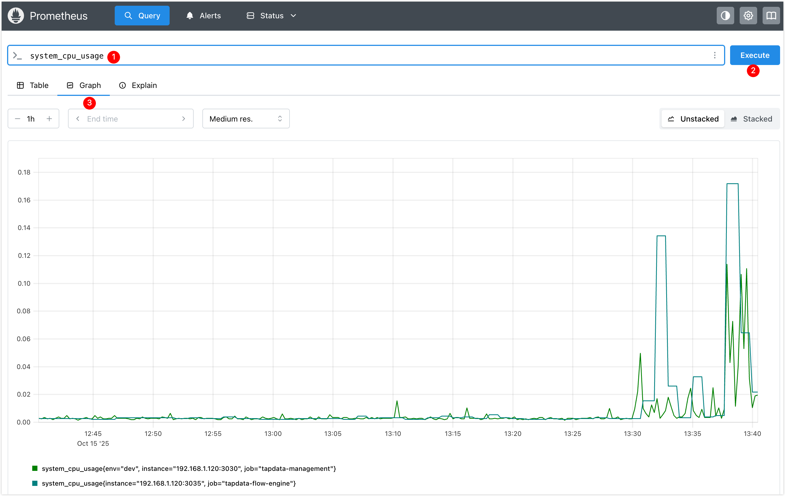
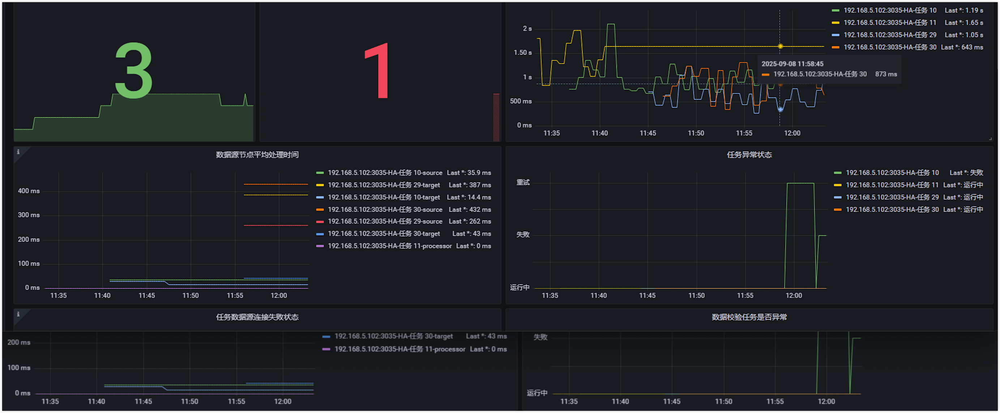
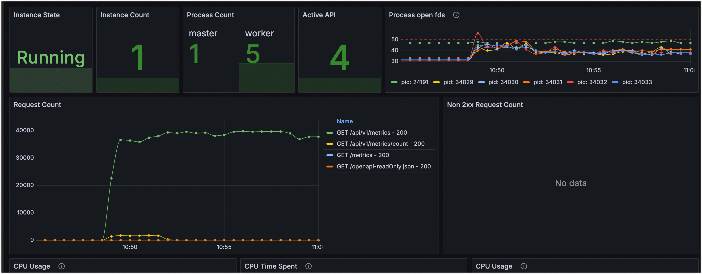
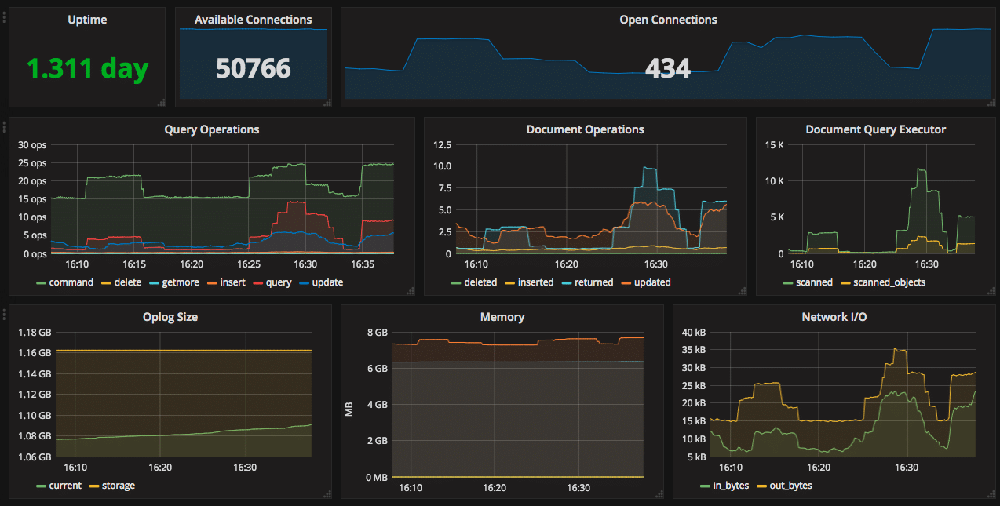

# 对接 Prometheus 监控

TapData 支持将运行时监控指标以 Prometheus 格式对外暴露，便于用户将 TapData 纳入自建监控体系中，实现统一的运行状态观测、趋势分析和告警配置。本文介绍如何启用监控、采集各组件指标并集成 Prometheus，同时可结合 Grafana 自定义可视化看板。

```mdx-code-block
import Tabs from '@theme/Tabs';
import TabItem from '@theme/TabItem';
```


## 背景介绍

TapData 是一款实时数据同步与融合平台，支持多种异构数据源之间的高效传输、转换与集成。平台由多个核心组件组成，包括 Management 服务、API Server、Agent 和 Flow Engine，这些组件的稳定运行对保障任务执行的连续性和可靠性至关重要。

为了帮助用户全面掌握平台运行状况，TapData 提供了基于 Prometheus 的监控能力。各核心组件支持通过配置文件或环境变量开启监控功能，启用后将运行指标以 Prometheus 格式通过 HTTP 接口对外暴露，便于接入现有的 Prometheus + Grafana 等可观测性平台，实现系统资源使用、任务状态等关键指标的采集、展示与告警。

与此同时，TapData 平台依赖 MongoDB 作为元数据存储服务。为了实现对 MongoDB 本身的运行状态进行统一监控，用户可以通过社区开源工具 `mongodb_exporter` 将 MongoDB 的内部性能指标（如连接数、操作统计、内存使用等）转化为 Prometheus 可采集的格式，从而与 TapData 的服务指标一并纳入统一的监控视图。

通过结合上述两种方法，帮助用户快速构建起完整的监控体系，覆盖 TapData 服务本身及其关键依赖组件，有效提升平台可观测性和运维响应效率。


## 步骤一：启用监控

### 1.1 启用 TapData 服务监控

默认情况下，TapData 的监控功能未开启。当您需要使用第三方监控工具（如 Prometheus）时，可以通过配置文件**或**环境变量启用监控，从而暴露探活端点和监控指标端点。

```mdx-code-block
<Tabs className="unique-tabs">
<TabItem value="通过配置文件启用" default>
```

登录 TapData 所属服务器，编辑 `application.yml` 文件，添加以下配置：

```yaml
spring:
  # ... 其他配置，省略 ...
tapdata:
  # ... 其他配置，省略 ...
  metrics:
    enable: true         # 启用监控
    enginePort: 3035     # Flow Engine 监控端口，默认 3035
    agentPort: 3036      # Agent 监控端口，默认 3036
```

</TabItem>

<TabItem value="通过环境变量启用">

登录 TapData 所属服务器，设置下述变量信息

```bash
export TAPDATA_MONITOR_ENABLE=true        # 启用监控
export TAPDATA_FE_MONITOR_PORT=3035       # Flow Engine 监控端口，默认 3035
export TAPDATA_AGENT_MONITOR_PORT=3036    # Agent 监控端口，默认 3036
```

</TabItem>

</Tabs>

:::tip

如 TapData 部署在多节点，需在每个节点上都添加配置。

:::


### 1.2 启用 MongoDB 服务监控

TapData 依赖 MongoDB 存储用户配置、任务元数据等信息。为监控 MongoDB 的性能和健康状态，本方案采用开源工具 mongodb_exporter，从 MongoDB 实例中提取指标并转换为 Prometheus 格式，以便与 TapData 的服务指标一并纳入统一的监控视图。

1. 登录 TapData 所依赖的 MongoDB 数据库，创建一个具有 clusterMonitor 角色的用户，确保其具备读取集群状态和性能指标的权限。

  ```bash
  # 替换要创建的用户名和密码
  use admin
  db.createUser({
    user: "tapdata_monitor",
    pwd: "your_password",
    roles: [
      { role: "clusterMonitor", db: "admin" },
      { role: "read", db: "local" }
    ]
  })
  ```

2. 前往 [mongodb_exporter  releases 页面](https://github.com/percona/mongodb_exporter/releases)，下载适用于您环境的二进制文件。

  本文以 0.47.1 版本为例，演示后续操作流程。

3. 解压下载的文件，随后进入解压目录。

  ```bash
  # 替换要解压的安装包名字
  tar -xzvf mongodb_exporter-0.47.1.linux-amd64.tar.gz
  cd mongodb_exporter-0.47.1.linux-amd64
  ```
4. 后台启动 mongodb_exporter，采集 MongoDB 指标并后台运行，日志输出到 exporter.log

  ```bash
  # 设置我们在前面创建的只读用户名和密码变量
  export MONGODB_USER=tapdata_monitor
  export MONGODB_PASSWORD=your_password

  # 后台启动服务，日志输出到 exporter.log
  # 注意替换 --mongodb.uri 为实际的 MongoDB 连接地址
  nohup ./mongodb_exporter \
    --mongodb.uri="mongodb://192.168.1.18:27017" \
    --collector.diagnosticdata \
    --collector.replicasetstatus \
    --collector.replicasetconfig \
    --collector.dbstats \
    --collector.dbstatsfreestorage \
    --collector.topmetrics \
    --collector.currentopmetrics \
    --collector.indexstats \
    --collector.profile \
    --collector.shards \
    --collector.pbm \
    --no-compatible-mode \
    > exporter.log 2>&1 &
  ```

  :::tip

  启动成功后，默认服务端口为 9216，路径为 `/metrics`，更多关于 mongodb_exporter 的配置和指标说明，请参考 [mongodb_exporter 文档](https://github.com/percona/mongodb_exporter)。

  :::

## 步骤二：集成到 Prometheus/Grafana

下文以 Docker Compose 部署 Prometheus 为例，演示如何集成 TapData 组件及 MongoDB 系统库的监控指标。如果尚未安装 Docker，参考 [Docker 官方文档](https://docs.docker.com/get-docker/) 安装。

1. 登录至某个和 TapData 服务网络联通的服务器， 执行 `mkdir prometheus && cd prometheus` 创建 Prometheus 配置目录。
  本案例中，假设该服务器 IP 地址为 192.168.1.100，TapData 服务部署在 192.168.1.200 和 192.168.1.201 两台服务器上。

2. 创建 docker-compose.yml 文件，添加 Prometheus 和 Grafana 服务配置，示例如下：

  ```yaml
  version: '3.7'
  services:
    prometheus:
      image: prom/prometheus:latest
      container_name: prometheus
      volumes:
        - ./prometheus.yml:/etc/prometheus/prometheus.yml
        - prometheus_data:/prometheus  # 数据持久化
      ports:
        - "9090:9090"
      command:
        - '--config.file=/etc/prometheus/prometheus.yml'
        - '--storage.tsdb.path=/prometheus'
        - '--web.console.libraries=/etc/prometheus/console_libraries'
        - '--web.console.templates=/etc/prometheus/consoles'
        - '--storage.tsdb.retention.time=30d'  # 保留30天数据

    grafana:
      image: grafana/grafana:latest
      container_name: grafana
      ports:
        - "3000:3000"
      environment:
        - GF_SECURITY_ADMIN_USER=admin
        - GF_SECURITY_ADMIN_PASSWORD=admin
      volumes:
        - grafana_data:/var/lib/grafana  # 数据持久化
  
  volumes:
    prometheus_data:
    grafana_data:
  ```
  
  :::tips 重要提示
    - `prometheus_data`：存储 Prometheus 采集的监控数据，避免容器重启后数据丢失
    - `grafana_data`：存储 Grafana 的配置、仪表板、数据源等设置  
  **如果不配置数据持久化**，执行 `docker compose down` 停止容器会删除所有数据，导致配置丢失！
  :::

3. 创建 `prometheus.yml` 文件，添加 TapData 组件及MongoDB 系统库的指标抓取作业，配置实例如下所示，支持多节点和自定义标签：
  ```yaml
    scrape_configs:
      - job_name: 'tapdata-management'
        metrics_path: /actuator/prometheus
        scrape_interval: 5s
        relabel_configs:  # 可选：添加自定义标签
          - target_label: 'env'
            replacement: 'dev'
        static_configs:
          - targets:
            - '192.168.1.200:3030'  # 替换为实际 IP
            - '192.168.1.201:3030'  # 多节点配置，如为单节点，可删除此配置

      - job_name: 'tapdata-flow-engine'
        metrics_path: /actuator/prometheus
        static_configs:
          - targets:
            - '192.168.1.200:3035'
            - '192.168.1.201:3035'

      - job_name: 'tapdata-api-server'
        metrics_path: /metrics
        static_configs:
          - targets:
            - '192.168.1.200:3080' 
            - '192.168.1.201:3080'

      - job_name: 'tapdata-agent'
        metrics_path: /metrics
        static_configs:
          - targets:
            - '192.168.1.200:3036'
            - '192.168.1.201:3036'

      - job_name: 'mongodb'
        metrics_path: /metrics
        static_configs:
          - targets:
            - '192.168.1.200:9216'
  ```

5. **启动容器**

  ```bash
  docker compose up -d
  ```

  :::tip 配置持久化说明
  上述配置已包含数据持久化，Prometheus 和 Grafana 的数据都会保存在 Docker 卷中，即使容器重启也不会丢失。
  :::

6. 访问 Prometheus UI 地址 `http://192.168.1.100:9090`，查询某个指标，例如 `system_cpu_usage`（系统 CPU 占用率），确认配置生效。

  

7. 访问 Grafana UI 地址 `http://192.168.1.100:3000`，登录 Grafana 后，重置默认密码并添加 Prometheus 数据源，配置地址为 `http://192.168.1.100:9090`。

  下图以监控 TapData Management 服务的磁盘总容量和可用容量为例，构建了自定义的可视化看板。更多设置介绍，见 [Grafana Dashboards 使用介绍](https://grafana.com/docs/grafana/latest/dashboards/)。

  

  :::tip
  您也可以导入我们提供的 Grafana [仪表板模板](#grafana-仪表板模板)，快速构建专业监控视图。
  :::


## 附录

### Grafana 仪表板模板

为帮助您快速构建 TapData 监控体系，我们提供了经过实战验证的 Grafana 仪表板模板。导入后即可获得专业的监控视图，无需从零开始配置，具体如下：

| 模板名称 | 监控范围 | 下载链接 |
|---------|---------|---------|
| **TapData 服务监控** | 任务运行状态、系统资源、组件健康度 | [TapData-Service-Template.zip](/resources/TapData_Service_Template.zip) |
| **API 服务监控** | 请求统计、API 性能、资源使用 | [API-Service-Template.zip](/resources/API_Service_Template.zip) |
| **MongoDB 监控** | 查询性能、Oplog、集合统计 | [Percona MongoDB 仪表板](https://github.com/percona/grafana-dashboards/tree/main/dashboards/MongoDB) |

**使用方法**

1. **下载模板**：点击上方链接获取 JSON 文件
2. **导入 Grafana**：Grafana → 右上角 + 图标 → Import dashboard
3. **配置数据源**：选择已添加的 Prometheus 数据源
4. **调整变量**：根据实际环境修改变量查询语句

**效果预览**

<Tabs>
<TabItem value="tapdata" label="TapData 监控">



*包含：任务延迟、节点状态、资源使用率等关键指标*

</TabItem>
<TabItem value="api" label="API 监控">



*包含：请求量、响应时间、错误率等 API 核心指标*

</TabItem>
<TabItem value="mongodb" label="MongoDB 监控">



*包含：查询性能、连接数、Oplog 状态等数据库指标*

</TabItem>
</Tabs>

:::tip 常见问题
如导入后无数据显示，请检查、Prometheus 数据源是否配置正确、变量查询语句是否匹配实际标签名、指标采集端点是否可访问。

:::

### 探活端点与指标说明

#### 探活端点

所有 TapData 组件提供无需认证的 HTTP GET 探活端点，用于检查服务健康状态。返回 200 状态码表示服务正常，否则表示异常。以下是各组件的探活端点：

* **TapData Management**：执行 `curl http://127.0.0.1:3030/health` 检查服务健康状态，示例响应：

  ```json
  {
    "reqId": "47f18971-92d5-48ab-9bfd-581f39988e06",
    "ts": 1758081846300,
    "code": "ok"
  }
  ```
* **TapData ApiServer**：执行 `curl http://127.0.0.1:3080/status` 检查服务健康状态，示例响应：

  ```json
  {
    "status": "UP"
  }
  ```
* **TapData Agent**：执行 `curl http://127.0.0.1:3036/health` 检查服务健康状态，示例响应如下所示，如果未启用监控，可通过检查进程 PID 判断健康。

    ```json
    {
      "status": "ok",
      "date": "2025-09-17T04:15:00.281Z",
      "pid": 78193,
      "platform": "darwin"
    }
    ```
* **TapData Flow Engine**：执行 `curl http://127.0.0.1:3035/actuator/health` 检查服务健康状态，示例响应如下所示，如果未启用监控，可通过检查进程 PID 判断健康。

    ```json
    {
      "status": "UP",
      "components": {
        "diskSpace": {
          "status": "UP",
          "details": {
            "total": 3939047620608,
            "free": 393134940160,
            "threshold": 10485760,
            "path": "/home/daguozb/package2/tapdata/.",
            "exists": true
          }
        },
        "ping": {
          "status": "UP"
        },
        "ssl": {
          "status": "UP",
          "details": {
            "validChains": [],
            "invalidChains": []
          }
        }
      }
    }
    ```


#### 可用指标

TapData 以 Prometheus 格式暴露指标，支持各类采集工具分析与告警。各组件的指标端点如下：

* TapData Management：`http://127.0.0.1:3030/actuator/prometheus`
* TapData Flow Engine：`http://127.0.0.1:3035/actuator/prometheus`
* TapData Agent：`http://127.0.0.1:3036/metrics`
* TapData ApiServer：`http://127.0.0.1:3080/metrics`


<details>
<summary><b>详细指标清单（单击展开）</b></summary>


#### TapData Management

| 指标名称                                  | 描述                                                                                                                                  |
| ------------------------------------------- | --------------------------------------------------------------------------------------------------------------------------------------- |
| up                                        | 进程存活状态                                                                                                                          |
| disk_free_bytes                           | 磁盘剩余可用容量（字节）                                                                                                              |
| disk_total_bytes                          | 磁盘总容量（字节）                                                                                                                    |
| http_server_requests_active_seconds_count | 当前活跃请求总数                                                                                                                      |
| http_server_requests_active_seconds_sum   | 当前活跃请求累计耗时（秒）                                                                                                            |
| http_server_requests_active_seconds_max   | 当前活跃请求最大耗时（秒）                                                                                                            |
| http_server_requests_seconds_count        | 累计请求总数                                                                                                                          |
| http_server_requests_seconds_sum          | 累计请求处理时间                                                                                                                      |
| process_cpu_time_ns_total                 | JVM 的 CPU 使用时间                                                                                                                   |
| process_cpu_usage                         | JVM 的 CPU 使用率                                                                                                                     |
| process_files_open_files                  | JVM 打开的句柄数                                                                                                                      |
| system_cpu_count                          | 系统 CPU 数量                                                                                                                         |
| system_cpu_usage                          | 系统 CPU 使用率                                                                                                                       |
| system_load_average_1m                    | 最近 1 分钟系统平均负载                                                                                                               |
| jvm_memory_used_bytes                     | 特定内存区域当前使用量（字节）。区域包括 Heap（G1 Eden、G1 Old Gen、G1 Survivor）和 Nonheap（CodeCache、Compressed Class、Metaspace） |
| jvm_buffer_memory_used_bytes              | 直接内存（Direct Memory）使用量                                                                                                       |

#### TapData Flow Engine

| 指标名称                     | 描述                                                                                                                                  |
| ------------------------------ | --------------------------------------------------------------------------------------------------------------------------------------- |
| up                           | 进程存活状态                                                                                                                          |
| disk_free_bytes              | 磁盘剩余可用容量（字节）                                                                                                              |
| disk_total_bytes             | 磁盘总容量（字节）                                                                                                                    |
| process_cpu_time_ns_total    | JVM 的 CPU 使用时间                                                                                                                   |
| process_cpu_usage            | JVM 的 CPU 使用率                                                                                                                     |
| process_files_open_files     | JVM 打开的句柄数                                                                                                                      |
| system_cpu_count             | 系统 CPU 数量                                                                                                                         |
| system_cpu_usage             | 系统 CPU 使用率                                                                                                                       |
| system_load_average_1m       | 最近 1 分钟系统平均负载                                                                                                               |
| jvm_memory_used_bytes        | 特定内存区域当前使用量（字节）。区域包括 Heap（G1 Eden、G1 Old Gen、G1 Survivor）和 Nonheap（CodeCache、Compressed Class、Metaspace） |
| jvm_memory_committed_bytes   | JVM 已分配内存（字节）                                                                                                                |
| jvm_buffer_memory_used_bytes | 直接内存（Direct Memory）使用量                                                                                                       |

#### TapData Agent

| 指标名称                  | 描述                     |
| --------------------------- | -------------------------- |
| up                        | 进程存活状态             |
| disk_free_bytes           | 磁盘剩余可用容量（字节） |
| disk_total_bytes          | 磁盘总容量（字节）       |
| process_cpu_time_ns_total | CPU 使用时间             |
| process_cpu_usage         | CPU 使用率               |
| process_files_open_files  | 句柄数                   |
| system_cpu_count          | 系统 CPU 数量            |
| system_cpu_usage          | 系统 CPU 使用率          |
| system_load_average_1m    | 最近 1 分钟系统平均负载  |

</details>