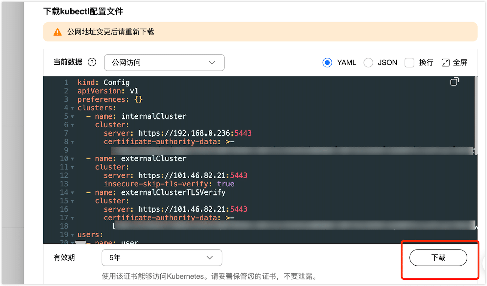

#  在华为云 CCE（云容器引擎）上部署 TapData

import Content from '../../reuse-content/_enterprise-features.md';

<Content />

云容器引擎（Cloud Container Engine，简称CCE）提供高度可扩展的、高性能的企业级Kubernetes集群。借助云容器引擎，您可以在华为云的 CCE 集群中轻松部署和管理 TapData 服务。

## 准备工作

[开通 CCE 服务并购买集群](https://support.huaweicloud.com/usermanual-cce/cce_10_0028.html)

## 操作步骤

1. 上传 TapData 镜像至华为云镜像仓库。
    
    1. 在本地[安装 docker 服务](https://docs.docker.com/engine/install/)（18.06 及以上版本），用于执行认证和上传操作。

    2. [通过命令将 TapData 镜像推送到镜像仓库](https://support.huaweicloud.com/usermanual-swr/swr_01_0011.html)。

2. 获取 kubectl 配置文件，用于对接认证集群。

    1. 在华为云 CCE 服务控制台，找到您的集群并单击 kubcetl 后的**配置**按钮，查看 kubctl 的连接信息。

    2. 在弹出的页面中，选择**内网访问**或**公网访问**，并下载对应的配置文件。
        
        本案例中，我们以**公网访问**为例演示配置流程，更多介绍，见[连接集群](https://support.huaweicloud.com/usermanual-cce/cce_10_0107.html)。

3. 通过 kubectl 连接至 CCE 集群，下文以本地的 Linux 平台为例，演示操作流程

    1. [安装 kubcetl 工具](https://kubernetes.io/zh-cn/docs/tasks/tools/)，您也可以通执行 `kubectl version` 命令判断是否已安装。

    2. 将刚刚下载的 kubectl 配置文件（kubeconfig.yaml），上传至本地 Linux 平台设备上。
    
    3. 执行下述命令，将 kubeconfig.yaml 配置文件移动到默认路径“$HOME/.kube/config”中。
        ```bash
        cd /home
        mkdir -p $HOME/.kube
        mv -f kubeconfig.yaml $HOME/.kube/config # 请将kubeconfig.yaml修改为对应的文件名称

    4. 据使用场景，切换 kubectl 的访问模式。
        * VPC 内网接入访问时，执行：`kubectl config use-context internal`
        * 公网接入访问且无需域名双休认证时，执行：`kubectl config use-context external`
        * 公网接入访问且需域名双向认证时时，执行：`kubectl config use-context externalTLSVerify`
        
    5. 在客户端中执行以下命令，检查客户端能否通过 kubectl 连接集群。
        ```bash
        kubectl cluster-info    # 查看集群信息
        ```
4. 创建 SWR 镜像拉取密钥。
    ```bash
    # 创建镜像拉取密钥，注意替换命令中认证信息
    kubectl create secret docker-registry my-registry-key \
        --docker-server=your-registry.com \
        --docker-username=your-username \
        --docker-password=your-password \
        --docker-email=your-email

    # 在 Deployment 中引用
    kubectl patch deployment tapdata-app -p '{"spec":{"template":{"spec":{"imagePullSecrets":[{"name":"my-registry-key"}]}}}}'
    ```

5. 通过 YAML 文件部署 TapData 服务。
    ```bash
    # 安装 Mongodb 服务，作为 TapData 的元数据存储
    sudo kubectl apply -f rcbc-deploy-mongo.yaml

    # 安装 TapData 服务
    sudo kubectl apply -f rcbc-deploy-tapdata.yaml
    ```
6. 验证 TapData 服务部署。
    ```bash
    # 检查 Mongodb 服务是否运行正常
    sudo kubectl get pod -n tapdata | grep mongo

    # 检查 TapData 服务是否运行正常
    sudo kubectl get pod -n tapdata | grep tapdata-app
    ```

## 附录

<details><summary>rcbc-deploy-mongo.yaml 配置样例</summary>

```yaml
kind: ConfigMap
apiVersion: v1
metadata:
  name: mongodb-config
  namespace: tapdata
  labels:
    app: mongodb-config
data:
  mongo_keyfile: |
    tuhIKOurCzkh4w0xUiRHhVteUZm9w3/ELaUgULajCcXit/cSHClmoWzjNbsp47Ms
    wIIAYXzMY2O80qVD75zQyhb2KKsASvr35evaUKCNf1LJVr19sn0dcf5LyyPNJPTH
    4Hj9jIKMHNOXKOBhB/zQcgbqnMx7rseIwMfOPGF9bZ4/lzJ7y6grf6L62IfgnkLL
    gxuP3qANIj/abQPBPQXx/oYV6exfRnLyu/RH26vgjqzxPYu1EjQDaVf38zEvwM6M
    5VEEGNgahHZquTmOA3j8dbqbbVb819eaNof/Nt1iyN7OyyI5BQE8vpWNAsm5bTUV
    X8+5zNoOwWkEOi7m9TyuyAw/5FapZ+1jlLWha83wKrqXzPZW9Gh7FWPyxSL1cUv/
    KPNjgHHujuZnpLrGPDKr2okThhgV7CiuNm4vNUkXi363BhNKbI8EP4f+qZswYJoi
    nQFFSv98K8wr5UKGMGB2Y37MxcGhBKXVrvz0GECPfCDOqgco4aAFa/IFJh9y8jni
    P0FmNZyCvZzQZ09o67uFND7cJMRszLlu1gSy0MDXgpUyb/eBr3A5i79eXVrBXKMl
    PC6GEs4EpJOui9SgYQsIcKME189aznz3qu5L18XUgh1w6Vl67t6grlUiVYY2nCzV
    ihIktKa5CVkuNTrlHDbYogFfDS/Owc5t3uvgsx3MdilsnzJzukZ5t0XeXNu4KmpY
    mAEL2nS6lOibG3wvUhBCjihPx/iuQCu6NSj9GiVsjBzEbZbwPjPoIi0zb+NPm0TQ
    N6piy4ZS+KixbyTZdOO1pDQ9/RzdzwQAGkIbEi4sYqDyLEWMb1jKnYy/3LtnYVAY
    EER+AmiCaX9Mcy/D4Bbef95KhEhCHCOj51IVimPb7K8XbbFQtWo2blwICtjkSVHa
    hw+JjSHObOycjy62wFB5jkYMv/eEomyOErsAYi3ae7VHcOkFdCuJpE211ttVElmZ
    17ZggibzRHXIsehcLZpFTGLGZubGm+AFtswHfYtFeYtw4Hin

  startup.sh: |
    #!/bin/bash
    if [ ! -e "/data/WiredTiger" ] && [ ! -e "/data/journal" ] && [ ! -e "/data/local.0" ] && [ ! -e "/data/storage.bson" ]; then
        mongod --replSet rs0 --dbpath /data --logpath /logs --pidfilepath /data/mongod.pid --fork
        mongosh admin --eval "rs.initiate({ _id: 'rs0', members: [ {_id: 0, host: 'localhost:27017' } ] })" --quiet
        mongosh admin --eval "db.getSiblingDB('admin').createUser({ 'user' : 'root', 'pwd' : 'AFtswHfYtFeYtw4Hin' , 'roles' : [ { 'role' : 'root', 'db' : 'admin' } ] })" --quiet
        mongod --replSet rs0 --dbpath /data --logpath /logs --pidfilepath /data/mongod.pid --shutdown

        echo
        echo 'MongoDB init process complete; ready for start up.'
        echo
    fi
    echo "Startup mongodb"
    exec mongod --config /etc/mongod.conf

  mongod.conf: |
    storage:
      dbPath: /data
      journal:
        commitIntervalMs: 100
    
    systemLog:
      logAppend: true
      path: /var/log/mongodb/mongod.log
      logRotate: rename
      destination: file
      timeStampFormat: iso8601-utc
    
    # network interfaces
    net:
      port: 27017
      bindIp: 0.0.0.0
    
    #replication:
    replication:
      replSetName: rs0
    
    security:
      authorization: enabled
      keyFile: /data/mongo_keyfile

---

apiVersion: v1
kind: PersistentVolumeClaim
metadata:
  name: mongodb-pvc
  namespace: tapdata
spec:
  accessModes:
    - ReadWriteOnce
  storageClassName: ssd
  resources:
    requests:
      storage: 50Gi

---
apiVersion: apps/v1
kind: Deployment
metadata:
  labels:
    app: mongodb
    version: "7.0"
  name: mongodb
  namespace: tapdata
spec:
  replicas: 1
  selector:
    matchLabels:
      app: mongodb
  strategy: {}
  template:
    metadata:
      labels:
        app: mongodb
    spec:
      containers:
        - image: swr.ap-southeast-5.myhuaweicloud.com/swr-poc/tapdata_poc_mongodb:7.0.6
          name: mongodb
          resources:
            limits:
              cpu: "4"
              memory: "8Gi"
            requests:
              cpu: "2"
              memory: "4Gi"
          ports:
            - containerPort: 27017
              name: node
              protocol: TCP
          livenessProbe:
            tcpSocket:
              port: node
            initialDelaySeconds: 20
            periodSeconds: 20
          readinessProbe:
            tcpSocket:
              port: node
            initialDelaySeconds: 10
            periodSeconds: 10
          volumeMounts:
            - name: mongodb-config
              mountPath: /startup.sh
              subPath: startup.sh
            - name: mongodb-config
              mountPath: /data/mongo_keyfile
              subPath: mongo_keyfile
            - name: mongodb-config
              mountPath: /etc/mongod.conf
              subPath: mongod.conf
            - name: persistent-storage
              mountPath: /data

          command: ["/startup.sh"]

      volumes:
        - name: persistent-storage
          persistentVolumeClaim:
            claimName: mongodb-pvc
        - name: mongodb-config
          configMap:
            name: mongodb-config
            items:
              - key: startup.sh
                path: startup.sh
                mode: 0755
              - key: mongo_keyfile
                path: mongo_keyfile
                mode: 0400
              - key: mongod.conf
                path: mongod.conf

---
apiVersion: v1
kind: Service
metadata:
  name: mdb-svc
  labels:
    app: mdb-svc
  namespace: tapdata
spec:
  type: NodePort
  ports:
    - port: 27017
      protocol: TCP
      targetPort: 27017
      nodePort: 32000
  selector:
    app: mongodb
```
</details>


<details><summary>rcbc-deploy-tapdata.yaml 配置样例</summary>

:::tip 配置说明
在部署前，请注意以下重要配置项：

* **安全配置**：所有敏感信息（密码、访问码等）都应存储在 Secret 中，避免明文配置
* **资源限制**：根据实际负载调整 CPU 和内存限制
* **UUID 生成**：每个部署实例应使用唯一的 UUID

部署前请先创建 Secret，然后再应用 ConfigMap 和 Deployment。
:::

```yaml
# Secret 配置 - 用于存储敏感信息
apiVersion: v1
kind: Secret
metadata:
  name: tapdata-secret
  namespace: tapdata
type: Opaque
data:
  # 注意：以下值需要进行 base64 编码
  # echo -n "your_mongodb_password" | base64
  mongodb-password: eW91cl9tb25nb2RiX3Bhc3N3b3Jk  # your_mongodb_password
  # echo -n "your_access_code" | base64  
  tapdata-access-code: eW91cl9hY2Nlc3NfY29kZQ==  # your_access_code
  # echo -n "$(uuidgen)" | base64
  tapdata-uuid: NTY4Yzc2NWItOWJjMC00OTUwLWJhMjQtNDZmZDQ4ODg0OTgw  # 568c765b-9bc0-4950-ba24-46fd48884980

---
kind: ConfigMap
apiVersion: v1
metadata:
  name: tapdata-config
  namespace: tapdata
  labels:
    app: tapdata-config
data:
  agent.yml: |
    {agentId: 06eefee4-8154-44a1-afc6-a5bd68d0c8c8}
  license.txt: |
    paste your_license_text here

  application.yml: |
    spring:
      data:
        mongodb:
          uri: ""
          ssl: 'false'
          sslCA: ""
          sslCertKey: ""
          conn_params: ""
          username: root
          # 密码通过 Secret 挂载
          password: ${MONGODB_PASSWORD}
          mongoConnectionString: 'mongodb://mdb-svc.tapdata.svc.cluster.local:32000/tapdata?authSource=admin'
          sslPEMKeyFilePassword: 
          authenticationDatabase: admin
    tapdata:
      cloud:
        # 访问码通过 Secret 配置
        accessCode: ${TAPDATA_ACCESS_CODE}
        retryTime: 3
        baseURLs: 'http://127.0.0.1:3030/api/'
      mode: cluster
      conf:
        tapdataPort: '3030'
        backendUrl: 'http://127.0.0.1:3030/api/'
        apiServerPort: '3080'
        tapdataJavaOpts: '-Xmx12G -Xms4G'
        SCRIPT_DIR: etc
        reportInterval: 5000
        apiWorkerCount: 3
        # UUID 在部署时生成
        uuid: ${TAPDATA_UUID}
        Decimal128ToNumber: 'false'
        tapdataTMJavaOpts: '-Xmx8G -Xms4G'

  docker-entrypoint.sh: |
    #!/bin/bash

    # logging functions
    daas_log() {
        local type="$1"
        shift
        printf '%s [%s] [Entrypoint]: %s\n' "$(date --rfc-3339=seconds)" "$type" "$*"
    }

    daas_note() {
        daas_log INFO "$@"
    }

    daas_warn() {
        daas_log Warn "$@" >&2
    }

    daas_error() {
        daas_log ERROR "$@" >&2
        exit 1
    }

    if [[ -z $TAPDATA_WORK_DIR ]]; then
        TAPDATA_WORK_DIR=/tapdata/apps
    fi

    # 检查是否是其它脚本引用
    _is_sourced() {
        # https://unix.stackexchange.com/a/215279
        [ "${#FUNCNAME[@]}" -ge 2 ] \
            && [ "${FUNCNAME[0]}" = '_is_sourced' ] \
            && [ "${FUNCNAME[1]}" = 'source' ]
    }

    # usage: file_env VAR [DEFAULT]
    file_env() {
        local var="$1"
        local fileVar="${var}_FILE"
        local def="${2:-}"
        if [ "${!var:-}" ] && [ "${!fileVar:-}" ]; then
            daas_error "Both $var and $fileVar are set (but are exclusive)"
        fi
        local val="$def"
        if [ "${!var:-}" ]; then
            val="${!var}"
        elif [ "${!fileVar:-}" ]; then
            val="$(< "${!fileVar}")"
        fi
        export "$var"="$val"
        unset "$fileVar"
    }

    docker_setup_env() {
        file_env 'MONGODB_USER'
        file_env 'MONGODB_PASSWORD'
        file_env 'MONGODB_CONNECTION_STRING'
        file_env 'BACKENDURL'
        file_env 'MODULE'
    }

    docker_tapdata_start() {
        daas_note "Waiting for tapdata startup"
        if [ -z "$MODULE" ]; then
            rm -rf ~/.local/*
            chmod +x /tapdata/apps/tapdata
            /tapdata/apps/tapdata status --workDir $TAPDATA_WORK_DIR
            /tapdata/apps/tapdata stop -f
            /tapdata/apps/tapdata start
        else
            rm -rf ~/.local/*
            /tapdata/apps/tapdata start $MODULE --workDir $TAPDATA_WORK_DIR
        fi
    }

    logrotate() {
        # 删除修改时间3天以前的日志
        cd /root/
        find ./ -maxdepth 1 -mtime +3 | grep 2023.* | xargs -I {} rm -rf {}
        # 将当前的current格式化归档
        mv $TAPDATA_WORK_DIR/ ~/$(date "+%Y-%m-%d-%H:%M:%S")
    }

    set_license() {
        echo "get license..."
        if [[ -z $LICENSE_HOST ]]; then
          LICENSE_HOST=58.251.34.123:18080
        fi
        echo "login..."
        curl -v -XPOST -H "Content-Type:application/json" http://$LICENSE_HOST/ldap/login -d '{"password": "Gotapd8!", "uid": "license-temp"}'
        if [[ $? -ne 0 ]]; then
            echo "login failed"
            exit 1
        fi
        echo "Get SID..."
        SID=$(java -cp /tapdata/apps/components/tm.jar -Dloader.main=com.tapdata.tm.license.util.SidGenerator org.springframework.boot.loader.launch.PropertiesLauncher | grep "SID:" | cut -d ' ' -f 2-)
        echo "SID: $SID"
        resp_json=$(curl -sb -XPOST -H "Content-Type:application/json" -H "uid:license-temp" http://$LICENSE_HOST/license -d '{"customer": "test", "reason": "本地测试", "sid": "'$SID'", "valid_days": 30, "version": "4.7", "licenseType": "OP", "engineLimit": 1}')
        apt install -y jq
        path=$TAPDATA_WORK_DIR
        # logrotate
        mkdir -p $path
        mkdir -p ~/.tapdata
        echo $resp_json | jq -r .data.content > $path/license.txt
        echo $resp_json | jq -r .data.content > ~/.tapdata/license.txt
        if [[ -f $path/license.txt && -f ~/.tapdata/license.txt ]]; then
            ls -al $path/license.txt
            ls -al ~/.tapdata/license.txt
            echo "set license file success."
        else
            echo "set license file failed."
        fi
    }

    docker_setup_tapdata() {
        # 创建一个临时文件来进行修改
        TMP_CONFIG=$(mktemp)
        cp /tapdata/apps/application.yml $TMP_CONFIG

        if [ -n "$MONGODB_USER" ]; then
            sed -ri "s#username:.*#username: $MONGODB_USER#" $TMP_CONFIG
        fi

        if [ -z "$MONGODB_CONNECTION_STRING" ]; then
            daas_error "MONGODB_CONNECTION_STRING not set.\n Did you forget to add -e MONGODB_CONNECTION_STRING=... ?"
        else
            sed -ri "s#(mongoConnectionString:.*').*(')#\1$MONGODB_CONNECTION_STRING\2#" $TMP_CONFIG
        fi

        if [ -n "$BACKENDURL" ]; then
            sed -ri "s#(backendUrl:.*').*(')#\1$BACKENDURL\2#" $TMP_CONFIG
        fi

        # 将修改后的配置复制到工作目录
        mkdir -p $TAPDATA_WORK_DIR
        cp $TMP_CONFIG $TAPDATA_WORK_DIR/application.yml
        rm -f $TMP_CONFIG

        if [ -n "$MONGODB_PASSWORD" ]; then
            /tapdata/apps/tapdata status --workDir $TAPDATA_WORK_DIR
            /tapdata/apps/tapdata resetpassword $MONGODB_PASSWORD
        fi
    }

    unzip_files() {
        tar xzvf /tapdata/apps/connectors/dist.tar.gz -C /tapdata/apps/
        cd /tapdata/apps/connectors/ && tar xzvf dist.tar.gz
        tar xzvf /tapdata/apps/components/apiserver.tar.gz -C /tapdata/apps/
    }

    setup_java() {
        if [[ -z "$JAVA_VERSION" || $JAVA_VERSION == "java8" ]]; then
            daas_log INFO "Setting up java version: java8"
            update-alternatives --set java /usr/java/jdk1.8.0_311/bin/java
            update-alternatives --set javac /usr/java/jdk1.8.0_311/bin/javac
            update-alternatives --set jar /usr/java/jdk1.8.0_311/bin/jar
            echo 'export PATH="/usr/java/jdk1.8.0_311/bin:$PATH"' >> /etc/profile && . /etc/profile
        elif [[ $JAVA_VERSION == "java11" ]]; then
            daas_log INFO "Setting up java version: java11"
            update-alternatives --set java /usr/java/jdk-11.0.25/bin/java
            update-alternatives --set javac /usr/java/jdk-11.0.25/bin/javac
            update-alternatives --set jar /usr/java/jdk-11.0.25/bin/jar
            echo 'export PATH="/usr/java/jdk-11.0.25/bin:$PATH"' >> /etc/profile && . /etc/profile
        elif [[ $JAVA_VERSION == "java17" ]]; then
            daas_log INFO "Setting up java version: java17"
            update-alternatives --set java /usr/java/jdk-17.0.12/bin/java
            update-alternatives --set javac /usr/java/jdk-17.0.12/bin/javac
            update-alternatives --set jar /usr/java/jdk-17.0.12/bin/jar
            echo 'export PATH="/usr/java/jdk-17.0.12/bin:$PATH"' >> /etc/profile && . /etc/profile
        else
            daas_error "Unsupported JAVA_VERSION: $JAVA_VERSION"
        fi
    }

    _main() {
        setup_java

        cp /tmp/conf/application.yml /tapdata/apps/application.yml
        echo "export JAVA_TOOL_OPTIONS=-Dfile.encoding=UTF8" >> /etc/profile && . /etc/profile
        unzip_files
        # set_license

        daas_note "Entrypoint script for tapmanager Server started."

        # Load various environment variables
        docker_setup_env "$@"

        db=$(echo $MONGODB_CONNECTION_STRING | awk -F '/' '{print $2}' | awk -F '?' '{print $1}')
        TAPDATA_MONGO_URI="mongodb://root:$MONGODB_PASSWORD@$MONGODB_CONNECTION_STRING"
        echo "restore data to db: $db, to uri: ${TAPDATA_MONGO_URI}"

        docker_setup_tapdata
        if [[ $TAPDATA_WORK_DIR != "" && -d /tapdata/apps/components/webroot/ ]]; then
            mkdir -p $TAPDATA_WORK_DIR/components/webroot/
            cp -r /tapdata/apps/components/webroot/* $TAPDATA_WORK_DIR/components/webroot/
        fi

        daas_note "Starting tapdata server"
        docker_tapdata_start
        daas_note "tapdata server started."

        exec "$@"
    }

    # 如果是其它脚本引用，则不执行操作
    if ! _is_sourced; then
        _main "$@"
    fi

    while [[ 1 ]]; do
        sleep 10
    done

---
apiVersion: apps/v1
kind: Deployment
metadata:
  labels:
    app: tapdata
    version: "4.8"
  name: tapdata-app
  namespace: tapdata
spec:
  replicas: 1
  selector:
    matchLabels:
      app: tapdata-app
  strategy: {}
  template:
    metadata:
      labels:
        app: tapdata-app
    spec:
      imagePullSecrets:
        - name: huawei-swr-secret
      containers:
        - image: swr.ap-southeast-5.myhuaweicloud.com/swr-poc/tapdata_poc:v4.8.0-68d8d3a1
          name: tapdata-app
          resources:
            limits:
              cpu: "8"
              memory: "24Gi"
            requests:
              cpu: "4"
              memory: "8Gi"
          ports:
            - containerPort: 3030
              name: tm
              protocol: TCP
            - containerPort: 3080
              name: apiserver
              protocol: TCP
#          livenessProbe:
#            tcpSocket:
#              port: tm
#            initialDelaySeconds: 120
#rc            periodSeconds: 20
          readinessProbe:
            httpGet:
              path: /health
              port: tm
            initialDelaySeconds: 120
            periodSeconds: 10
          volumeMounts:
#            - name: tapdata-config
#              mountPath: /tapdata/apps/application.yml
#              subPath: application.yml
            - name: tapdata-config
              mountPath: /tapdata/docker-entrypoint.sh
              subPath: docker-entrypoint.sh
            - name: tapdata-config
              mountPath: /tapdata/apps/agent.yml
              subPath: agent.yml
            - name: tapdata-config
              mountPath: /tapdata/apps/license.txt
              subPath: license.txt

          env:
            - name: MONGODB_CONNECTION_STRING
              value: "mongodb://192.168.0.18:32000/tapdata?authSource=admin"
            # 从 Secret 中获取敏感信息
            - name: MONGODB_PASSWORD
              valueFrom:
                secretKeyRef:
                  name: tapdata-secret
                  key: mongodb-password
            - name: TAPDATA_ACCESS_CODE
              valueFrom:
                secretKeyRef:
                  name: tapdata-secret
                  key: tapdata-access-code
            - name: TAPDATA_UUID
              valueFrom:
                secretKeyRef:
                  name: tapdata-secret
                  key: tapdata-uuid
            - name: MONGODB_USER
              value: "root"
            - name: FRONTEND_WORKER_COUNT
              value: "1"
            - name: API_WORKER_COUNT
              value: "1"
            - name: JAVA_VERSION
              value: "java17"
      volumes:
        - name: tapdata-config
          configMap:
            name: tapdata-config
            items:
#              - key: application.yml
#                path: application.yml
              - key: docker-entrypoint.sh
                path: docker-entrypoint.sh
                mode: 0755
              - key: agent.yml
                path: agent.yml
              - key: license.txt
                path: license.txt

---
apiVersion: v1
kind: Service
metadata:
  name: tapdata-svc
  labels:
    app: tapdata-svc
  namespace: tapdata
spec:
  type: NodePort
  ports:
    - name: tm
      port: 3030
      protocol: TCP
      targetPort: 3030
      nodePort: 32001
    - name: apiserver
      port: 3080
      protocol: TCP
      targetPort: 3080
      nodePort: 32002
  selector:
    app: tapdata-app

```

</details>