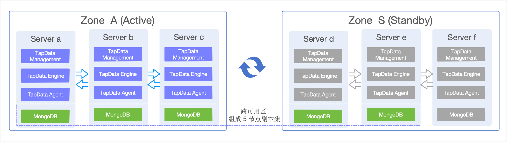

# TapData 跨数据中心灾难恢复实践

本文档介绍 TapData 的**跨数据中心/可用区级别**的灾难恢复（DR）解决方案，适用于需要应对整个数据中心或可用区故障的生产环境。该方案通过"主集群 + 冷备服务 + 热数据"的模式，实现跨地域的数据持续热同步和服务快速切换，确保在区域性灾难发生时业务能够快速恢复。

:::tip

如果您只需要实现**单个集群内的高可用**部署（应对单点故障），请参考 [部署高可用 TapData Enterprise（三节点）](install-tapdata-ha-with-3-node.md)。

:::

## 1. 背景与方案介绍

TapData 采用分布式架构设计，核心组件包括 TapData Management（任务管理）、TapData Engine（数据处理）、TapData Agent（数据采集）和 MongoDB（元数据存储）。在单数据中心部署模式下，您可以通过集群内高可用来应对单点故障，但当整个数据中心发生故障时，仍然存在业务中断的风险。

为进一步提升业务连续性和数据可用性，TapData 提供了跨数据中心/可用区级别的灾难恢复方案，可适用于下述场景：
- **跨数据中心部署**：主备站点位于不同的数据中心或地理区域
- **区域性灾难应对**：需要应对整个数据中心断电、网络中断、自然灾害等区域性故障
- **严格的业务连续性要求**：对 RTO（恢复时间目标）和 RPO（恢复点目标）有严格要求
- **合规性要求**：满足行业监管对灾难恢复能力的要求



本方案采用"主集群 + 冷备服务 + 热数据"的双数据中心架构，通过 TapData 无状态设计和 MongoDB 跨区域副本集实现高可用灾备。

- **Zone A（主集群）**：运行完整的 TapData 服务栈（3台）+ MongoDB 副本集（3节点），承载所有生产业务。
- **Zone S（备集群）**：预部署 TapData 服务（停止状态，3台）+ MongoDB 副本集（2节点运行 + 1节点预部署），平时仅数据同步。

:::tip 数据同步机制

通过 MongoDB 跨区域副本集实现任务和元信息的实时同步，确保备集群数据与主集群保持一致。详细的副本集配置和切换机制请参考后续章节。

:::

## 2. 主机配置与部署要求

基于上述架构设计，以下是具体的主机配置示例和部署要求：

### 2.1 主机配置说明

| 主机名 | IP 地址 | 区域 | MongoDB 角色 | TapData 服务 | 备注 |
|--------|---------|------|---------------|--------------|--------|
| tapdata-a | 192.168.1.10 | Zone A | Primary | **运行** | 主节点 |
| tapdata-b | 192.168.1.11 | Zone A | Secondary | **运行** | 从节点 |
| tapdata-c | 192.168.1.12 | Zone A | Secondary | **运行** | 从节点 |
| tapdata-d | 192.168.2.10 | Zone S | Secondary（不参与选举） | **停止** | 备用节点 |
| tapdata-e | 192.168.2.11 | Zone S | Secondary（不参与选举） | **停止** | 备用节点 |
| tapdata-f | 192.168.2.12 | Zone S | 预部署（暂不加入副本集） | **停止** | 仅在 Zone A 故障时启用 |


:::tip 网络延迟推荐
- 跨区域网络推荐采用专线链接，网络延迟建议控制在 **100ms 以内**，以确保 MongoDB 副本集数据同步性能和故障检测的及时性。
- 服务器和网络需要开放必要的服务端口，例如 MongoDB (27017)、TapData Management (3030)、TapData Engine (3080)、SSH (22)。
:::

### 2.2 MongoDB 跨区域副本集配置

MongoDB 作为 TapData 的核心存储引擎，负责存储任务配置、元数据信息和系统状态等关键数据。本方案采用 5 节点跨区域副本集架构：Zone A（3 节点）+ Zone S（2 节点），通过优先级设置确保主节点优先分布在 Zone A。

**架构优势：**
- **自动数据同步**：数据自动从 Zone A 同步到 Zone S，确保备用区域数据实时性
- **故障自动切换**：MongoDB 内置选举机制，可在主节点故障时自动选举新主节点
- **数据冗余保护**：多副本存储，避免单点故障导致的数据丢失

**推荐副本集配置：**
```javascript
rs.reconfig({
  members: [
    { _id: 0, host: "192.168.1.10:27017", priority: 2 },  // Zone A 主节点
    { _id: 1, host: "192.168.1.11:27017", priority: 1 },  // Zone A 从节点
    { _id: 2, host: "192.168.1.12:27017", priority: 1 },  // Zone A 从节点
    { _id: 3, host: "192.168.2.10:27017", priority: 0 },  // Zone S 从节点
    { _id: 4, host: "192.168.2.11:27017", priority: 0 },  // Zone S 从节点
  ]
})
```


**推荐写关注配置：**
```javascript
// TapData 推荐的 MongoDB 写关注设置
db.adminCommand({
  setDefaultRWConcern: 1,
  defaultWriteConcern: {
    w: "majority",        // 写入大多数节点才确认
    j: true,             // 确保写入 journal
    wtimeout: 5000       // 写入超时 5 秒
  }
})
```

此配置确保数据写入至少 3 个节点（5 节点的大多数）才确认成功，提供数据一致性保障。通常情况下，写入操作主要在 Zone A 进行，通过副本集的自动同步机制将数据复制到 Zone S 的备用节点。

### 2.3 TapData 服务配置

**连接字符串配置：**
所有 TapData 节点使用统一的 MongoDB 副本集连接字符串：
```bash
# 此处的 databaseName 为 TapData 服务使用的数据库名称
mongodb://192.168.1.10:27017,192.168.1.11:27017,192.168.1.12:27017,192.168.2.10:27017,192.168.2.11:27017,192.168.2.12:27017/tapdata?replicaSet=tapdata-rs
```

**服务部署策略：**
- **Zone A**：所有 TapData 服务正常运行，提供生产服务
- **Zone S**：TapData 服务已安装配置但保持停止状态，作为冷备
- **配置同步**：定期将 Zone A 的配置文件同步到 Zone S

**关键配置文件同步：**

需要从 Zone A 同步到 Zone S 的核心配置文件：
- **`application.yml`**：TapData 服务主配置文件
- **`agent.yml`**：TapData Agent 配置文件

**同步方法：**
```bash
# 从 Zone A 复制配置到 Zone S 各节点（请根据 TapData 实际安装路径调整 <work_dir>）
scp <work_dir>/conf/{application.yml,agent.yml} root@192.168.2.10:<work_dir>/conf/
scp <work_dir>/conf/{application.yml,agent.yml} root@192.168.2.11:<work_dir>/conf/
scp <work_dir>/conf/{application.yml,agent.yml} root@192.168.2.12:<work_dir>/conf/
```


## 3. 灾难恢复操作流程

### 3.1 恢复目标指标

#### 3.1.1 恢复时间目标（RTO）
- **故障检测**：1-2分钟（监控告警 + 人工确认）
- **MongoDB 主节点切换**：30秒-1分钟（自动选举）
- **TapData 服务启动**：2-3分钟（服务启动 + 健康检查）
- **负载均衡切换**：1-2分钟（DNS/LB 配置更新）
- **总计 RTO**：5-8分钟

#### 3.1.2 恢复点目标（RPO）
- **数据实时同步**：副本集自动处理跨区域数据复制
- **理论 RPO**：≤ 30秒（网络延迟 + 同步时间）
- **实际 RPO**：≤ 1分钟（考虑网络抖动等因素）

### 3.2 故障切换（Zone A → Zone S）

:::tip 自动故障检测
建议配置自动监控和告警机制，详细配置请参考 [监控与自动化](#41-监控与自动化) 部分。
:::

#### 3.2.1 执行前检查

**故障确认：**
1. **多路径验证 Zone A 故障**：通过不同网络路径、监控系统确认 Zone A 确实不可访问
2. **评估故障影响范围**：确认是否为整个 Zone A 故障，还是部分节点故障

**备用环境验证：**
3. **Zone S MongoDB 状态**：确认 tapdata-d、tapdata-e 节点运行正常，数据同步无延迟
4. **Zone S TapData 配置**：验证服务配置文件已同步，依赖组件可用
5. **网络连通性**：确认 Zone S 与外部系统的网络连接正常

#### 3.2.2 切换步骤 

1. **启动 Zone S MongoDB**
   
   登录至 tapdata-f 节点，执行下述命令：
   ```bash
   systemctl start mongod
   ```

2. **重新配置副本集**
   
   登录至 tapdata-d 或 tapdata-e 节点，执行下述命令：
   ```javascript
   mongo --host tapdata-d:27017  # 或 tapdata-e:27017
   
   // 先添加节点 f
   rs.add({ _id: 5, host: "192.168.2.12:27017", priority: 0 })
   
   // 然后重新配置副本集为 3 节点配置
   var conf = rs.conf()
   conf.members = [
     { _id: 3, host: "tapdata-d:27017", priority: 1 },
     { _id: 4, host: "tapdata-e:27017", priority: 0 },
     { _id: 5, host: "tapdata-f:27017", priority: 0 }
   ]
   rs.reconfig(conf, {force:true})
   ```

3. **更新任务状态**
   
   登录至当前 MongoDB 主节点（通常是 tapdata-d），执行下述命令：
   ```javascript
   mongo --host tapdata-d:27017  # 或当前主节点
   use {databaseName}; # 替换为 TapData 服务使用的数据库名称
   db.Task.updateMany({}, { $set: { pingtime: -1 } })
   ```

4. **启动 TapData 服务**
   
   分别登录至 Zone S 的各个 TapData 节点（tapdata-d、tapdata-e、tapdata-f），执行下述命令：
   ```bash
   systemctl start tapdata
   ```

5. **更新负载均衡器**指向 Zone S
   > 更新业务接入层的负载均衡器（如 Nginx、HAProxy、F5 等）配置，将客户端请求从 Zone A 路由到 Zone S 的 TapData 服务
6. **验证服务恢复**：
   - **任务状态检查**：确认所有数据同步任务正常运行，无错误状态
   - **数据一致性验证**：抽样对比源端和目标端数据，确保数据完整性
   - **服务可用性测试**：通过 Web 界面或 API 验证 TapData 服务正常响应
   - **性能指标监控**：检查 CPU、内存、网络等资源使用情况是否正常
   - **日志检查**：查看系统日志，确认无异常错误信息

### 3.3 故障恢复（Zone S → Zone A）

#### 3.3.1 执行前检查

**Zone A 环境验证：**
1. **基础设施恢复**：确认 Zone A 所有服务器硬件、网络、存储等基础设施完全恢复正常
2. **网络连通性**：验证 Zone A 与外部系统、Zone S 之间的网络连接稳定可靠
3. **服务依赖**：确认 Zone A 相关的外部依赖服务（如数据库、消息队列等）已恢复

**数据同步验证：**

1. **Zone S 数据状态**：确认当前 Zone S 中的数据完整性和一致性
2. **同步延迟检查**：验证 MongoDB 副本集数据同步无延迟，所有节点数据一致
3. **监控系统**：确认监控告警系统正常，能够及时发现回切过程中的异常

#### 3.3.2 回切步骤

1. **启动 Zone A MongoDB**
   
   分别登录至 Zone A 的各个 MongoDB 节点（tapdata-a、tapdata-b、tapdata-c），执行下述命令：
   ```bash
   systemctl start mongod
   ```

2. **重新配置 5 节点副本集**
   
   登录至当前 MongoDB 主节点（Zone S 中的 tapdata-d 或 tapdata-e），执行下述命令：
   ```javascript
   mongo --host tapdata-d:27017  # 或当前主节点
   var conf = rs.conf();
   conf.members = [
     { _id: 0, host: "tapdata-a:27017", priority: 2 },
     { _id: 1, host: "tapdata-b:27017", priority: 1 },
     { _id: 2, host: "tapdata-c:27017", priority: 1 },
     { _id: 3, host: "tapdata-d:27017", priority: 0 },
     { _id: 4, host: "tapdata-e:27017", priority: 0 }
   ]
   rs.reconfig(conf, {force: true})
   ```

3. **检查副本集状态**
   
   登录至任一 MongoDB 节点（建议 tapdata-a），执行下述命令：
   ```javascript
   mongo --host tapdata-a:27017
   rs.status()
   ```

4. **转移主节点**（如需要）
   
   **执行条件**：当前主节点不在 Zone A 时（即主节点仍在 Zone S 的某个节点上）
   
   登录至当前主节点（Zone S 的 MongoDB 主节点），执行下述命令：
   ```javascript
   # 首先检查当前主节点位置
   mongo --host tapdata-d:27017
   rs.status()
   
   # 连接到当前主节点（假设是 tapdata-d）
   mongo --host tapdata-d:27017
   
   # 强制主节点下台，触发重新选举
   rs.stepDown()
   
   # 验证新主节点已切换到 Zone A 中的某个节点（优先级更高的节点）
   rs.status()
   ```

5. **停止 Zone S 服务**
   
   分别登录至 Zone S 的各个节点（tapdata-d、tapdata-e），执行下述命令：
   ```bash
   systemctl stop tapdata
   ```
   
   登录至 tapdata-f 节点，执行下述命令：
   ```bash
   systemctl stop tapdata
   systemctl stop mongod  # 停止 MongoDB 服务
   ```

6. **更新任务状态并启动 Zone A 服务**
   
   登录至 Zone A 的 MongoDB 主节点（通常是 tapdata-a），执行下述命令：
   ```javascript
   mongo --host tapdata-a:27017  # 或当前主节点
   use {databaseName}; # 替换为 TapData 服务使用的数据库名称
   db.Task.updateMany({}, { $set: { pingtime: -1 } })
   ```
   
   分别登录至 Zone A 的各个 TapData 节点（tapdata-a、tapdata-b、tapdata-c），执行下述命令：
   ```bash
   systemctl start tapdata
   ```

7. **验证服务恢复**并逐步切换流量回主站点
   
   登录至任一 Zone A 节点或管理节点，执行验证操作

## 4. 运维最佳实践

### 4.1 监控与自动化

#### 4.1.1 故障检测与告警

**检测机制与频率：**
- **基础连通性**：TCP 端口检测（MongoDB 27017、TapData 3030），每 30 秒
- **服务功能**：MongoDB 副本集状态、TapData API 健康检查，每 1 分钟
- **业务逻辑**：数据同步任务状态、复制延迟监控，每 5 分钟

**告警规则：**
- MongoDB 主节点连续 2 分钟无响应 → Critical 告警
- TapData 服务连续 3 分钟无响应 → Critical 告警
- MongoDB 复制延迟超过 5 分钟 → Warning 告警
- Zone A 故障节点超过 50% → 自动触发切换流程

#### 4.1.2 自动化脚本

**健康检查与监控：**
- 集成监控系统（如 Prometheus + Grafana）
- 实时监控所有节点的服务状态和性能指标

**自动故障切换：**
- 满足故障判定条件时自动执行切换流程
- 包含副本集重新配置、服务启动、状态验证等步骤
- 建议先在测试环境充分验证后再部署到生产环境

### 4.2 定期演练与监控

- **演练频率**：每季度进行一次完整的灾备演练，包括故障检测、切换流程、数据验证、服务恢复
- **关键指标监控**：服务可用性、数据同步延迟、资源使用率
- **告警策略**：分级告警机制，确保及时响应
- **演练记录**：详细记录演练过程、发现的问题和改进措施

定期的灾备演练和持续的监控优化是确保灾难恢复能力的关键。建议结合实际业务需求，不断完善和优化灾难恢复策略。


### 4.3 文档与安全管理

- **流程文档**：保持灾备流程文档的及时更新，维护最新的应急联系人信息
- **变更记录**：记录所有架构和配置变更
- **访问控制**：严格控制灾备环境的访问权限
- **数据安全**：确保跨区域数据传输的安全性，定期验证备份数据的完整性