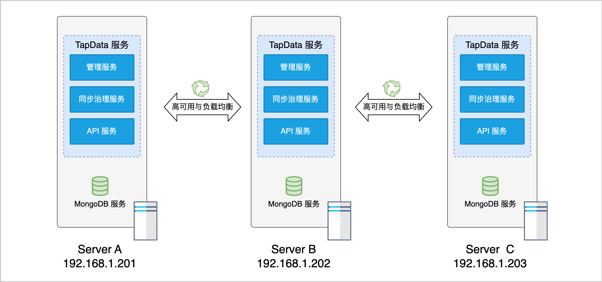
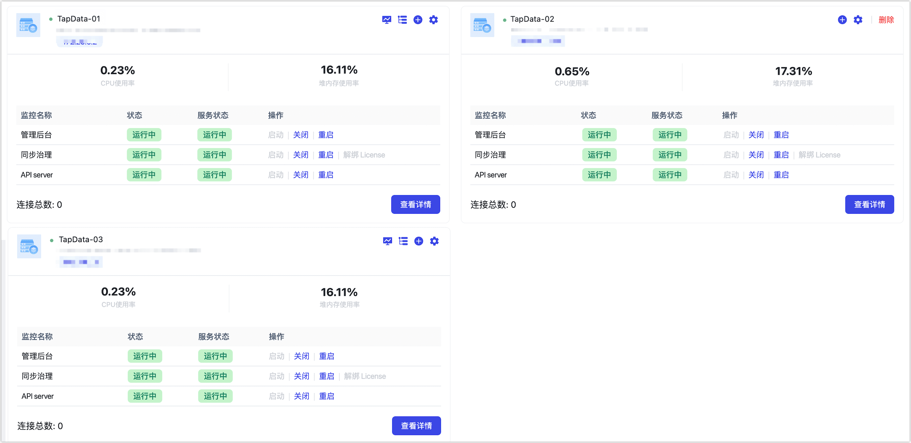

# 部署高可用 TapData Enterprise（三节点）
import Content from '../../reuse-content/_enterprise-features.md';

<Content />

为保障生产环境的业务可靠性，推荐采用高可用部署的方式，本文介绍如何通过三台服务器组建部署高可用的 TapData 服务。

## 部署架构

本案例中，假设我们有三个服务器（架构如下），分别为它们配置了 IP，现在我们希望分别在这三个服务器上部署 **MongoDB 服务**（用于存储 TapData 运行所需信息）和完整的 **TapData 服务**，从而实现整体服务的高可用。



本案例中，机器配置为 **16 核 CPU + 32 GB 内存**，推荐最低配置为 8 核 CPU + 16 GB 内存，操作系统为 CentOS 7 + 或 Ubuntu 16.04 +。

| 部署服务     | 服务端口 | 角色说明                                                     | 资源规划说明                                            |
| ------------ | -------- | ------------------------------------------------------------ | ------------------------------------------------------- |
| 管理服务     | 3030     | 负责提供任务管理服务，任务运行时无需持续占用内存，对负载要求低 | 推荐为总内存的 18%：`32*0.18` = `5.76`，向上取至 6 GB   |
| 同步治理服务 | 不涉及   | 负责执行数据同步/转换任务及其关联的处理节点，需要较多的计算和内存资源 | 推荐总内存的 35%：`32*0.35` = `11.2`，向上取至 12 GB    |
| API 服务     | 3080     | 负责以 API 形式发布表数据，为其提供调用和管理服务，由系统自动分配资源，单进程约使用 100 MB 左右内存 | 默认 Woker 进程数为 CPU 核数，推荐基于 API 服务负载调整 |
| MongoDB 服务 | 27017    | 负责存储 TapData 运行所产生的任务必要配置、共享缓存等信息    | 推荐为总内存的 30%：`32*0.3` = `9.6`，向上取至 10 GB    |

## 准备工作

在部署前，我们需要为这三台服务器执行分别下述操作，本文以 CentOS 7 为例，演示具体的部署流程。

1. 登录至服务器，依次执行下述命令完成文件访问数、防火墙等系统参数设置。

   ```bash
   ulimit -n 1024000 
   echo "* soft nofile 1024000" >> /etc/security/limits.conf 
   echo "* hard nofile 1024000" >> /etc/security/limits.conf 
   systemctl disable firewalld.service 
   systemctl stop firewalld.service 
   setenforce 0 
   sed -i "s/enforcing/disabled/g" /etc/selinux/config 
   ```

2. 执行下述命令安装 Java 17 版本，安装环境依赖。

   ```bash
   yum -y install java-17-openjdk
   ```

3. 设置机器时间与时区，保持一致。

4. [部署 MongoDB 副本集](install-replica-mongodb.md)，用于存储 Tapdata 服务运行所产生的任务必要配置、共享缓存等信息。

   :::tip

   您需要基于机器规格调整 MongoDB 的资源配置，本案例中通过其配置文件，设置的 `cacheSizeGB` 为 `10`，`oplogSizeMB` 为 `512000`，更多配置说明，见 [MongoDB 配置文件选项](https://www.mongodb.com/docs/v4.4/reference/configuration-options)。

   :::

## 安装服务

:::tip

下述操作需要在三台服务器上**分别执行**，从而完成部署流程。

:::

1. 获取 License 文件。

   1. 执行下述命令获取申请所需的 SID 信息。

      ```bash
      java -cp components/tm.jar -Dloader.main=com.tapdata.tm.license.util.SidGenerator org.springframework.boot.loader.PropertiesLauncher
      ```

   2. 将打印出的 SID 信息提供给 TapData 支持团队，完成 License 申请流程。

   3. 将申请到的 License 文件上传至解压后的目录（**tapdata**）中。

2. 下载 TapData 安装包（可[联系 Tapdata](mailto:team@tapdata.io)获取），将其上传至待部署的设备中。

3. 在所有待部署的设备上，执行下述格式的命令，创建安装目录和工作目录，将 Tapdata 安装包解压至该目录。

   ```bash
   # 创建安装目录和工作目录
   mkdir -p /data/tapdata/tapdata_work
   # 解压安装包，需替换安装包名称为真实名称
   tar -zxvf 安装包名 -C /data/tapdata
   ```
   :::tip
   如需将解压后的程序文件复制到其他目录进行部署，请使用 `cp -a` 命令复制整个目录，避免使用 `*` 通配符匹配文件，以免遗漏隐藏文件导致启动失败。
   :::

4. 进入解压后的目录，执行 `./tapdata start` 命令启动 Tapdata 部署程序，然后跟随命令行提示，依次设置 TapData 的登录地址、API 服务端口、MongoDB 连接认证等信息，示例及说明如下：

   :::tip

   如采用非 root 用户部署，应避免使用 `sudo` 提权操作以避免安装失败。在执行命令前，请使用 `sudo chown -R <your-username>:<your-group> <installation-dir>` 或 `sudo chmod -R 777 <installation-dir>` 为当前用户赋予安装目录的完全权限。

   :::

   ```bash
   ./tapdata start
    _______       _____  _____       _______
   |__   __|/\   |  __ \|  __ \   /\|__   __|/\    
      | |  /  \  | |__) | |  | | /  \  | |  /  \   
      | | / /\ \ |  ___/| |  | |/ /\ \ | | / /\ \  
      | |/ ____ \| |    | |__| / ____ \| |/ ____ \ 
      |_/_/    \_\_|    |_____/_/    \_\_/_/    \_\ 
   
   WORK DIR:/root/tapdata
   Init tapdata...
   # 设置 Tapdata 管理界面地址列表
   ✔ Please enter backend url, comma separated list. e.g.:http://127.0.0.1:3030/ (Default: http://127.0.0.1:3030/):  … http://192.168.1.201:3030,http://192.168.1.202:3030,http://192.168.1.203:3030
   # 设置 Tapdata 服务端口，保持默认即可
   ✔ Please enter tapdata port. (Default: 3030):  … 
   ✔ Please enter api server port. (Default: 3080):  … 
   # MongoDB 是否启用认证
   ✔ Does MongoDB require username/password?(y/n):  … y
   # 如果 MongoDB 启用认证，则需要根据提示输入 MongoDB 的账号名和密码
   ✔ Does MongoDB require TLS/SSL?(y/n):  … no
   # 设置 MongoDB 连接串
   ✔ Please enter mongodb connection string without username and password (Default: mongodb://127.0.0.1:27017/tapdata)
   mongodb://192.168.1.201:27017,192.168.1.202:27017,192.168.1.203:27017/tapdata
   ✔ Does API Server response error code?(y/n):  … yes
   System initialized. To start Tapdata, run: tapdata start
   WORK DIR:/data/tapdata/tapdata_work
   Testing JDK...
   java version:17
   Java environment OK.
   Unpack the files...
   frontend server started.begin deploy init
   Try to connect to TM for deploy connector...
   deploy connector...
   ```

   * **Please enter backend url**：设置 TapData 平台的登录地址，此处我们需要设置服务器 A 和 B 的登录地址，以英文逗号（,）分隔，即填入：`http://192.168.1.201:3030,http://192.168.1.202:3030,http://192.168.1.203:3030`
   * **Please enter tapdata port**：设置 TapData 平台的登录端口，默认为 `3030`。
   * **Please enter api server port**：设置 API Server 的服务端口，默认为 `3080`。
   * **Does MongoDB require username/password?**：MongoDB 数据库是否启用了安全认证，未启用则输入 **n**，如果启用则输入 **y**，然后根据提示分别输入用户名、密码和鉴权数据库（默认为 `admin`）。
   * **Does MongoDB require TLS/SSL?(y/n)**：MongoDB 数据库是否启用 TSL/SSL 加密，未启用则输入 **n**，如果启用则输入 **y**，然后根据提示分别输入 CA 证书和 Certificate Key 文件的绝对地址路径，以及 Certificate Key 的文件密码。
   * **Please enter MongoDB host, port, database name**：设置 MongoDB 数据库的 URI 连接信息，本案例中，我们填写为 `mongodb://192.168.1.201:27017,192.168.1.202:27017,192.168.1.203:27017/tapdata`。
   * **Does API Server response error code?**：是否启用 API Server 响应错误码功能。

   部署成功后，命令行返回示例如下：

   ```bash
   deployed connector.
   Waiting for the flow engine to start \
   FlowEngine is startup at : 2023-04-01 23:10
   API service started
   ```

5. 调整 TapdData 内存资源配置，本案例中机器内存为 32 GB，MongoDB 服务已分配了 8 GB，即剩余 24 GB 可用内存，参数及说明如下：

   - `tapdataTMJavaOpts`：控制管理服务的内存使用限制，通常设置为总内存的 18% 左右，本案例中设置为 `"-Xms6G -Xmx6G"`
   - `tapdataJavaOpts`：控制数据同步治理服务的内存使用限制，通常设置为总内存的 35%，本案例中设置为 `"-Xms12G -Xmx12G"`
   - `apiWorkerCount` ：控制 API 服务中 Woker 的个数，默认为 CPU 核数，可基于 API 服务负载设置，本案例中设置为 `4`

6. 为 TapData 服务设置开机启动。

   1. 进入 `/usr/lib/systemd/system` 目录， 使用文本编辑器（如 `vim`）创建一个新的服务文件并命名为 `tapdata.service`，将下述文件内容粘贴到文件中。

      ```bash
      [Unit]
      Description=Tapdata Service
      After=network.target
      
      [Service]
      Type=simple
      User=root
      # 根据 tapdata 安装路径 设置下述路径
      ExecStart=/data/tapdata/tapdata start
      ExecStop=/data/tapdata/tapdata stop
      Restart=on-failure
      
      [Install]
      WantedBy=multi-user.target
      ```

   2. 加载新的服务文件，并启用以实现开机启动：

      ```bash
      sudo systemctl daemon-reload
      sudo systemctl enable tapdata.service
      ```

   3. （可选）在业务低峰期，重启机器并通过 `systemctl status tapdata.service` 命令查看 TapData 服务是否正常启动。

## 登录 TapData

为三个服务器均执行上述操作完成部署后，即可在同一内网的设备，通过 `http://192.168.1.201:3030`、`http://192.168.1.202:3030` 或 `http://192.168.1.203:3030` 来登录管理页面，如配置了本机 DNS 也可以通过服务器对应主机名登录。

:::tip
首次登录请及时修改密码以保障安全性。
:::

登录成功后，在**系统管理** > **集群管理**中，即可查看到三个服务器上 TapData 服务的状态。




## 下一步

[连接数据库](../../quick-start/connect-database.md)