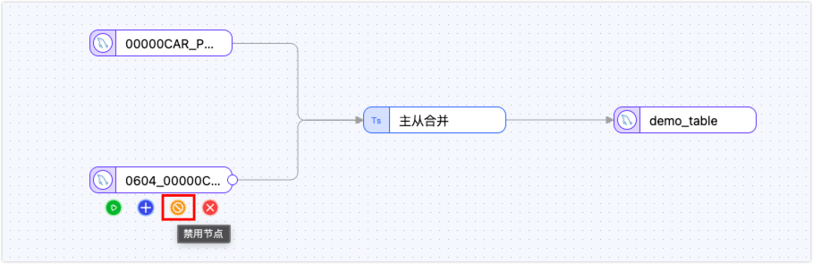
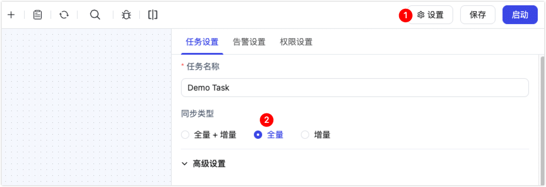
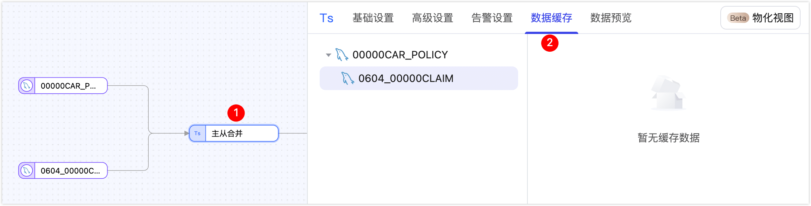

# 任务故障排查

本文介绍 TapData 数据同步任务的运维管理、性能优化、故障排查等操作指南，帮助您保障数据链路的稳定运行。

## 如何排查数据同步任务异常？

当发现数据同步出现异常时，建议按照以下步骤进行系统性排查：

1. 检查任务运行状态。
   
   首先前往[任务监控页面](../../user-guide/copy-data/monitor-task.md)，查看任务状态是否正常，是否处于运行中状态，同时检查是否有其他异常信息。如果任务虽然显示运行中但存在警告信息（如正在重试），说明任务可能处于重试状态，此时数据同步可能无法正常进行。

2. 分析任务日志。
   
   
   在任务监控页面，查看下方的运行日志，重点关注是否存在异常日志记录。如发现异常日志，应根据日志中的具体提示信息进行相应处理。也可以单击对应的错误码查看解决方案，更多介绍，参考[任务日志错误与排查参考](troubleshooting/README.md)。

3. 重启任务验证。
   
   按照日志提示完成问题处理后，重新启动任务观察是否能够恢复正常同步。

4. 重置任务处理。
   
   如果重启后仍无法恢复同步，可以停止任务并重置，从而清除任务的同步进度，重新启动任务以重新执行数据同步任务。

## 同步性能较差，如何排查？

同步性能类问题，我们需要将任务的执行过程进行分解，即源端、目标端和引擎，然后判断瓶颈可能的节点。

- 目标：替换逻辑，例如用 DummyDB 替换目标，观察任务执行的情况，如果性能提升明显，可初步定位为目标端问题，可从目标端入手进行详细排查。
- 引擎：跟踪逻辑，按处理时间延时对每一个引擎处理节点进行排序，找到延时最长（Top N）的节点信息，作为重点目标进行详细排查，然后制造一个问题任务的克隆任务，对来源到目标的每一条实体数据进行跟踪，记录该数据通过引擎处理节点的延时，输出最细粒度的日志信息，确认问题节点的具体问题原因。
- 来源：排除逻辑，由于 TapData 对于不同来源的实现方式不同，判定问题是否与来源相关的方式是首先确定问题与目标和引擎无关，然后再根据来源的具体情况确定排查策略。

此外，我们还需要考虑不同阶段的处理过程所导致的处理延时和网络传输延迟。

## 如何处理告警性通知？

TapData 通过[邮件发送告警](../../case-practices/best-practice/alert-via-qqmail.md)，帮助您监控任务状态。您可以根据告警标题识别类型，并参考以下指南进行处理。

**任务状态变更告警**

| 告警类型 | 含义 | 处理建议 |
| --- | --- | --- |
| **任务遇到错误** | 任务因错误而停止，数据同步中断。 | 登录平台查看任务错误日志，根据提示解决问题后重启任务。若无法解决，请联系技术支持。 |
| **任务全量完成** | 任务的全量数据同步阶段已完成。 | 此为提示信息，通常无需操作。如需校验数据，可执行数据校验任务。 |
| **任务增量开始** | 任务已进入增量数据同步阶段。 | 此为提示信息，无需操作。 |
| **任务停止** | 任务被手动停止。 | 确认是否为误操作。如是，请及时登录平台重启任务。 |

**任务复制延迟超过阈值告警**

当任务的增量同步延迟超过预设阈值时，会触发此告警。请登录 TapData 平台，通过任务监控信息排查以下几点原因：

- **源端读取慢**：当源节点“读取耗时”指标异常升高时，可联系数据库或网络管理员排查源库负载或网络波动情况。
- **目标写入慢或增量事件过多**：当任务 QPS 持续很高或目标“平均写入时间”较长时，可适当调大源节点的“增量事件读取条数”（建议不超过 1000）和目标节点的“每批次写入条数”（建议不超过 10,000），并关注 Agent 内存使用率（建议不超过 70%）。
- **虚假延迟**：当任务 QPS 为 0 但增量延迟仍在增长时，可在源端启用[心跳表](../../case-practices/best-practice/heart-beat-task.md)功能以推进增量位点。
- **引擎处理慢**：当处理节点的“平均处理时间”持续增加时，需优化任务中的 JS 计算等处理逻辑，或联系技术支持协助排查。

**校验与性能告警**

| 告警类型 | 含义 | 处理建议 |
| --- | --- | --- |
| **任务校验差异** | 增量校验发现数据不一致。 | 若开启“[增量校验自动修复](../../user-guide/incremental-check.md)”则无需操作；也可以进入任务“增量校验”页手动修复差异。 |
| **数据源节点处理时间超阈值** | 源或目标库平均处理时间变长，通常是数据库负载高或网络延迟导致。 | 如已触发“增量延迟告警”，按上述“源端读取慢”方案处理；如未触发可先观察，若后续出现延迟再联系 DBA 检查。 |
| **处理节点处理时间超阈值** | JS 等处理节点平均耗时增加，存在性能瓶颈。 | 如已触发增量延迟，按上述“引擎处理慢”方案优化节点逻辑；如未触发可先观察，若导致延迟再联系技术支持。 |
| **验证任务报错** | 数据验证任务执行失败，验证停止。 | 验证失败不影响同步任务，一般无需立即处理。进入验证任务查看错误信息并重试，仍失败请联系技术支持。 |
| **计数校验差异超阈值** | 计数校验发现差异行数超过设定值。 | **全量任务**：切换为“全字段值校验”定位差异并修复；**增量任务**：等待 1-2 个延迟周期后再次验证，若差异仍存在再修复。 |
| **字段值校验差异超阈值** | 全字段/关联字段校验差异数量超过阈值。 | 同“计数校验差异超阈值”处理流程。 |
| **任务重试告警** | 任务连续重试仍未恢复，同步中断。 | 立即登录平台查看重试原因，按错误提示处理；无法恢复请联系技术支持。 |

## 如何修复主数据层（MDM）中的数据异常？

当发现主数据层（MDM，也称平台加工层）中的数据存在异常时，可通过同步任务进行数据修复。根据数据量大小选择合适的修复策略：数据量较小时建议直接重新运行任务生成模型；数据量较大时，建议仅针对异常表进行重新同步。下面详细介绍通过重新同步异常表来修复数据的具体方法。

主表与子表概念说明

- **主表**：生成最终模型的关键表，是 MDM 模型的核心
- **子表**：在 MDM 模型中以主表字段形式存在的嵌入式文档或数组

例如，在订单管理场景中，orders 订单表为主表，可以将 users 用户信息表和 products 产品信息表作为子表，以嵌入式文档的形式合并到订单数据中。这样分析师可以通过统一的订单视图快速识别高价值客户，支持优惠券投放、忠诚度计划等精准营销活动。

在修复前，我们可以前往实时数据中心，查看表数据的血缘关系，了解其关联的任务

### 修复主表异常数据

当主表数据出现异常时，按以下步骤处理：

1. 首先停止任务运行，记录任务停止时的增量时间点 t1。

2. 对任务执行重置操作，清除任务状态和换成信息。

3. 找到并编辑任务，禁用所有子表节点。

    

5. 单击页面右上角的设置按钮，将任务调整为仅全量同步模式，将主表已有数据重新同步到 MDM 模型中。
    

6. **选择修复策略**
   
   - **完全重新同步**：直接启动任务，待主表全量完成后，重新编辑任务恢复，单击任务配置右上角的设置按钮，设置为仅增量模式，并设置我们在步骤 1 记录的增量起始时间为 t1，启用所有之前禁用的节点，重新启动任务。
   - **条件筛选同步**：如异常数据可通过筛选条件匹配，在主表源节点设置自定义筛选条件，仅同步需要修复的数据。

### 修复子表异常数据

当子表数据出现异常时，按以下步骤处理：

1. 停止子表相关任务的运行。
   
2. 编辑任务，单击主从合并节点，在缓存管理中，对需要重新同步的子表缓存执行重建操作。

   

3. 重新启动任务，系统将自动对缓存的子表进行全量重新同步。

4. 任务会等待子表全量完成后继续进行增量同步。

## 相关文档
- [数据链路常见问题处理](../../faq/data-pipeline.md)
- [产品特性问题解答](../../faq/use-product.md)