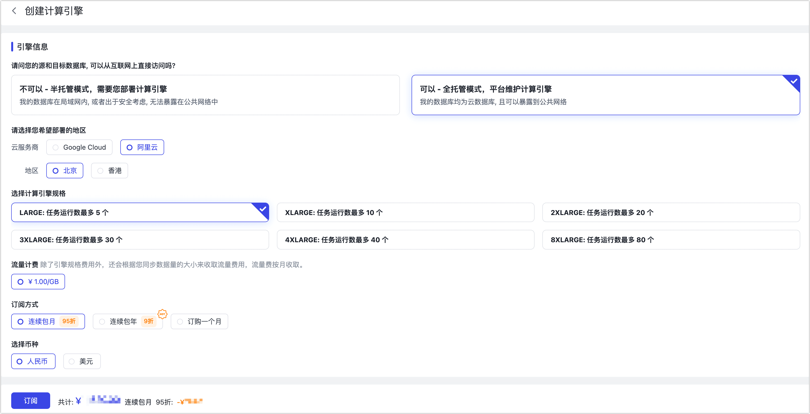

# 订阅实例

import Content from '../reuse-content/_cloud-features.md';

<Content />

注册 [TapData Cloud](https://cloud.tapdata.net/console/v3/) 后，您可以免费创建一个 Agent 实例，如需创建更多的 Agent 或更高的传输性能，您可以跟随本文流程，在 TapData Cloud 平台或阿里云市场订阅 Agent 实例。

:::tip

如您选用的是 TapData Enterprise 产品，则是按年支付相应的订阅费用，可部署至本地数据中心，适合对数据敏感性或网络隔离有严格要求的场景，正式采购前可[申请试用](https://tapdata.net/tapdata-on-prem/demo.html)‍。

:::

Agent 有什么作用？

Agent 是数据同步、数据异构、数据开发场景中的关键程序，负责通过流式技术从源库获取数据、处理转换数据并发送到目标库，由云上的管理端统一管理。

## 通过 TapData Cloud 订阅实例（推荐）

1. 登录 [TapData Cloud 平台](https://cloud.tapdata.net/console/v3/)。

2. 在左侧导航栏，单击**资源管理**。

   当前我们已经创建了一个免费的 Agent 实例（半托管模式），现在我们需要订阅更多的 Agent 实例以满足业务对性能需求。

   

3. 单击页面右侧的**创建计算引擎**。

4. 在弹出的对话框中，选择托管模式并单击**下一步**。

   * 
   
5. 本文以**全托管模式**为例演示购买流程，首先选择计费方式、Agent 规格等信息。

   

   * **引擎信息**：基于业务需求选择工作模式，此外，您还可以通过[阿里云市场](https://market.aliyun.com/products/56024006/cmgj00061912.html)采购/试用，在本页面下方选择**直接使用阿里云授权码**以完成绑定。
     * **半托管模式**：由您提供设备来部署和运维 Agent，为其运行提供计算/存储资源，可充分利用现有硬件资源，获得更低的价格的同时，进一步提升安全性。
     * **全托管模式（推荐）**：由 TapData Cloud 提供 Agent 运行所需的计算/存储资源并自动部署，同时提供统一的运行维护和资源监控以提升运行可靠性，可实现一键交付使用，免去部署和运维精力，专注业务本身。
   
   * **云服务商**、**地区**：选择为**全托管模式**时需设置，目前支持阿里云的**北京**和**香港**。
   * **计算引擎规格**：基于评估所需的任务数和性能需求，选择产品规格，您可免费创建一个 **SMALL** 规格（半托管模式）的实例，关于产品定价及规格的详细说明，见[计费概述](billing-overview.md)。
   * **流量计费**：选择为**全托管模式**时，您还需要基于同步的数据量支付流量费用（按月收取），前 100 GB 免费。
   * **订阅方式**：选择需要的订阅方式，为避免实例到期影响任务的执行，推荐选择连续包月（**95 折**优惠）或连续包年（**9 折**优惠）。
   * **币种**：选择支付所用的币种。
   
7. 单击页面右下角的**订阅**，确认待购买的规格、计费方式，确认接收账单的邮箱，然后单击**立即支付**。

   :::tip

   您也可以[联系 TapData](../support.md) 进行对公汇款，流程完成后，TapData 将尽快联系您开通服务，您也可以通过页面左下方的在线客服联系我们。

   :::

7. 在跳转到的支付页面，根据页面指引完成支付流程，支持信用卡支付，完成支付后可下载支付凭证信息。

8. 支付成功后，页面将自动跳转回 TapData Cloud 平台，可查看到您购买的 Agent 实例处于**待部署**状态。
   :::tip
   如您选择的是**全托管模式**，Agent 将自动完成部署；如您选择的是**半托管模式**，您需要手动在您的设备上[部署 Agent](../quick-start/install/install-tapdata-agent/README.md)。
   :::

## 通过阿里云市场订阅实例

1. 登录[阿里云市场](https://market.aliyun.com/)。

2. 在页面顶部的搜索框，输入 **TapData** 并搜索。

3. 在搜索结果页，单击 TapData 卡片对应的**查看详情**。

   

4. 在跳转到的页面中，选择实例配置。

   * **套餐版本**：基于评估所需的任务数和性能需求，选择产品规格，可免费创建一个 **SMALL** 规格的实例，关于产品定价及规格的详细说明，见[计费概述](billing-overview.md)。
   * **托管模式**：根据业务需求和下述说明选择托管模式。
     * **全托管模式（推荐）**：由 TapData Cloud 提供 Agent 运行所需的计算/存储资源并自动部署，同时提供统一的运行维护和资源监控以提升运行可靠性，可实现一键交付使用，免去部署和运维精力，专注业务本身。
     * **半托管模式**：由您提供设备来部署和运维 Agent，为其运行提供计算/存储资源，可充分利用现有硬件资源，获得更低的价格的同时，进一步提升安全性。

   * **购买时长**：根据业务需求选择购买时长，您也可以选择**试用 14 天**（仅一次）。

5. 单击**立即购买**，然后在跳转到的页面完成支付流程。

   :::tip

   推荐在此页面选中自动续费，避免实例到期影响任务的执行。

   :::

6. 绑定 Agent 实例至 TapData Cloud 平台。

   1. 前往[云市场控制台](https://market.console.aliyun.com/imageconsole/index.htm)。

   2. 在**已购买的服务页面**中，单击已购买实例的**详情**。

      

   3. 复制授权码信息，单击**激活地址**。

      

   4. 在跳转到的 TapData Cloud 平台，完成登录后输入授权信息并单击**激活**。

   5. 页面提示成功后，单击页面右下方的**前往控制台**。

      :::tip

      您可以单击 TapData Cloud 平台页面右上角的用户名，选择**用户中心**，下翻至页面底部的**服务订阅信息**区域，可查看到您绑定的授权码信息。

      :::

7. 基于阿里云授权码创建 Agent 实例。

   1. 在 TapData Cloud 平台的左侧导航栏，单击**创建 Agent**。

   2. 在弹出的对话框下方，单击**直接使用阿里云市场授权码**。

   3. 页面显示您已绑定的授权码信息，单击右侧的**创建 Agent**。

      

      :::tip
      如您选择的是**全托管模式**，您还需要选择部署的地区并单击**部署**，TapData Cloud 将自动完成 Agent 的部署；如您选择的是**半托管模式**，您需要根据跳转到的页面的提示，在您的设备上[部署 Agent](../quick-start/install/install-tapdata-agent/README.md)。
      :::

## 下一步

为保障后续数据复制/转换功能正常使用，您需要调整相关防火墙以保障 Agent 可与 TapData Cloud、源/目标数据库间的正常通信，Agent 工作流程如下所示： 

如果您订阅的是[全托管 Agent](#hosted-mode)，且待连接的数据源只接受与特定的 IP 地址建立连接，此时您需要将 Agent 所属的服务器地址添加至数据源对应的安全设置中，例如添加至自建数据库的防火墙白名单规则中，以允许 Agent 与您的数据源建立通信与传输数据，各地域 Agent 服务器地址如下：

- 阿里云 北京：**47.93.190.224**
- 阿里云 香港：**47.242.251.110**
