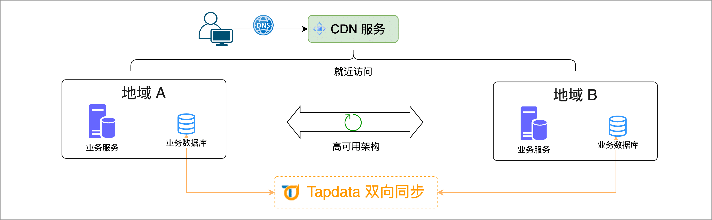

# MySQL 双向同步实现异地多活
import Content from '../reuse-content/_all-features.md';

<Content />

随着企业业务的快速发展，保障数据一致性与系统高可用性成为核心需求。通过不同地域间的数据同步，不仅可以实现就近访问，降低响应延迟，还能构建异地多活架构，从而提高系统在面对单点故障时的稳定性与可靠性。

在本文中，我们将介绍如何使用 Tapdata 实现两个地域的 MySQL 数据库之间的双向同步，从而实现多活架构，保障业务持续性。

## 场景说明

随着业务的快速发展和用户数量的增长，如果业务部署在单个地域中，可能会面临如下问题：

- **高访问延迟**：用户在地理位置上分布较广，地理位置较远的用户访问延迟较高，影响用户体验。
- **扩展受限**：单个地域底层基础设施的能力限制了业务扩展，例如供电能力、网络带宽建设能力等。

为了解决上述问题，您可以通过 TapData 实现同城或异地多个业务单元间的数据实时同步，从而保障全局数据的一致性。当任何一个单元出现故障时，只需将流量自动切换至其他可用单元即可，有效地保障服务的高可用性。

TapData 通过跨地域的数据同步，帮助企业实现如下目标：

- **降低访问延迟**：通过将数据同步至离用户最近的业务单元，显著降低访问延迟，提升用户体验。
- **提高系统扩展性**：突破单个地域基础设施的限制，利用多个地域的资源进行业务扩展。
- **增强高可用性**：在任一单元出现故障时，能够快速将流量切换至其他可用单元，确保业务连续性。

:::tip

Tapdata 支持 MySQL ↔ MySQL、PostgreSQL ↔ PostgreSQL、MongoDB ↔ MongoDB、PostgreSQL ↔ MySQL 的双向数据同步，接下来，我们以 MySQL 间的双向同步为例介绍具体的操作流程。

:::

## 注意事项

- 为保障双向的 DML 操作可正常执行，待同步的表需具备主键。
- 双向同步期间，请勿对同步的表执行 DDL 变更（如增加列），否则将导致任务失败。
- 双向同步任务由 2 个数据同步任务构成，其中一个任务负责同步全量与增量数据，另一个仅需选择同步增量数据，避免数据重复。
- 为保障双向同步任务的正常运行，Tapdata 会自动在数据库中新增一个名为 `_tap_double_active` 的表用于记录任务心跳信息。

## 准备工作

[分别连接两个地域的 MySQL 数据库](../../prerequisites/on-prem-databases/mysql.md)

:::tip

您需要跟随该文档中的介绍，完成 Binlog 配置并创建用于数据同步的账号。

:::

## 操作步骤

1. [登录 TapData 平台](../../user-guide/log-in.md)。

2. 在左侧导航栏，单击**数据转换**。

3. 创建正向数据同步任务。

   1. 单击页面右侧的**创建**。

   2. 在页面左侧，将我们在准备工作创建的两个地域的 MySQL 数据源（分别命名为 Region A 和 Region B），分别拖拽至右侧画布中，然后将其连接起来。

   3. 单击 Region A 节点，选择要同步的表，本案例选择为 `customer` 表。更多参数的介绍（如高级设置），见[创建数据复制任务](../../user-guide/copy-data/create-task.md)。

      

      :::tip

      为保障任务正常运行，请勿打开高级配置中的**同步 DDL 事件**开关。

      :::

   4. 单击 Region B 节点，根据下述说明完成节点配置。

      

      * **目标表结构**：展示 TapData 将写入目标端的表结构信息，该信息基于源端节点设置所推演，您还可以直接单击目标字段旁的编辑按钮，在弹出的对话框中调整字段类型和精度。
      * **重复处理策略**：根据业务需求选择，默认为**保持目标端原有表结构和数据**。 
      * **全量多线程写入**：全量数据写入的并发线程数，默认为 **8**，可基于目标端写性能适当调整。 
      * **增量多线程写入**：增量数据写入的并发线程数，默认未启用，启用后可基于目标端写性能适当调整。 
      * **每批次写入条数**：全量同步时，每批次写入的条目数，默认为 100 条。 
      * **每批写入最大等待时间**：根据目标库的性能和网络延迟评估，设置最大等待时间，默认为 500 毫秒。     

   5. 单击页面右上角的**设置**，设置同步类型为**全量+增量**，然后打开**双向同步**开关。

      

   6. 单击**启动**，等待任务启动运行。

4. 返回至数据复制任务列表页面，找到刚刚配置的任务，等待其进入**增量数据复制**状态。

   

5. 配置反向增量同步任务。

   1. 单击页面右侧的**创建**。

   2. 在页面左侧，将我们在准备工作创建的两个地域的 MySQL 数据源（分别命名为 Region A 和 Region B），分别拖拽至右侧画布中，然后将其连接起来。

   3. 单击 Region B 节点，选择要反向同步的表，保持和正向同步任务的表相同，本案例中为 `customer` 表。

      

   4. 单击 Region A 节点，确认表结构预览无误，其他保持默认即可。

   5. 单击页面右上角的**设置**，设置同步类型为**增量**，然后打开**双向同步**开关。

      

   6. 确认无误后，单击**启动**。

      操作完成后，您可以在当前页面观察任务的执行情况，如 RPS（每秒处理记录数）、延迟、任务时间统计等信息。

6. 等待一段时间后，在任务列表可查看到刚刚创建的 2 个任务均已进入增量同步复制状态。

   

   至此，我们已完成双向同步任务的配置，接下来，您可以验证双向同步的效果，例如在 Region A 的数据上变更一条数据，然后在 Region B 上查看其变化。

   :::tip

   对于 Tapdata Enterprise 产品，您还可以通过[数据校验](../../user-guide/verify-data.md)功能，对双向同步的两个任务的数据进行持续校验，更好满足业务需求。

   :::

## 任务管理

在任务列表页面，您还可以对任务进行启动/停止、监控、编辑、复制、重置、删除等操作。

具体操作，见[管理任务](../../user-guide/copy-data/manage-task.md)。
