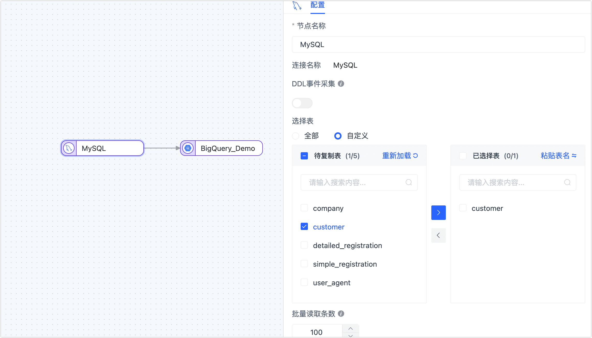
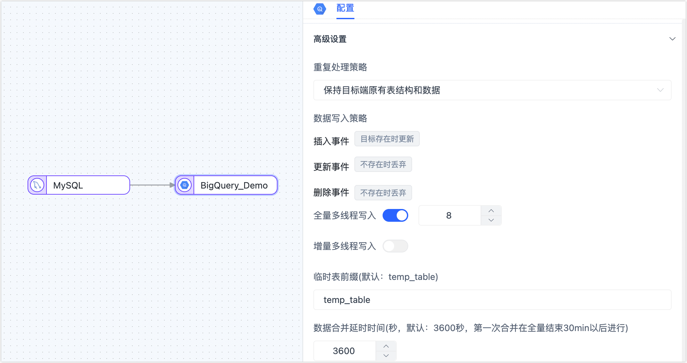
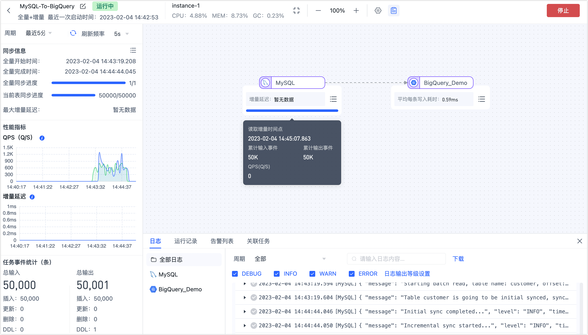
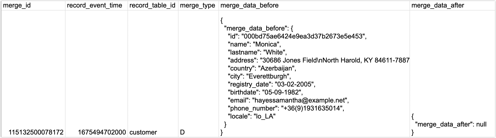

# MySQL 实时同步至 BigQuery
import Content from '../../reuse-content/_all-features.md';

<Content />

[BigQuery](https://cloud.google.com/bigquery/docs?hl=zh-cn) 是 Google Cloud 的全代管式 PB 级经济实惠的分析数据仓库，可让您近乎实时地分析大量数据。通过 TapData 可以将多种数据源实时同步至 BigQuery，轻松实现数据的流转，更好满足业务数据架构变化或大数据分析场景。

本文以 MySQL 为源数据为例，演示如何将其数据同步至 BigQuery，其他数据的配置方法与本文流程类似。

## 准备工作

在创建同步任务前，请确保您已经配置好了相关数据源：

1. [配置 MySQL 连接](../../prerequisites/on-prem-databases/mysql.md)
2. [配置 BigQuery 连接](../../prerequisites/warehouses-and-lake/big-query.md)

同时还请注意参考[数据类型支持说明](../../user-guide/no-supported-data-type.md)。

## 配置任务

1. 登录 TapData 服务平台。

2. 在左侧导航栏，单击**数据复制**。

3. 单击页面右侧的**创建**。

4. 在页面左侧，将 MySQL 和 BigQuery 数据源拖拽至右侧画布中，然后将其连接起来。

5. 单击 MySQL 数据源，根据下述说明完成右侧面板的参数配置。

   

   - **节点名称**：默认为连接名称，您也可以设置一个具有业务意义的名称。
   - **DDL 事件采集**：BigQuery 暂不支持 DDL 写入，无需配置此参数。
   - **动态新增表**：打开该开关后，TapData 会自动将源库新增/删除的表同步到目标库，仅在选择了全部表时生效。
   - **选择表**：可选择**全部**或**自定义**，如选择为**自定义**，您还需要在下方选择要同步的表。
   - **批量读取条数**：全量同步时，每批次读取的记录条数，默认为 **100**。

6. 单击 BigQuery 数据源，预览数据结构并设置高级选项。

   1. 在推演结果区域框，可预览同步后的数据结构。

      :::tip

      如需调整字段类型，单击目标字段类型中的图标，然后在弹出的对话框中完成设置。

      :::

   2. 下翻至**高级设置**区域框，完成高级设置。

      

      - **重复处理策略**、**数据写入策略**：根据业务需求选择，也可保持默认。
      
      - **全量写入线程数**：全量数据写入的并发线程数，默认为 **8**，可基于目标端写性能适当调整。
      
      - **增量写入线程数**：增量数据写入的并发线程数，默认未启用，可基于目标端写性能适当调整。
      
      - **临时表前缀**：源表执行的 INSERT 操作会被直接同步至目标表，而当源表执行了 UPDATE/DELETE 操作后，该记录将被同步至目标数据集的临时表，此处配置临时表的名称前缀。
      
        :::tip
      
        更多临时表的原理介绍，见[常见问题](#faq)。
      
      - **数据合并时间**：TapData 会间隔指定的时间，将临时表的数据合并至目标表，合并时间越短，目标表的数据越新，首次合并时间为全量结束后的 1 小时进行。

7. 确认无误后，单击**启动**。

   操作完成后，您可以在当前页面观察任务的执行情况，如 RPS（每秒处理记录数）、延迟、任务时间统计等信息，示例如下：

   

## 任务管理

在任务列表页面，您还可以对任务进行启动/停止、监控、编辑、复制、重置、删除等操作。

具体操作，见[管理任务](https://tapdata.netlify.app/cloud/user-guide/copy-data/manage-task)。

##  常见问题 

* 问：为什么 Agent 所属的机器要能访问谷歌云服务？

  答：Agent 通过流式技术从源端获取数据、处理转换数据并发送到目标端，因此需要访问到谷歌云的 BigQuery 服务，以保障数据可写入至 BigQuery 中。

* 问：临时表的工作原理是什么？

  答：为提升数据写入 BigQuery 的性能，降低数据延迟，TapData 基于 BigQuery 数据特征，组合使用 Stream API 与 Merge API，其过程如下：

  1. 在全量写入阶段，使用 Stream API 进行数据导入。

  2. 在增量写入阶段，先将增量事件写入至 BigQuery 的临时表，周期性地将临时表的数据合入至主表，完成 UPDATE 和 DELETE 操作的同步。

     :::tip

     为避免触发 Stream API 写入的数据无法被更新的限制，首次数据合并时间为全量结束后的 1 小时进行。

     :::

* 问：临时表的结构是什么样的？

  答：下图以临时表中一条数据为例展示其结构和数据，其中 **merge_data_before** 和 **merge_data_after** 分别存储了该条记录变更前后的数据，数据类型为 [Record](https://cloud.google.com/bigquery/docs/nested-repeated?hl=zh-cn)，由于此条记录的 **merge_type** 为 **D**（DELETE 的缩写），即删除数据，则 **merge_data_after** 的内容为空。

  

* 问：为什么在 BigQuery 查询到的数据不是最新的？

  答：您可以在任务的管理界面查看增量延迟信息，排除网络延迟因素后，可能因临时表尚未合并至目标 BigQuery 表引起，您可以等待其自动合并后再查询。

