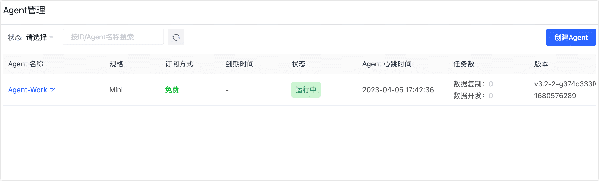
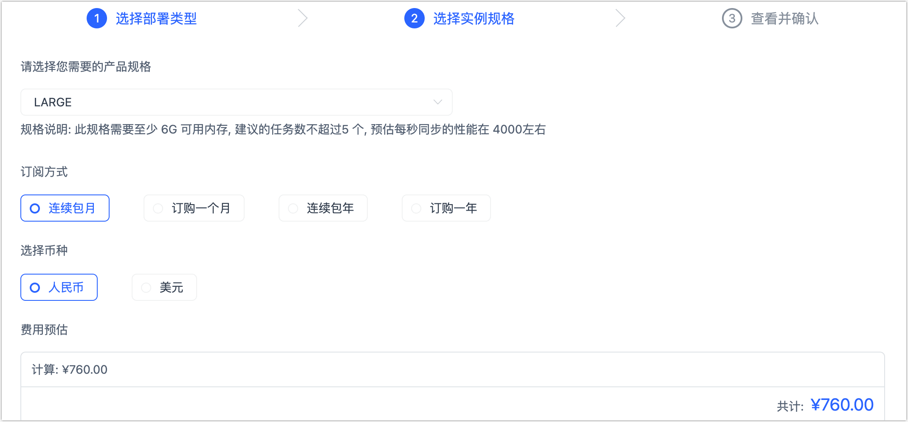
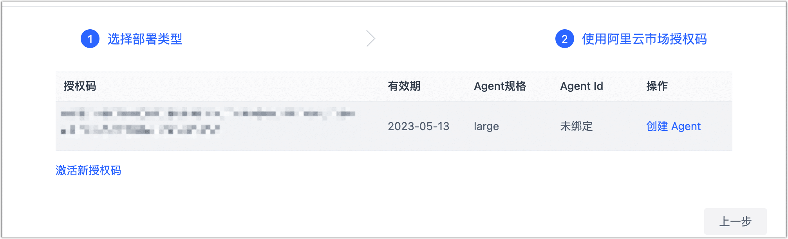

# 订阅实例

注册 Tapdata Cloud 后，您可以免费创建一个 Agent 实例，如需创建更多的 Agent 或更高的传输性能，您可以跟随本文流程，在 Tapdata Cloud 平台或阿里云市场订阅 Agent 实例。

## 通过 Tapdata Cloud 订阅实例（推荐）

1. 登录 [Tapdata Cloud 平台](https://cloud.tapdata.net/console/v3/)。

2. 在左侧导航栏，单击 **Agent 管理**。

   当前我们已经创建了一个免费的 Agent 实例，现在我们需要订阅更多的 Agent 实例以满足业务对性能需求。

   

3. 单击页面右侧的**创建 Agent**。

4. 在弹出的对话框中，选择托管模式并**单击下一步**。

   * **全托管模式（推荐）**：由 Tapdata Cloud 提供 Agent 运行所需的计算/存储资源并自动部署，同时提供统一的运行维护和资源监控以提升运行可靠性，可实现一键交付使用，免去部署和运维精力，专注业务本身。
   * **半托管模式**：由您提供设备来部署和运维 Agent，为其运行提供计算/存储资源，可充分利用现有硬件资源，获得更低的价格的同时，进一步提升安全性。

   :::tip

   此外，您还可以通过[阿里云市场](https://market.aliyun.com/products/56024006/cmgj00061912.html)采购/试用 Tapdata Cloud，在阿里云市场获得授权码后，在本页面下方选择**直接使用阿里云授权码**以完成绑定。

   :::

5. 本文以**全托管模式**为例演示购买流程，首先在**选择实例规格**页签中，选择 Agent 规格、计费方式等信息。

   

   * **产品规格**：基于评估所需的任务数和性能需求，选择产品规格，可免费创建一个 **SMALL** 规格的实例，关于产品定价及规格的详细说明，见[计费概述](billing-overview.md)。
   * **云服务商**：选择为**全托管模式**时需设置，目前支持**青云**。
   * **地区**：选择为**全托管模式**时需设置，目前支持**广东 2**。
   * **订阅方式**：选择需要的订阅方式，为避免实例到期影响任务的执行，推荐选择连续包月（**95 折**优惠）或连续包年（**9 折**优惠）。
   * **选择币种**：当前支持人民币或美元。

6. 单击页面右下角的**下一步**，确认待购买的规格、计费方式，确认接收账单的邮箱，然后单击**在线支付**。

   :::tip

   您也可以单击**转账支付**，页面将展示账户信息，完成转账后，Tapdata Cloud 将尽快联系您开通服务，您也可以通过页面左下方的在线客服联系我们。

   :::

7. 在跳转到的支付页面，根据页面指引完成支付流程，支持信用卡支付，完成支付后可下载支付凭证信息。

8. 支付成功后，页面将自动跳转回 Tapdata Cloud 平台，可查看到您购买的 Agent 实例处于**待部署**状态。

   
   :::tip
   如您选择的是**全托管模式**，Agent 将自动完成部署；如您选择的是**半托管模式**，您需要手动在您的设备上[部署 Agent](../quick-start/install-agent/README.md)。
   :::

## 通过阿里云市场订阅实例

1. 登录[阿里云市场](https://market.aliyun.com/)。

2. 在页面顶部的搜索框，输入 **Tapdata** 并搜索。

3. 在搜索结果页，单击 Tapdata 卡片对应的**查看详情**。

   

4. 在跳转到的页面中，选择实例配置。

   * **套餐版本**：基于评估所需的任务数和性能需求，选择产品规格，可免费创建一个 **SMALL** 规格的实例，关于产品定价及规格的详细说明，见[计费概述](billing-overview.md)。
   * **托管模式**：根据业务需求和下述说明选择托管模式。
     * **全托管模式（推荐）**：由 Tapdata Cloud 提供 Agent 运行所需的计算/存储资源并自动部署，同时提供统一的运行维护和资源监控以提升运行可靠性，可实现一键交付使用，免去部署和运维精力，专注业务本身。
     * **半托管模式**：由您提供设备来部署和运维 Agent，为其运行提供计算/存储资源，可充分利用现有硬件资源，获得更低的价格的同时，进一步提升安全性。

   * **购买时长**：根据业务需求选择购买时长，您也可以选择**试用 14 天**（仅一次）。

5. 单击**立即购买**，然后在跳转到的页面完成支付流程。

   :::tip

   推荐在此页面选中自动续费，避免实例到期影响任务的执行。

   :::

6. 绑定 Agent 实例至 Tapdata Cloud 平台。

   1. 前往[云市场控制台](https://market.console.aliyun.com/imageconsole/index.htm)。

   2. 在**已购买的服务页面**中，单击已购买实例的**详情**。

      

   3. 复制授权码信息，单击**激活地址**。

      

   4. 在跳转到的 Tapdata Cloud 平台，完成登录后输入授权信息并单击**激活**。

   5. 页面提示成功后，单击页面右下方的**前往控制台**。

      :::tip

      您可以单击 Tapdata Cloud 平台页面右上角的用户名，选择**用户中心**，下翻至页面底部的**服务订阅信息**区域，可查看到您绑定的授权码信息。

      :::

7. 基于阿里云授权码创建 Agent 实例。

   1. 在 Tapdata Cloud 平台的左侧导航栏，单击**创建 Agent**。

   2. 在弹出的对话框下方，单击**直接使用阿里云市场授权码**。

   3. 页面显示您已绑定的授权码信息，单击右侧的**创建 Agent**。

      

      :::tip
      如您选择的是**全托管模式**，Agent 将自动完成部署；如您选择的是**半托管模式**，您需要根据跳转到的页面的提示，在您的设备上[部署 Agent](../quick-start/install-agent/README.md)。
      :::
