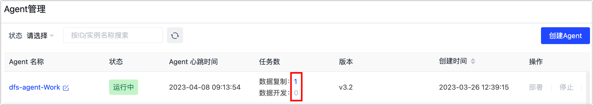
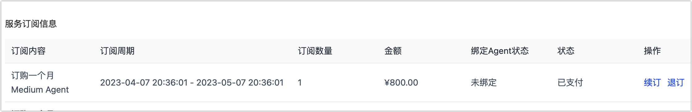

# 退订实例

如果您不再需要使用 Agent 示例，可以在确保其关联任务不影响您业务的情况下，跟随本文流程退订实例。

## 操作步骤

1. 登录 [Tapdata Cloud 平台](https://cloud.tapdata.net/console/v3/)。

2. 在左侧导航栏，单击 **Agent 管理**。

3. 确认 Agent 没有关联运行中的任务。

   1. 找到目标  Agent 示例，查看是否有任务关联在运行，如无关联任务可跳过本步骤，如有关联任务请继续执行下述步骤。

   2. 如下图所示，该 Agent 示例关联了 1 个运行中的实例，单击任务数字。

      

   3. 在跳转到的任务列表页面，停止相关任务。

4. 停止并删除 Agent。

   1. 返回至 **Agent 管理**页面，找到目标 Agent，单击其右侧的**停止**。
   2. 等待 Agent 停止后，单击其右侧的**删除**。
   3. 在弹出的对话框中，单击**确定**。

5. 执行退订操作。

   1. 在页面右上角，单击您的用户名，选择**用户中心**。

      

   2. 下翻至页面底部的，在**服务订阅信息**区域，可查看到您当前的订阅信息。

   3. 找到目标 Agent 实例，确认未绑定 Agent并单击**退订**。

      

      :::tip

      对于包年/包月的实例，您可以单击**取消订阅**后再执行退订。

      :::

## 退款说明

当您发起了退订操作后，Tapdata Cloud 将按照使用时间执行退款，例如一次性订购 1 个月的实例，在使用了 10 天后发起退订，则默认在原有支付金额上退还剩余 20 天的费用，计算公式如下：

`（订购结束日期−退订日期）`➗`（订购结束日期−订购开始日期）`✖️ `实际支付金额`（不含优惠券金额）
