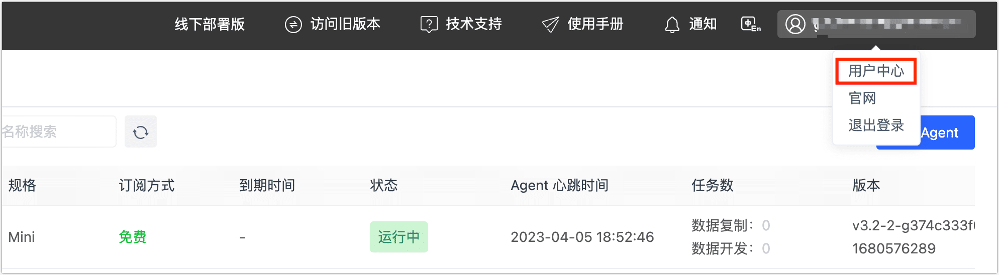
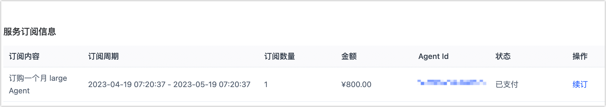

# 续订实例

对于包年/包月实例，在到期前一个月 Tapdata 会提醒您及时续费，为避免影响您的业务，请在实例到期前及时续费或者在购买时选择**连续包年**/**包月**计费方式。

## 操作步骤

1. 登录 [Tapdata Cloud 平台](https://cloud.tapdata.net/console/v3/)。

2. 在页面右上角，单击您的用户名，选择**用户中心**。

   

3. 下翻至页面底部的**服务订阅信息**区域，可查看到您当前的订阅信息。

   :::tip

   如您是通过阿里云市场订阅的实例，您需要在本页面的**授权码信息**区域执行续订操作。

4. 找到目标实例，单击**续订**，如您是连续包年/包月，无需执行本操作。

   

5. 在跳转到的支付页面，根据页面指引完成支付流程。

