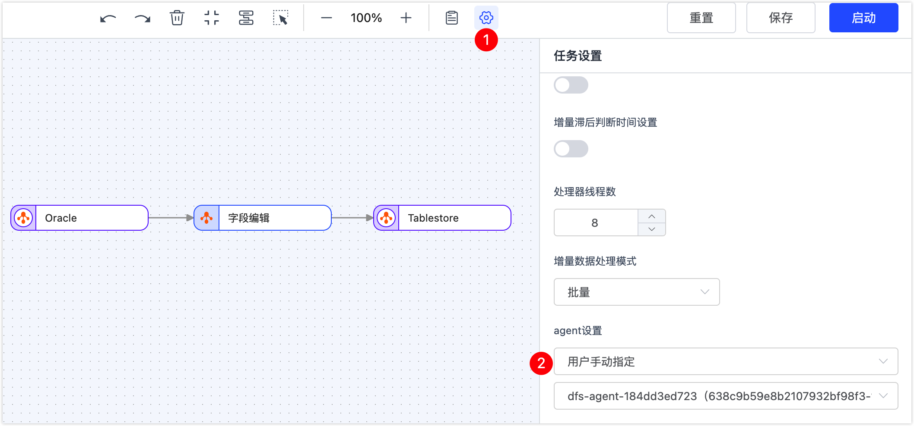
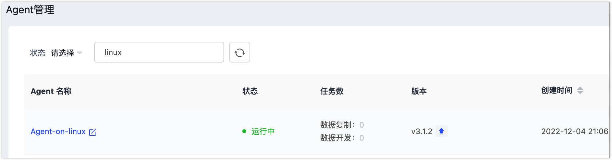

# 部署与管理 Agent

本文列举 Tapdata Agent 在部署和运行遇到的常见问题。

## 部署 Agent

### Agent 有什么作用？

Agent 是数据同步、数据异构、数据开发场景中的关键程序，负责通过流式技术从源系统获取数据、处理转换数据并发送到目标系统，由云上的管理端统一管理。


### 全托管和半托管模式有什么区别？

| 类别   | 说明                                                         | 架构图                                     |
| ------ | ------------------------------------------------------------ | ------------------------------------------ |
| 全托管 | 由 Tapdata Cloud 提供 Agent 运行所需的计算/存储资源并自动部署，同时提供统一的运行维护和资源监控以提升运行可靠性，可实现一键交付使用，免去部署和运维精力，专注业务本身。 |      |
| 半托管 | 由您提供设备来部署和运维 Agent，为其运行提供计算/存储资源，可充分利用现有硬件资源，获得更低的价格的同时，进一步提升安全性。 |  |


### 半托管模式下，推荐将 Agent 部署在哪里？

通常数据流转应用场景对时效性有较高的要求，因此，可将 Agent 部署在数据库所属的本地网络中降低网络延迟。

更多介绍，见[部署 Tapdata Agent](../quick-start/install-agent)。

### 需要部署多少个 Agent？

只需部署一个 Agent，需确保该 Agent 可和数据的来源/目标端可正常通信。

### 是否可以部署多个 Agent？

可以，需要确保这些 Agent 可和数据的来源/目标端可正常通信。

:::tip

一个任务只会在一个 Agent 上运行，在任务比较多时，可部署多个 Agent 来解决单点负载问题。

:::

### 部署了多个 Agent，某任务的 Agent 发生异常如何处理？

您可以编辑对应的任务，然后为其手动指定一个正常运行的 Agent，再对异常的 Agent 进行排查，设置方法如下：



### 如果 Oracle 是 rac 模式，aix 的两节点 rac，如何部署 Agent？

只要可以连接到 rac 即可，即 Agent 能连到 rac 的 scan/vip，无需和 Oracle 部署在同一设备。 

### 安装了DockerWindows (64 bit)，无法通过检测？

推荐直接使用 [Docker 方式部署 Agent](../quick-start/install-agent/agent-on-docker.md)。

### 如何再次获取部署所需的 token？

1 个 Token 仅用于部署 1 个 Agent，如需部署多个 Agent，请前往 Tapdata Cloud 创建 Agent。

### Agent 一直是部署状态检测中？

您需要根据提示完成 Agent 的部署，部署完成后 Agent 状态会自动转换为**运行中**。如果超过 5 分钟还未显示正常，则可能部署失败，您可以联系我们[获取技术支持](support.md)，并提供日志协助定位问题。


## 管理 Agent

### Agent 启动报错：“start timout”？

如果遇到启动 Agent 失败，您可以查看安装目录中的日志文件 **logs/tapdata-agent.log**，判断是否为网络问题，您也可以联系我们[获取技术支持](support.md)，并提供日志协助定位问题。

### 输入 token 后报错：“ java.lang.IllegalStateException: Cannot load configuration class: io.tapdata.Application”？

软件包不完整，请更换一个版本重新安装。

### 如何检查 Agent 状态？

* **通过命令查看**：登录部署了 Agent 的设备并进入 Agent 安装目录，执行 `./tapdata status` 命令，示例如下，该 Agent 处于正常运行中。

  

* **通过界面查看**：登录 [Tapdata Cloud 平台](https://cloud.tapdata.net/console/v3/)，单击左侧导航栏的 **Agent 管理**即可查看所有 Agent 的状态，单击 Agent 名称还可以获取到该 Agent 安装的目录、日志等信息。

  

### Agent 意外停止了，如何启动 Agent ？

登录部署了 Agent 的设备并进入 Agent 安装目录，执行 `./tapdata start` 命令，如果无法启动可以联系我们[获取技术支持](support.md)，并提供日志协助定位问题。

### Agent 正常运行，界面上却显示为离线？

Agent 每分钟向 Tapdata Cloud 上报一次心跳信息，如果  Tapdata Cloud 连续五分钟没有收到心跳信息则会显示该 Agent 离线，通常由于网络波动引起，您可以检查 Agent 的状态以确认。

Agent 离线不影响已运行任务的正常运行，但是新建任务会受到影响。 

### 如何卸载重装 Agent？

根据您的部署方式选择下述方法卸载重装 Agent：

* Docker 部署：直接删除容器，然后重新运行启动容器的命令即完成了重新安装。
* Linux/Windows 上部署：
  * **全新安装**
    1. 执行命令停止服务：`./tapdata stop -f`。
    2. 删除安装目录。
    3. 在 Tapdata Cloud 上创建 Agent 并根据提示完成部署。
  * **保留配置重装**
    1. 保存 Agent 安装目录中的配置文件 **application.yml**。
    2. 执行命令停止服务：`./tapdata stop -f`。
    3. 删除安装目录。
    4. 创建新的安装目录，并将 **application.yml** 复制到该目录。
    5. 下载 tapdata 工具。
    6. 执行 `./tapdata start backend `

### Agent 运行时报错：“OutOfMemoryError”

需要确认部署 Agent 设备是否具有充足的可用内存，具体解决方案如下：

* 内存不足：更换部署 Agent 的设备，也可以尝试调小 Tapdata Cloud 平台中任务的**每次读取数量**配置值。

* 内存充足

  1. 在 Agent 安装目录中，找到并修改 **application.yml** 文件

  2. 根据设备的可用内存量来调整内存大小，例如在文件里增加配置：`tapdataJavaOpts: "-Xms4G -Xmx8G"`，即初始内存为 4G，最大内存为 8G。

     ```yaml
     tapdata:
         conf:
             tapdataPort: '3030'
             backendUrl: 'https://cloud.tapdata.net/api/'
             apiServerPort: ""
             tapdataJavaOpts: "-Xms4G -Xmx8G"
             reportInterval: 20000
             uuid: a5f266a1-a495-412f-a433-29d345713c176
         cloud:
             accessCode: ""
             baseURLs: 'https://cloud.tapdata.net/api/'
             username: null
             token: 
     spring:
         data:
             mongodb:
                 username: ""
                 password: ""
                 mongoConnectionString: ""
                 uri: ""
                 ssl: ""
                 sslCA: ""
                 sslCertKey: ""
                 sslPEMKeyFilePassword: ""
                 authenticationDatabase: ""
     ```

     

  3. 保存后执行下述命令重启 Agent。

     ```shell
     #停止 Agent
     ./tapdata stop -f
     #启动 Agent
     ./tapdata start
     ```

     
