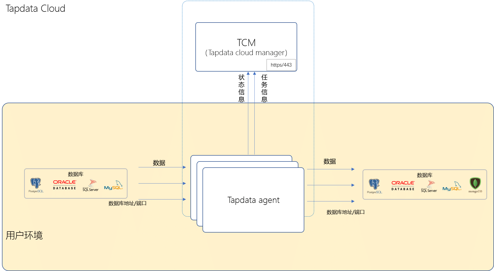

# 产品架构与工作原理

Tapdata Cloud 组件包含 Tapdata Cloud manager 和 Tapdata Agent：

* **Tapdata Cloud Manager**（TCM）：Tapdata Cloud 的管理端，负责 agent 实例的安装，同步任务的配置、分发、任务状态监测。

* **Tapdata Agent**：是 Tapdata Cloud 数据同步服务的执行实例，负责从 TCM 获取任务信息，通过流式技术从源系统获取数据、处理转换数据并发送到目标系统，并在任务执行过程中监测并上报任务状态至 TCM 。

Tapdata Cloud 采用了多种网络安全措施，确保用户数据和信息安全。

* **单向连接**：同步实例节点单向连接管控端运行服务。 Tapdata agent 实例节点对外不主动暴露网络信息，只会连接 TCM 管理端服务，获取任务信息、上报状态信息。
* **HTTPS 协议**：用户部署的Tapdata agent实例节点和 TCM 通信链路采用 HTTPS 协议，防止盗取并篡改信息。
* **可信环境**：自建模式下，所有数据流转均发生在受用户管理的服务器和网络环境，数据不流出泄漏。

:::tip

如您的网络环境不支持访问外网，可选择在本地部署 [Tapdata](https://tapdata.net/tapdata-enterprise.html)，更多介绍，见[版本对比](https://tapdata.net/pricing.html)。

:::
