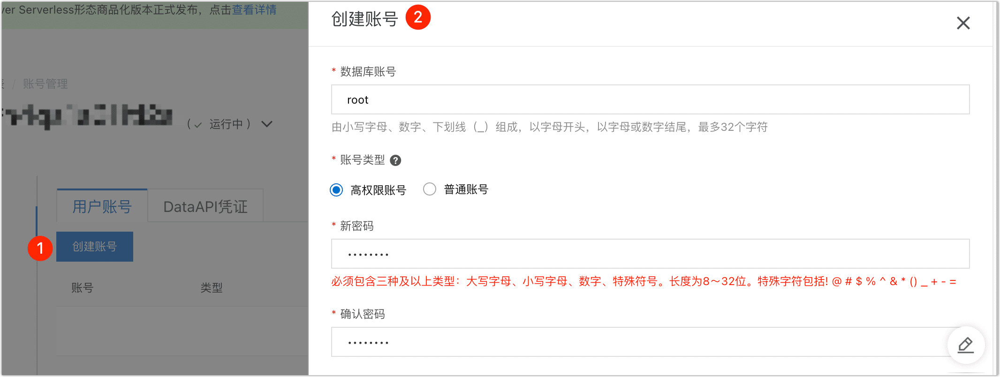
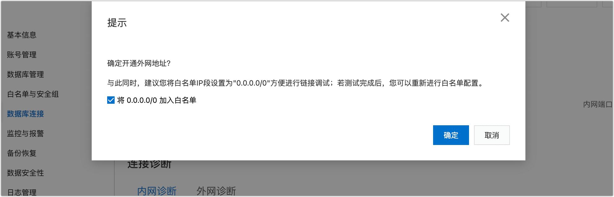

# Aliyun RDS for MySQL

安装 Agent 后，您需要在 Tapdata Cloud 平台为 Agent 和阿里云 RDS for MySQL 建立连接，完成操作后即可在数据复制/开发任务中使用该数据源。本文介绍建立连接前的准备工作（如授权账号等）。

### **支持版本**

5.1、5.5、5.6、5.7、8.0


## 操作步骤

 连接阿里云 RDS for MySQL 时，作为源或目标库均可参考下述步骤操作。

1. 访问阿里云 [RDS 实例列表](https://rdsnext.console.aliyun.com/rdsList/basic)，在上方选择地域，然后单击目标实例ID。

2. 创建高权限账号。

   1. 在左侧导航栏，选择**账号管理**。

   2. 在页面右侧，单击**创建账号**。

   3. 在右侧的面板中，完成下述设置。

      

      * **数据库账号**：以小写字母开头，以小写字母或数字结尾，支持小写字母、数字和下划线，长度为 2~32 个字符。
      * **账号类型**：选择为**高权限**账号，以便可获取数据库的 Binlog 和读写数据库。更多账号类型介绍，见[账号类型](https://help.aliyun.com/document_detail/96089.htm#section-b3f-whz-q2b)。
      * **账号密码**：长度为 8~3 2个字符，至少包含大写字母、小写字母、数字、特殊字符中的任意三种。特殊字符为 `!@#$%^&*()_+-=`。

   4. 单击**确定**。

3. 创建数据库。

   1. 在左侧导航栏，选择**数据库管理**。
   2. 单击创建数据库，在弹出的对话框中填写数据库名称并选择字符集。
   3. 单击**创建**。

4. 开通外网访问地址，如您的 Agent 部署的机器与 RDS MySQL 属于同一内网，可跳过本步骤。
   1. 在左侧导航栏，选择**数据库连接**。
   2. 单击**开通外网地址**。
   3. 在弹出的对话框中，保持选项：**将0.0.0.0/0 加入白名单** 处于选中状态。
      
   4. 单击**确定**。
      :::tip
      完成操作后，您可以在本页面查看到外网连接地址，后续将在连接数据源时填写该地址。
      :::

### 常见问题

* 问：执行异构数据源之间同步时，表级联出发的数据更新和删除没有同步到目标库？

  答：此场景下，如需要在目标端构建级联处理能力，可以视目标情况，通过触发器等手段来实现该类型的数据同步。

* 问：Tapdata Cloud 连接测试时，提示错误：“Unknown error 1044”？

  答：如果已经授予了正确的权限，可以通过下述方法检查并修复：

  ```sql
  SELECT host,user,Grant_priv,Super_priv FROM mysql.user where user='username';
  //查看Grant_priv字段的值是否为Y
  //如果不是，则执行以下命令
  UPDATE mysql.user SET Grant_priv='Y' WHERE user='username';
  FLUSH PRIVILEGES;
  ```

## 下一步

[连接阿里云 RDS for MySQL](../../user-guide/connect-database/alpha/connect-aliyun-rds-mysql.md)