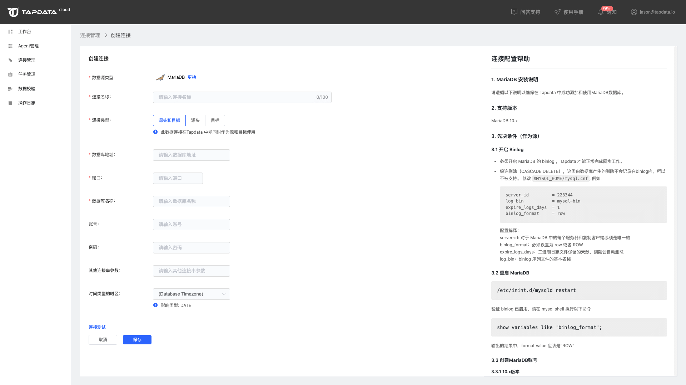

# MariaDB

请遵循以下说明以确保在 Tapdata 中成功添加和使用 MariaDB 数据库。

## 支持版本
MariaDB 10.x

## 准备工作

### 作为源库

#### 开启 binlog

- 必须开启 MariaDB 的 binlog ，Tapdata 才能正常完成同步工作。
- 级连删除（CASCADE DELETE），这类由数据库产生的删除不会记录在binlog内，所以不被支持。 修改 $MYSQL_HOME/mysql.cnf, 例如:

```bash
server_id         = 223344
log_bin           = mysql-bin
expire_logs_days  = 1
binlog_format     = row
```

配置解释：

- server-id: 对于 MariaDB 中的每个服务器和复制客户端必须是唯一的，且server_id必须大于0

- binlog_format：必须设置为 row 或者 ROW

- expire_logs_days：二进制日志文件保留的天数，到期会自动删除

- log_bin：binlog 序列文件的基本名称


#### 重启 MariaDB

```bash
/etc/inint.d/mysqld restart
```

验证 binlog 已启用，请在 mysql shell 执行以下命令

```bash
show variables like 'binlog_format';
```

输出的结果中，format value 应该是"ROW"


#### 创建MariaDB账号

```bash
create user 'username'@'localhost' identified by 'password';
```

#### 给 tapdata 账号授权

对于某个数据库赋于select权限

```bash
GRANT SELECT, SHOW VIEW, CREATE ROUTINE, LOCK TABLES ON <DATABASE_NAME>.<TABLE_NAME> TO 'tapdata' IDENTIFIED BY 'password';
```

对于全局的权限

```bash
GRANT RELOAD, SHOW DATABASES, REPLICATION SLAVE, REPLICATION CLIENT, SUPER ON *.* TO 'tapdata' IDENTIFIED BY 'password';
```

### 作为目标库

对于某个数据库赋于全部权限

```bash
GRANT ALL PRIVILEGES ON <DATABASE_NAME>.<TABLE_NAME> TO 'tapdata' IDENTIFIED BY 'password';
```

对于全局的权限

```bash
GRANT PROCESS ON *.* TO 'tapdata' IDENTIFIED BY 'password';
```

## 添加数据源

1. 点击左侧菜单栏的【连接管理】，然后点击右侧区域【连接列表】右上角的【创建连接】按钮，打开连接类型选择页面，然后选择MariaDB。

2. 在打开的连接信息配置页面依次输入需要的配置信息。

   

    * 连接名称：设置连接的名称，多个连接的名称不能重复

    * 数据库地址：数据库 IP / Host

    * 端口：数据库端口

    * 数据库名称：tapdata 数据库 MySQL连接是以一个db为一个数据源。这里的 db 是指一个 mysql 实例中的 database，而不是 一个 mysql 实例。

    * 账号：可以访问数据库的账号

    * 密码：数据库账号对应的密码

    * 时间类型的时区：默认使用该数据库的时区；若指定时区，则使用指定后的时区设置

      例如源端数据库mysql默认数据库时区，数据库时区为+8:00，目标端数据库mysql为制定时区+0:00。假设源端数据库存储的时间为2020-01-01 16:00:00，目标端数据库存储的时间则为2020-01-01 08:00:00

3. 测试连接，提示测试通过。

4. 测试通过后保存连接即可。
