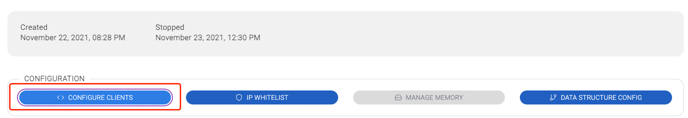
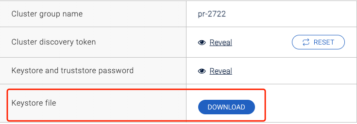
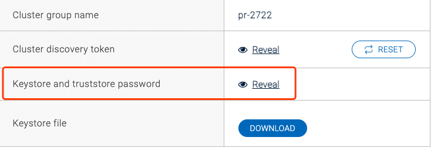

# Hazelcast Cloud

请遵循以下说明以确保在 Tapdata 中成功添加和使用 Hazelcast Cloud 数据库。

### 限制说明

Tapdata系统支持 hazelcast cloud 作为目标。

### 配置说明

- 以下配置，均可在 Hazelcast 集群配置中获取

- 集群名称(Cluster Name)：集群名称

- Token: 鉴权秘钥

- 是否开启ssl(Enable SSL): 是否使用SSL加密协议
- Key Store File: client.keystore文件
- Trust Key Store File: client.truststore文件

- Key File Password: ssl文件的密码

