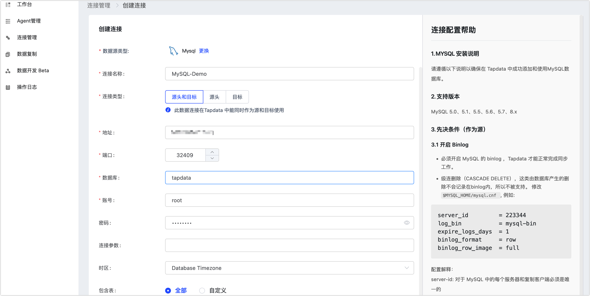

# MySQL

MySQL 是应用最广泛的开源关系数据库，是许多网站、应用程序、商业产品使用的关系数据存储。完成 Agent 部署后，您可以跟随本文教程在 Tapdata Cloud 中添加 MySQL 数据源，后续可将其作为源或目标库来构建数据管道。

## 支持版本 

MySQL 5.0、5.1、5.5、5.6、5.7、8.x

## 准备工作

### 作为源库

import Content1 from '../../../reuse-content/certificate/_mysql-as-source.md';

<Content1 />

      

### 作为目标库

import Content2 from '../../../reuse-content/certificate/_mysql-as-target.md';

<Content2 />


## 添加数据源

1. 登录 [Tapdata Cloud 平台](https://cloud.tapdata.net/console/v3/)。

2. 在左侧导航栏，单击**连接管理**。

3. 单击页面右侧的**创建连接**。

4. 在弹出的对话框中，单击**认证数据源**，然后选择 **MySQL**。

5. 在跳转到的页面，根据下述说明填写 MySQL 的连接信息。

   

    * 连接信息设置
        * **连接名称**：填写具有业务意义的独有名称。
        * **连接类型**：支持将 MySQL 作为源或目标库。
        * **地址**：数据库连接地址。
        * **端口**：数据库的服务端口。
        * **数据库**：数据库名称，即一个连接对应一个数据库，如有多个数据库则需创建多个数据连接。
        * **账号**：数据库的账号。
        * **密码**：数据库账号对应的密码。
        * **连接参数**：额外的连接参数，默认为空。
    * 高级设置
        * **时区**：默认为数据库所用的时区，您也可以根据业务需求手动指定。
          如果源库为默认数据库时区（+8:00），目标端数据库为指定时区+0:00，那么假设源端数据库存储的时间为 2020-01-01 16:00:00，目标端数据库存储的时间则为 2020-01-01 08:00:00
        * **包含表**：默认为**全部**，您也可以选择自定义并填写包含的表，多个表之间用英文逗号（,）分隔。
        * **排除表**：打开该开关后，可以设定要排除的表，多个表之间用英文逗号（,）分隔。
        * **Agent 设置**：默认为**平台自动分配**，您也可以手动指定 Agent。
        * **模型加载频率**：数据源中模型数量大于 1 万时，Tapdata Cloud 将按照设置的时间定期刷新模型。

6. 单击**连接测试**，测试通过后单击**保存**。

   :::tip

   如提示连接测试失败，请根据页面提示进行修复。

   :::

## 常见问题

* 问：可以使用从库作为源进行数据同步吗？

  答：可以，除在从库上开启以上设置外，还需要：

  1. 执行下述命令，检查 MySQL 库的参数配置，确保 **log_slave_updates** 的值为 1。

     ```sql
     Select @@log_slave_updates
     ```

  2. 检查主从库是否一致，不一致时可查看从节点状态：`SHOW SLAVE STATUS`，

     根据具体报错修复后，再执行数据同步。

* 问：Tapdata Cloud 连接测试时，提示错误：“Unknown error 1044”

  答：如果已经授予了正确的权限，可以通过下述方法检查并修复：

  ```sql
  SELECT host,user,Grant_priv,Super_priv FROM mysql.user where user='username';
  //查看Grant_priv字段的值是否为Y
  //如果不是，则执行以下命令
  UPDATE mysql.user SET Grant_priv='Y' WHERE user='username';
  FLUSH PRIVILEGES;
  ```

