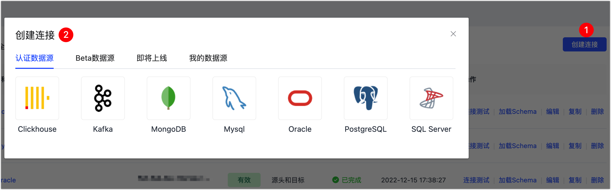

# 连接数据库

[安装 Agent ](install-agent)后，您需要在 Tapdata Cloud 平台为 Agent 和数据库建立连接，完成操作后即可创建数据同步任务。

:::tip

在连接数据库前，您还需要确保网络环境访问正常并完成数据库账号的授权，更多介绍，见[准备工作](../prerequisites)。

:::

## 操作步骤

1. 登录 [Tapdata Cloud 平台](https://auth.tapdata.net/)。

2. 在左侧导航栏栏，单击**连接管理**。

3. 单击页面右侧的**创建连接**。

4. 选择要添加的数据库并填写连接信息，更多介绍，见[连接各类数据库](../user-guide/connect-database)。

   

## 下一步

[开始数据同步](create-task)