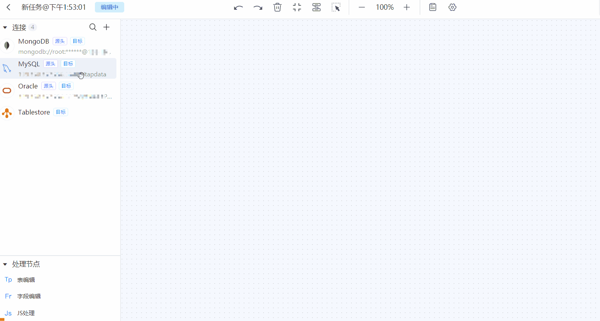
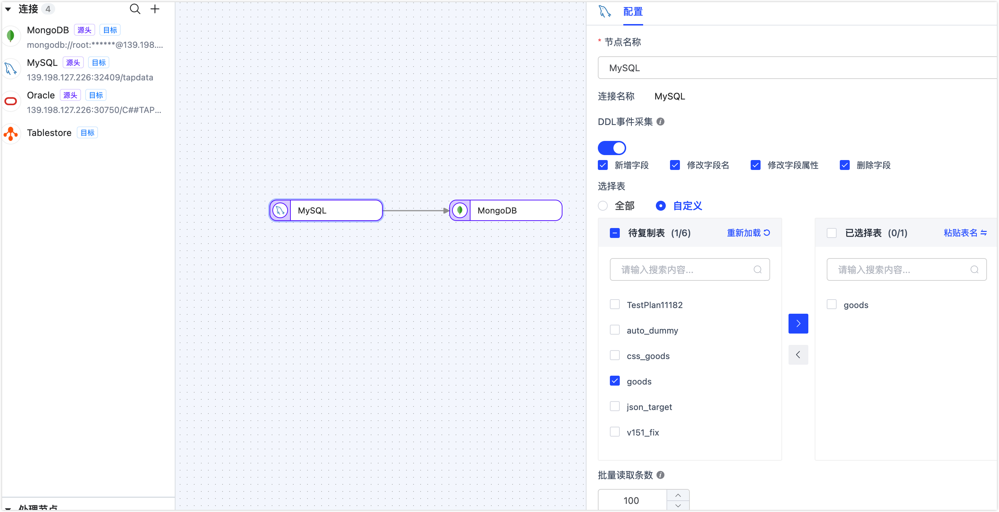
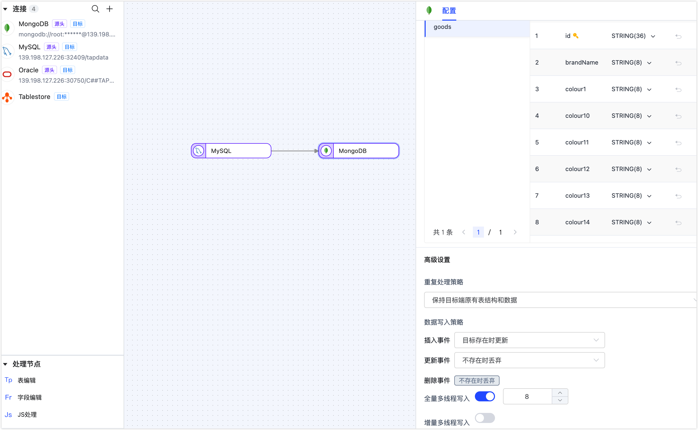
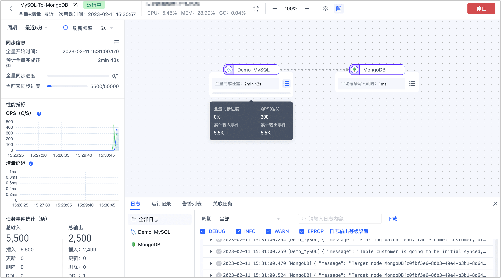

# 步骤三：创建数据复制任务

数据复制功能可以帮助您实现同/异构数据源间的实时同步，适用于数据迁移/同步、数据灾备、读性能扩展等多种[业务场景](../introduction/use-cases.md)。本文介绍数据复制功能的具体使用流程，帮助您快速掌握如何创建、监控和管理数据复制任务。

## 前提条件

在创建数据复制任务前，您需要执行下述准备工作：

* [安装 Tapdata Agent](install-agent)
* [连接数据源](connect-database.md)

## 操作步骤

本文以 MySQL 实时同步至 MongoDB 为例，为您演示数据复制任务的创建流程，其他数据源也可参考此流程。

1. 登录 [Tapdata Cloud 平台](https://auth.tapdata.net/)。

2. 在左侧导航栏，单击**数据复制**。

3. 单击页面右侧的**创建**，跳转到任务配置页面。

4. 在页面左侧，分别拖拽作为源和目标的数据连接至右侧画布中，然后将二者连接。

   

5. 单击源端节点（本例为 MySQL），根据下述说明完成右侧面板的参数配置。

   

   * **节点名称**：默认为连接名称，您也可以设置一个具有业务意义的名称。
   * **DDL 事件采集**：打开该开关后，Tapdata Cloud会自动采集所选的源端 DDL 事件（如新增字段），如果目标端支持 DDL 写入即可实现 DDL 语句的同步。
   * **动态新增表**：打开该开关后，Tapdata Cloud 会自动将源库新增/删除的表同步到目标库，仅在选择了全部表时生效。
   * **选择表**：可选择**全部**或**自定义**，如选择为**自定义**，您还需要在下方选择要同步的表。
   * **批量读取条数**：全量同步时，每批次读取的记录条数，默认为 **100**。

6. 单击目标端节点（本例为 MongoDB），根据下述说明完成右侧面板的参数配置。

   

   * **节点名称**：默认为连接名称，您也可以设置一个具有业务意义的名称。
   * **推演结果**：展示 Tapdata 将写入目标端的表结构信息，该信息基于源端节点设置所推演。
   * **重复处理策略**、**数据写入策略**：根据业务需求选择，也可保持默认。
   * **全量写入线程数**：全量数据写入的并发线程数，默认为 **8**，可基于目标端写性能适当调整。
   * **增量写入线程数**：增量数据写入的并发线程数，默认未启用，可基于目标端写性能适当调整。

7. （可选）单击上方的  图标，配置任务属性。

   * **任务名称**：填写具有业务意义的名称。
   * **同步类型**：可选择**全量+增量**，也可单独选择**全量**或**增量**。
     全量表示将源端的存量数据复制到目标端，增量表示将源端实时产生的新数据或数据变更复制到目标端，二者结合可用于实时数据同步场景。
   * **任务描述**：填写任务的描述信息。
   * **高级设置**：设置任务开始的时间、增量数据处理模式、处理器线程数、Agent 等。

8. 单击**启动**，操作完成后，您可以在当前页面查看到任务的执行情况，如 QPS、延迟、任务事件计等信息。

   

## 推荐阅读

[监控或管理任务](../user-guide/copy-data/manage-task.md)

