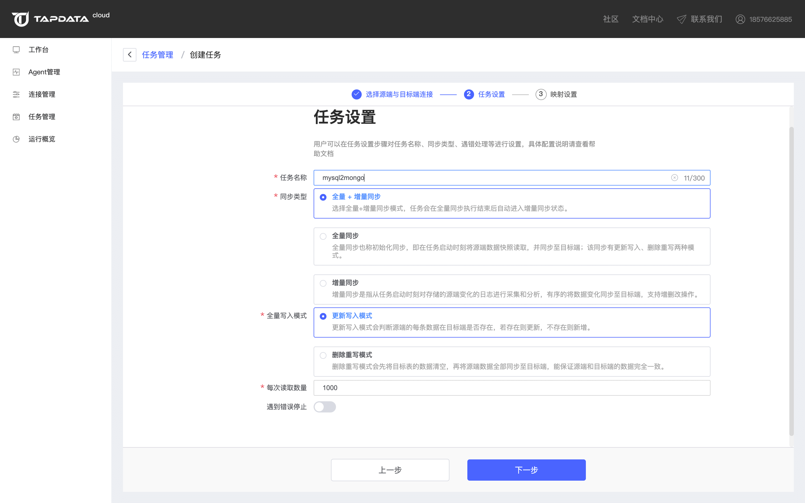
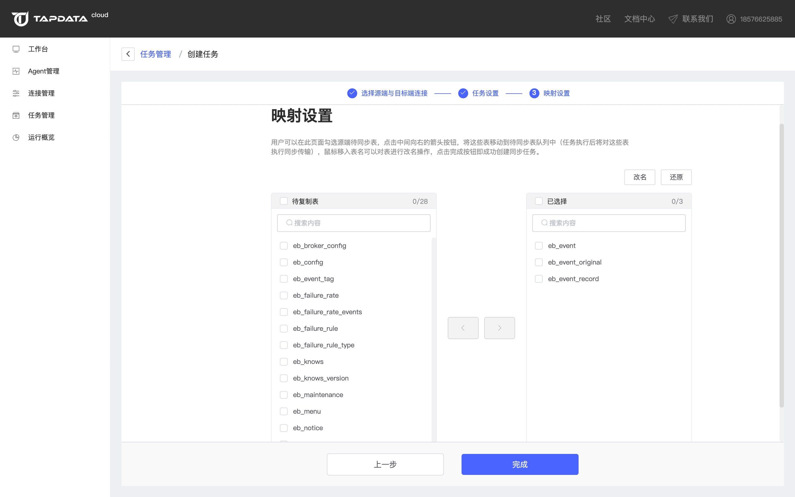

# 增量数据同步

### 前提条件

在配置全量同步任务前，您需要添加至少一个[数据连接](../../user-guide/connect-database)。

### 操作步骤

1. 进入**任务管理**页面，点击**创建任务**进入任务设置流程。

2. 根据您的同步任务需求，正确的选择源端与目标端。

   如果您的场景为数据同步（非异构），在该页面需要将源端与目标端设置为同类型的数据存储。如果您的场景为数据异构，那么您需要将源端与目标端设置为不同类型的数据存储。

   

3. 设置任务名称与同步类型等信息。

   

4. 选择您所需要的同步的库、表，如果您对表名有修改需要，可以通过页面中的表名批量修改功能对目标端的表名进行批量设置，需要注意的是目前 Tapdata Agent 免费版仅支持单库数据同步。

   

   在以上选项设置完毕后，点击下方的**全量+增量**选项并点击**确定**即可完成本次全量同步任务的配置，在点击确定后将自动返回任务管理页面，在任务管理页面中，点击右侧的启动按钮即可使Tapdata Agent开始执行本次任务。在全量任务执行完毕后，Tapdata Agent 会自动进入增量同步状态。在该状态中，Tapdata Agent 会持续监听源端的数据变化（包括：写入、更新、删除)，并实时的将这些数据变化写入目标端。
