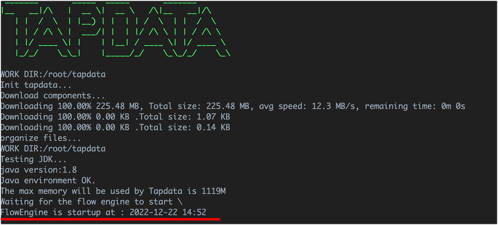

# Linux 平台上安装

Tapdata Agent（简称 Agent）通过流式技术从源端获取数据、处理转换数据并发送到目标端，支持多平台安装，本文介绍如何在 Linux 平台上安装 Agent。

## 环境要求

- 硬件环境：x86 架构处理器
- 操作系统：64 位
- 网络环境：可连通公网，且可与源/目标数据库通信
- 软件依赖：Java 1.8 版本

:::tip

您可以在设备上执行 `java -version` 命令查看 Java 版本，如未安装则需手动安装 Java 环境，例如执行 `yum -y install java-1.8.0-openjdk` 命令进行安装。

:::

## 安装 Agent

1. 登录 [Tapdata Cloud 平台](https://cloud.tapdata.net/console/v3/)。

2. 基于业务需求创建所需规格的 Agent，具体操作，见[订阅实例](../../billing/purchase.md)。

   :::tip

   推荐选购全托管实例，由 Tapdata Cloud 提供 Agent 运行所需的计算/存储资源并自动部署，同时提供统一的运行维护和资源监控以提升运行可靠性，免去部署和运维精力，专注业务本身。

   :::

3. 订阅完成后，在跳转到的部署页面选择 **Linux（64 bit）**，然后复制安装命令。

   

4. 登录至待部署 Agent 的设备，为便于管理 Agent，我们首先创建一个文件夹（如 **tapdata**）并进入。

5. 粘贴并执行您在步骤 3 复制的安装命令，该命令包含下载、部署和启动 Agent 的流程，启动成功如下图所示。

   

## 视频教程
<iframe      src="https://20778419.s21v.faiusr.com/58/2/ABUIABA6GAAgqJSHkQYo5JeGyQc.mp4"   width="100%"      height="539"      frameborder="0"    allowfullscreen="true"  > </iframe>

## 下一步

[连接数据库](../connect-database.md)

## 推荐阅读

* [管理 Agent](../../user-guide/manage-agent.md)
* [安装与管理 Agent 常见问题](../../faq/agent-installation.md)
