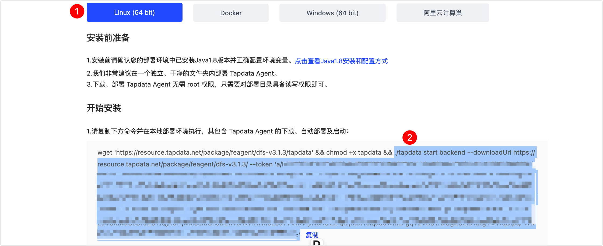

# Mac 平台上安装（M1 芯片）

Tapdata Agent（简称 Agent）通过流式技术从源端获取数据、处理转换数据并发送到目标端，支持多平台安装，本文介绍如何在 Mac 平台（M1 芯片）上安装 Agent。

## 环境要求

- 网络环境：可连通公网，且可与源/目标数据库通信
- 软件依赖：Dokcer，安装方法见[官方文档](https://docs.docker.com/desktop/install/mac-install/)。

## 安装 Agent

1. 打开 Mac 的命令行终端，依次执行下述命令下载并启动 JDK 镜像。

   ```shell
   # 下载镜像
   docker pull openjdk:8u312 
   # 启动镜像
   docker run -t -d openjdk:8u312
   ```

2. 执行 `docker ps` 获取容器 ID，然后执行下述格式的命令进入容器命令行，示例如下：

   ```shell
   docker exec -it 容器ID /bin/bash
   ```

   :::tip

   需替换命令中的容器 ID，例如 `docker exec -it 1dbee41b4adc /bin/bash`。

   :::

3. 为便于管理 Agent，在容器命令行中执行下述命令创建一个文件夹（如 **tapdata**）并进入。

   ```shell
   mkdir tapdata&&cd tapdata
   ```

4. 在容器命令行中，执行下述命令下载 Agent 程序并解压。

   ```shell
   wget 'https://resource.tapdata.net/doc-source/tapdata.zip' && unzip tapdata.zip
   ```
   
5. 登录 [Tapdata Cloud 平台](https://cloud.tapdata.net/console/v3/)，获取 Agent 启动的配置信息。

   1. 基于业务需求创建所需规格的 Agent，具体操作，见[订阅实例](../../billing/purchase.md)。

      :::tip

      推荐选购全托管实例，由 Tapdata Cloud 提供 Agent 运行所需的计算/存储资源并自动部署，同时提供统一的运行维护和资源监控以提升运行可靠性，免去部署和运维精力，专注业务本身。

      :::

   2. 订阅完成后，在跳转到的部署页面选择 **Linux（64 bit）**，然后复制 Agent 启动的配置信息（从 **./tapdata** 开始复制），示例如下。

      

6. 返回至容器命令行，粘贴您刚刚复制的命令并执行，启动成功如下图所示。

   

   


## 下一步

[连接数据库](../connect-database.md)

## 推荐阅读

* [管理 Agent](../../user-guide/manage-agent.md)
* [安装与管理 Agent 常见问题](../../faq/agent-installation.md)

