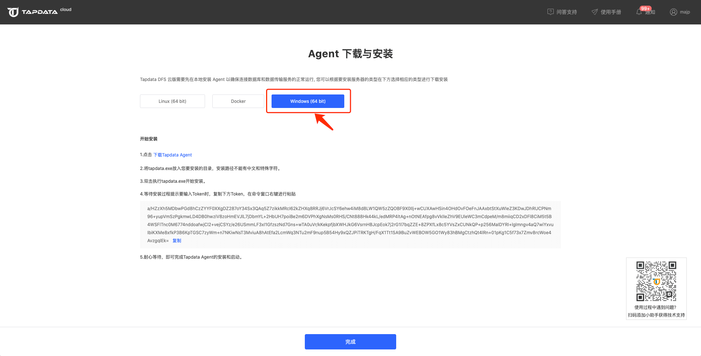
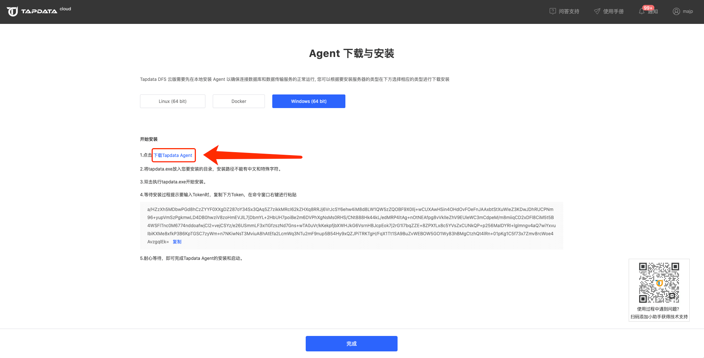

# Windows 平台上安装

## 环境要求

- 系统版本：64位
- 硬件环境：x86
- 环境要求：Java 1.8

## 安装步骤

本手册中给出的 Tapdata Agent 下载、部署、运行代码均为示例，Tapdata Agent 实际下载、部署、运行命令可通过Agent的部署页面来获取。

1. 在 Agent 管理列表，创建 Agent 后，点击Agent的部署按钮，打开 Agent 的部署页面。

   

2. 在部署页面点击【Windows(64bit)】，进入到 Windows 环境 Agent 部署页面。

   

3. 点击 Agent 部署页面中的`下载Tapdata Agent`，将 Tapdata Agent 下载至本地环境。

   

4. 在 Tapdata Agent 下载完毕后，请将其放入您的安装目录，安装路径不能有中文和特殊字符。

5. 双击 tapdata.exe 开始安装。

6. 等待安装过程提示要输入 Token 时，复制部署页面的 Token（如下图所示），在命令窗口右键进行粘贴。

   

7. 粘贴Token后按回车键，Tapdata Agent 会自动安装完成并启动。


Tapdata Agent运行后会在Tapdata官网`Agent管理`页面自动注册，此时您可通过管理页面对其进行管控，也可在本地使用命令行方式对其进行管控，如果您的本地部署环境无法连通公网，那么您部署的 Agent 将无法注册成功，在`Agent管理`页面，您的 Tapdata Agent 将不会变为运行中状态。


## 管理 Tapdata Agent

进入到 Tapdata Agent 的安装目录，然后通过以下方式来对 Tapdata Agent 进行管理：

* 关闭 Tapdata Agent：双击 `stop.bat`
* 启动 Tapdata Agent：双击 `start.bat` 或者直接双击 `tapdata.exe`
* 查看 Tapdata Agent 状态：双击 `status.bat`


## 调整 Tapdata Agent 运行内存

在Agent部署目录下找到 `application.yml` 文件，找到 tapdataJavaOpts 配置，比如：`tapdataJavaOpts: "-Xms4G -Xmx8G"`

调整该配置里内存的值，具体的运行内存大小根据服务器的可用内存自行判断设置。

```yaml
tapdata:
    conf:
        tapdataPort: '3030'
        backendUrl: 'https://cloud.tapdata.net/api/'
        apiServerPort: ""
        tapdataJavaOpts: "-Xms4G -Xmx8G"
        reportInterval: 20000
        uuid: a5f266a1-a495-412f-a433-29d345713c176
    cloud:
        accessCode: ""
        baseURLs: 'https://cloud.tapdata.net/api/'
        username: null
        token: 
spring:
    data:
        mongodb:
            username: ""
            password: ""
            mongoConnectionString: ""
            uri: ""
            ssl: ""
            sslCA: ""
            sslCertKey: ""
            sslPEMKeyFilePassword: ""
            authenticationDatabase: ""
```

配置文件修改完成后，重启Agent生效

```bash
#先停止Agent
./tapdata stop -f

#然后再启动Agent
./tapdata start
```


以上目录并不会占用太多磁盘空间，为了确保 Tapdata Agent 的稳定运行及在您遇到问题时 Tapdata 技术客服能够协助您快速定位问题根因，请勿删除这些目录以及目录中的文件。


## 视频教程

<iframe      src="https://20778419.s21v.faiusr.com/58/2/ABUIABA6GAAg-ZOHkQYoqs3RogI.mp4"   width="100%"      height="539"      frameborder="0"    allowfullscreen="true"  > </iframe>

## 下一步

[连接数据库](../connect-database.md)
