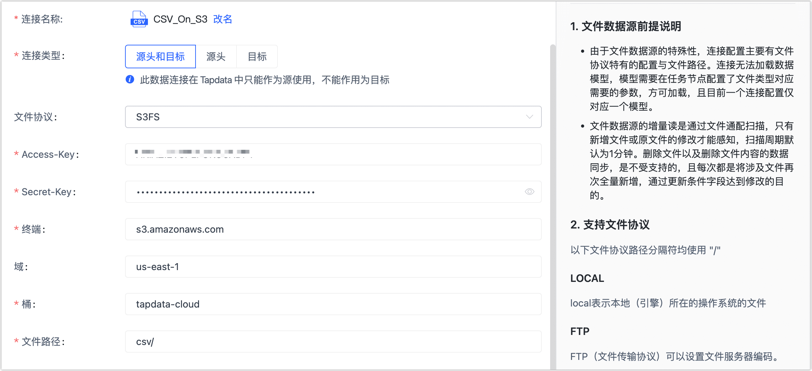

# 连接 CSV

CSV 文件是一种以纯文本形式存储表格数据的简单文件格式，每列数据由特殊分隔符分割（如逗号，分号或制表符）。Tapdata Cloud 支持读取本地、FTP、SFTP、SMB、S3FS 或 OSS 上的 CSV 文件，满足多样化的数据流转需求。本文介绍如何在 Tapdata Cloud 上连接 CSV 数据源。

## 注意事项

- 一个连接配置仅对应一个模型（表），如有多个模型您需要分别为其创建链接。
- 如果多个文件的表头不一致，Tapdata 会取并集作为模型。
- CSV 数据源仅适用于数据开发任务，暂不支持在数据复制任务中引用。
- Tapdata Cloud 默认每隔 1 分钟检测 CSV 文件是否发生变更（如新增/修改文件），如发生变更则将涉及的文件全量新增后更新条件字段以完成修改，暂不支持同步删除文件或数据。

## 操作步骤

1. 登录 [Tapdata Cloud 平台](https://cloud.tapdata.net/console/v3/)。

2. 在左侧导航栏，单击**连接管理**。

3. 单击页面右侧的**创建**。

4. 在弹出的对话框中，选择 **CSV**。

5. 在跳转到的页面，根据下述说明填写 CSV 的连接信息。

   

   * **连接名称**：填写具有业务意义的独有名称。
   * **连接类型**：目前仅支持**源头**。
   * **文件协议**：根据 CSV 文件存放的位置选择下述协议，本文以 **S3FS**（Amazon S3 存储桶） 为例演示操作流程。     
     :::tip     
     关于如何获取各协议所需填写的信息，见 [CSV/EXCEL 数据源准备工作](../../../prerequisites/config-database/beta/csv-and-excel.md)。     
     :::     
     * **Local**：文件存放在本地（引擎）所在的设备上，选择此项后，您还需要填写文件路径。
     * **FTP**（文件传输协议）：文件存放在 FTP 服务器上，选择此项后，您还需要填写 FTP 服务器的地址、端口、用户名、口令、文件路径等信息，如上图所示。
     * **SFTP**（安全加密文件传输协议）：文件存放在 SFTP 服务器上，选择此项后，您还需要填写 SFTP 服务器的地址、端口、用户名、口令、文件路径等信息。
     * **SMB**（文件共享协议）：文件存放在 SMB 服务器上，兼容 1.x、2.x、3.x，选择此项后，您还需要填写 SMB 服务器的地址、用户名、口令、文件路径等信息。
     * **S3FS**（遵循S3协议文件系统）：文件存放在 Amazon S3 存储桶上，选择此项后，您还需要填写 Accesskey、Secretkey、终端（固定为 **s3.amazonaws.com**）、桶和文件路径等信息。
     * **OSS**（对象存储服务）：文件存放在阿里云对象存储 OSS 上，选择此项后，您还需要填写云账户的 Accesskey、Secretkey、终端、桶和文件路径等信息。     
   * **Agent 设置**：默认为**平台自动分配**，您也可以手动指定。
   * **模型加载时间**：当数据源中模型数量小于 10,000 时，每小时刷新一次模型信息；如果模型数据超过 10,000，则每天按照您指定的时间刷新模型信息。
   
6. 单击**连接测试**，测试通过后单击**保存**。

   :::tip

   如提示连接测试失败，请根据页面提示进行修复。

   :::
