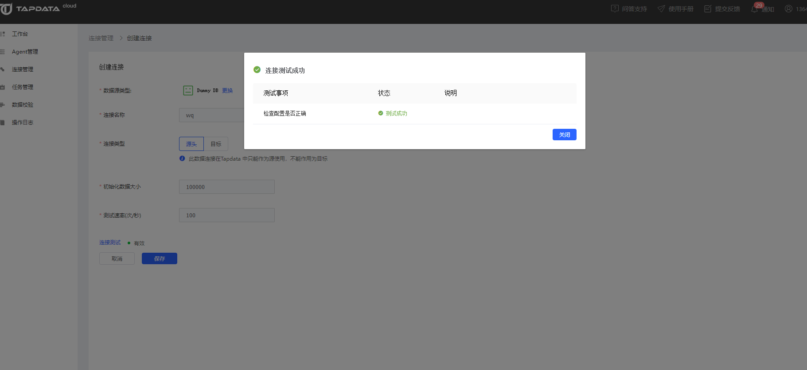

# 连接 Dummy DB

1. 点击左侧菜单栏的【连接管理】，然后点击右侧区域【连接列表】右上角的【创建连接】按钮，打开连接类型选择页面，然后选择 **Dummy DB**。

2. 在打开的连接信息配置页面依次输入需要的配置信息。

   

   * 连接名称：设置连接的名称，多个连接的名称不能重复
   * 连接类型：可选作为源或目标
   * 初始化数据大小：设置测试数据数量
   * 测试速率(次/秒)：设置测试速率

3. 测试连接，提示测试通过后保存连接即可。

   