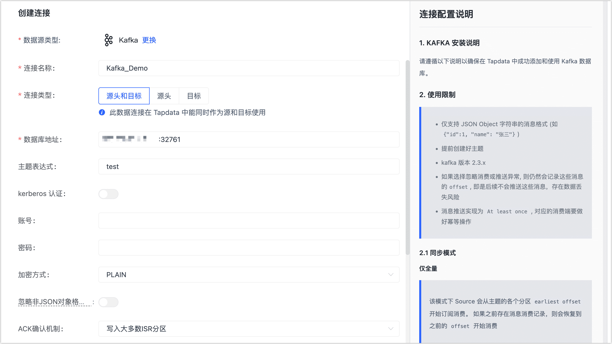

# 连接 Kafka

Apache Kafka 是一个分布式数据流处理平台，可以实时发布、订阅、存储和处理数据流。Tapdata Cloud 支持将 Kafka 作为源和目标数据库构建数据管道，本文介绍如何在 Tapdata Cloud 中添加 Kafka 数据源。

## 准备工作

 [Kafka 数据源准备工作](../../../prerequisites/config-database/certified/kafka.md)

## 操作步骤

1. 登录 [Tapdata Cloud 平台](https://cloud.tapdata.net/console/v3/)。

2. 在左侧导航栏，单击**连接管理**。

3. 在页面右侧，单击**创建连接**。

4. 在跳转到的页面，单击**认证数据源**标签页，然后选择 **Kafka**。

5. 根据下述说明完成数据源配置。

   

   * 连接信息设置
     * **连接名称**：填写具有业务意义的独有名称。
     * **连接类型**：支持将 Kafka 作为源或目标库。
     * **数据库地址**：Kafka 连接地址，包含地址和端口号，两者之间用英文冒号（:）分隔，例如 `113.222.22.***:9092`。
     * **主题表达式**：Kafka 中的 Topic，支持正则表达式，长度不超过 256 个字符，Topic 创建方法，见 [Kafka 快速入门](https://kafka.apache.org/23/documentation.html#quickstart)。
     * **Kerberos 认证**：如 Kafka 开启了该认证，您需要打开该开关，然后上传并设置密钥、配置等信息。
     * **账号**、**密码**、**加密方式**：如 Kafka 开启了密码认证，您需要填写账号和密码，选择加密方式。
   * 高级设置
     * **忽略非 JSON 对象格式消息**：根据业务需求选择是否忽略，如果未忽略且遇到了该格式的消息，将停止拉取。
     * **ACK 确认机制**：根据业务需求选择：不确认、仅写入 Master 分区、写入大多数 ISR 分区（默认）或写入所有 ISR 分区。
     * **消息压缩类型**：支持 gzip、snappy、lz4、zstd，消息量较大时可开启压缩以提高传输效率。
     * **忽略推送消息异常**：打开该开关后，系统仍会记录相关消息的 offset，但后续不会推送，可能存在数据丢失风险。
     * **agent 设置**：默认为**平台自动分配**，您也可以手动指定。
     * **模型加载频率**：数据源中模型数量大于 1 万时，Tapdata 将按照本参数的设定定期刷新模型。

单击**连接测试**，测试通过后单击**保存**。

   :::tip

   如提示连接测试失败，请根据页面提示进行修复。

   :::

## Kafka 消费说明

* **仅全量**：从 Topic 中各分区的 earliest offset 开始订阅消费，如果之前存在消息消费记录，则恢复到之前的 offset 开始消费。
* **仅增量**：从 Topic 中各分区的 latest offset 开始订阅消费，如果之前存在消息消费记录，则恢复到之前的 offset 开始消费。
* **全量 + 增量**：跳过全量同步阶段，从增量阶段开始。
  * 如果没有进行过全量同步，则会从 Topic 中各分区的 earliest offset 开始订阅消费，否则从 Topic 中各分区的 latest offset 开始订阅消费。
  * 如果之前存在消息消费记录，则会恢复到之前的 offset 开始消费。