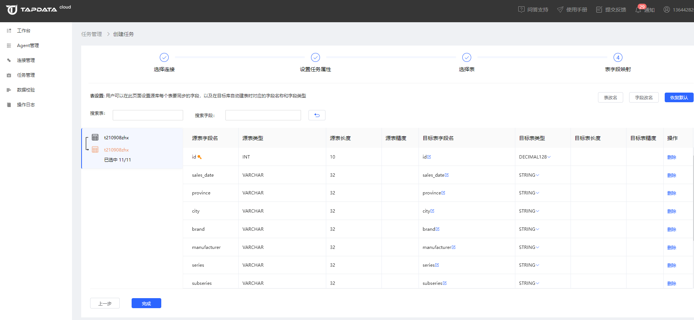
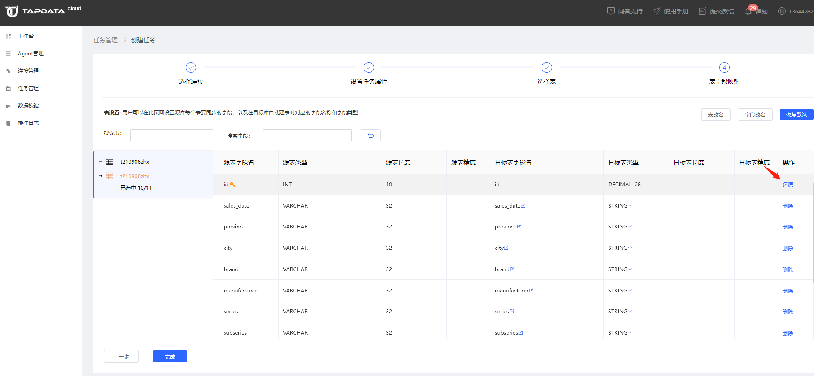
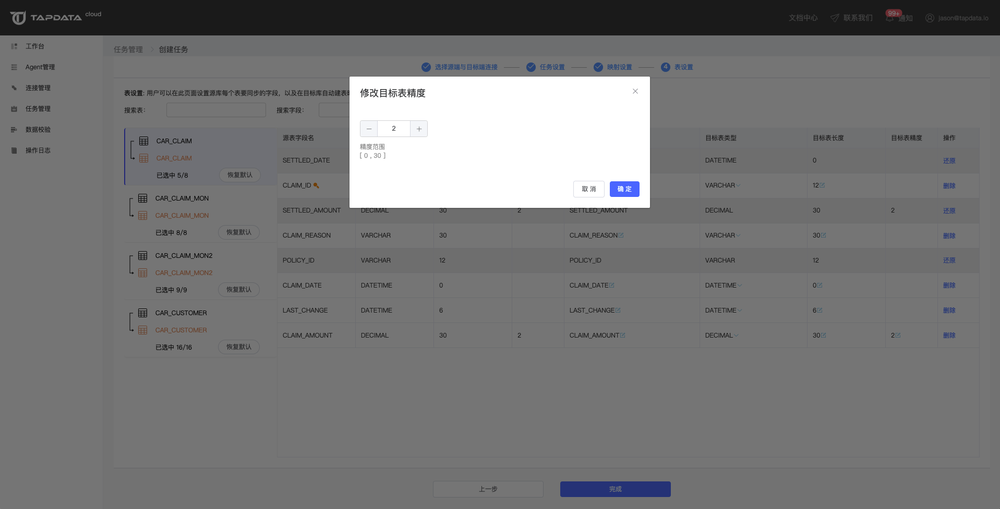
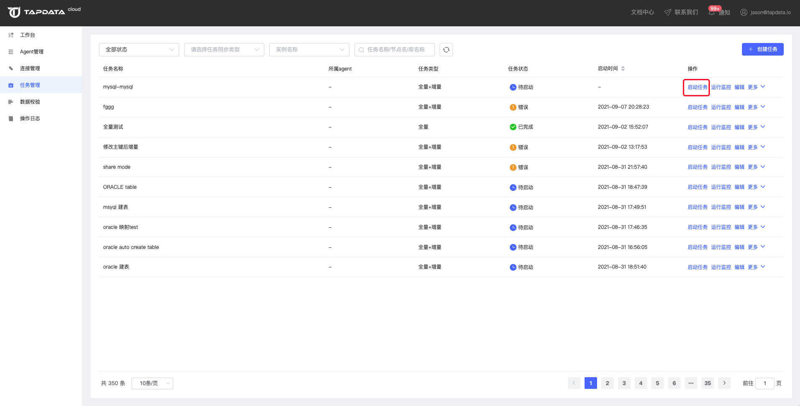

# 创建数据复制任务

Tapdata Cloud 支持数据全量/增量同步，您可以跟随本文的步骤创建数据同步任务。

## 前提条件

* [安装 Agent](../../quick-start/install-agent)
* [连接数据库](../connect-database)

## 操作步骤

1. 单击左侧导航栏的**任务管理**，然后单击右上角上角的**创建任务**。

2. 选择源端与目标端对应的连接，设置完成后，点击**下一步**。

   

   * 源端类型：以下拉列表方式选择您的源端数据库的类型，选择类型后源端连接会自动关联出该类型下的已创建的所有连接
   * 源端连接：选择您要使用的数据连接
   * 目标端类型：以下拉列表方式选择您的目标端数据库的类型，选择类型后源端连接会自动关联出该类型下的已创建的所有连接
   * 目标端连接：选择您的目标端要使用的数据连接

3. 在任务设置步骤，对任务名称、同步类型、全量写入模遇错处理等进行设置，设置完成后单击**下一步**。

   

4. 在选择表步骤，设置迁移范围，可以在此页面勾选需要将源端哪些表同步到目标端，设置完成后单击**下一步**。

   点击选择待复制表区域表，然后点击中间向右的箭头按钮，可以将这些表移动到右侧的已选择表区域，任务开始执行后将对这些表执行同步传输。

   

5. 在表字段映射步骤，设置源表到目标表的字段名、字段类型和字段精度等信息。

   在源表同步到目标表的过程中，默认字段名保持一致。如果用户希望对同步到目标表后的字段名进行调整，可以直接点击目标字段名后的修改按钮进行修改。

   :::tip

   如果在这里对目标字段名进行了修改，将会导致进行字段值数据校验时因为字段名无法匹配而出现异常，此时只能通过高级校验对表数据进行校验。

   :::

   

   * **重命名表**：单击已选择表上方的【改名】操作可以对已选择要同步的表进行批量改名，批量改名操作目前仅支持添加前缀和后缀。

     

   * **设置字段名**：在源表同步到目标表的过程中，默认将源表所有字段同步到目标表。对于不需要同步到目标的字段，用户可以手动删除。删除后的字段会置灰，点击还原按钮可以恢复。

     

   * **设置目标字段类型和精度**：Tapdata Cloud 会自动根据源表的字段类型和精度推演出同步到目标表后对应的字段类型和精度信息。如果用户对自动推荐出的结果不满意或者有很明确的字段类型和精度的要求时，可以在这里灵活调整目标字段的类型和精度。

     如果目标表存在字段类型为空时，在左侧的表区域会有明显的提示，此时无法保存任务，需要完善类型信息后才可保存。

     

     对于字段类型支持设置精度的目标字段，可以修改目标字段的精度：

     

6. 表映射设置完成后，点击完成按钮，即可完成任务的创建。

   我们在任务管理列表可以看到我们刚创建的任务，状态为待启动。

   

7. 点击任务管理列表对应任务的【启动任务】，可以启动任务执行。启动成功后，任务会变为运行中状态。

   

