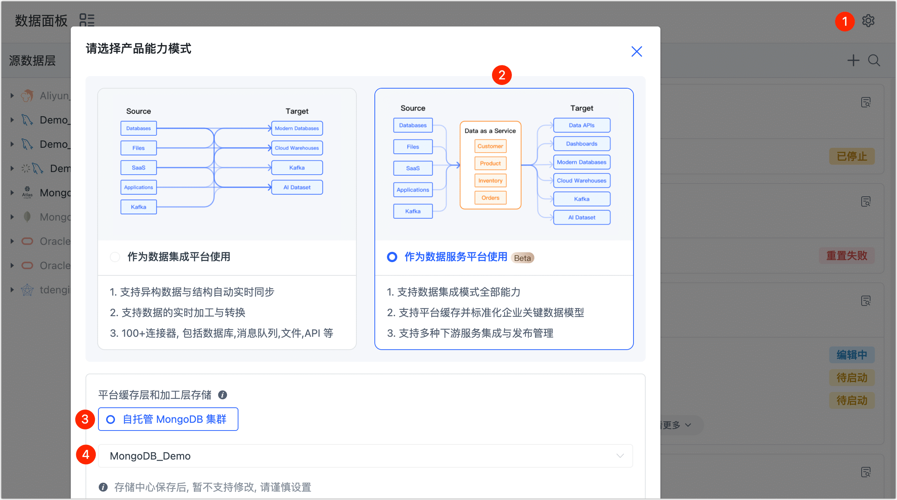

# 开启数据服务平台模式

随着数字化转型的持续深入，数据孤岛问题已逐渐成为主要的阻碍，同时业务对数据需求日益增多，传统的数据交付因其周期长、资源投入大而成为交付瓶颈，如何快速打通数据流转通道，发掘数据价值，已成为企业竞争力的关键因素。

借助 Tapdata Cloud 的数据服务平台模式，您可以将分散在不同业务系统的数据同步至统一的平台缓存层，可为后续的数据加工和业务提供基础数据，从而构建一致、实时的数据平台，连通数据孤岛。

## 数据服务平台介绍

随着源库承载的任务增多，为最大限度地降低数据提取对源库的影响，同时契合组织对数据分层治理的理念，Tapdata 根据数据流转顺序，将数据服务平台分层如下：

| 分层                 | 说明                                                                                                                  |
| -------------------- |---------------------------------------------------------------------------------------------------------------------|
| **源数据层**         | Tapdata Cloud 将来自不同业务系统的数据源，抽象为统一的数据源层，它是打通数据孤岛的第一步。更多介绍，见[连接数据源](../../../prerequisites/README.md)。 |
| **平台缓存层**       | 通过将源库的表数据提前同步到的平台缓存层，后续可直接通过平台缓存层直接给业务提供数据，避免在数据加工时直接读取/操作源库的数据（如合并表），可极大降低对源库所属业务的影响。                              |
| **平台加工层**       | 如需对数据进行深度定制化的加工/运算（如生成宽表），您可以将平台缓存层的数据表拖动至平台加工层来操作，从而生成最终业务要用的模型数据。                                                 |
| **数据目标和服务层** | Tapdata Cloud 将支持作为目标的数据源集中展示在数据目标和服务层，您可以将加工后的数据提供给业务使用，从而为企业构建统一的数据服务平台。                                          |

## 准备工作

在数据服务平台模式下，我们需要准备一个自建的 MongoDB 数据库，将其作为平台缓存层/平台加工层的数据存储库：

1. 准备一个 MongoDB 数据库（4.0 及以上），相关部署介绍，见 [MongoDB 官网](https://www.mongodb.com/docs/manual/administration/install-on-linux/)。

   :::tip

   为保障业务高可用性，推荐 MongoDB 采用副本集/分片集群架构，同时需基于源数据层的数据规模预留足够的存储空间。

   :::

2. [连接 MongoDB 数据库](../../../prerequisites/certified/mongodb.md)。

## 操作步骤

Tapdata Cloud 默认处于[数据集成平台模式](../etl-mode/README.md)，接下来，我们将介绍如何开启数据服务平台模式。

1. 登录 [Tapdata Cloud 平台](https://cloud.tapdata.net/console/v3/)。

2. 在左侧导航栏，单击**数据面板**。

3. 在页面右侧，单击图标。

4. 选择**作为数据服务平台使用**，然后设置平台缓存层/平台加工层所用的存储引擎，即我们在准备工作中设置的 MongoDB 数据源。

   

   :::tip

   存储引擎目前仅支持自建的 MongoDB 数据库，且一旦选定保存，后续无法修改，请谨慎操作。

   :::

5. 单击**保存**，页面将基于我们前面介绍的层级进行[分类展示](daas-mode-dashboard.md)。

   

