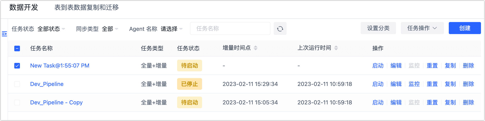

# 管理数据开发任务

任务创建完成后，您可以在任务列表中对任务进行监控和管理操作。

| 操作              | 说明                                                         |
| ----------------- | ------------------------------------------------------------ |
| **设置分类**      | 选中目标任务，将任务以业务的视角分类，方便后续管理。         |
| **启动**/**停止** | 停止任务后，下次启动将基于上次停止的增量时间点继续复制数据。 |
| **编辑**          | 调整任务的配置，例如调整节点设置、同步的表、任务启动计划等信息，任务运行时不可调整。 |
| **监控**          | 查看任务的运行进度、运行日志、连接、历史运行记录、同步内容等信息。更多介绍，见[监控数据复制任务](monitor-task.md)。 |
| **复制**          | 快速克隆一个配置完全相同的任务，基于复制后的任务微调即可完成配置，简化配置流程。 |
| **重置**          | 清除任务的数据同步进度，下次启动将重新执行数据同步任务。     |
| **删除**          | 任务删除后将无法恢复，请谨慎操作。                           |
