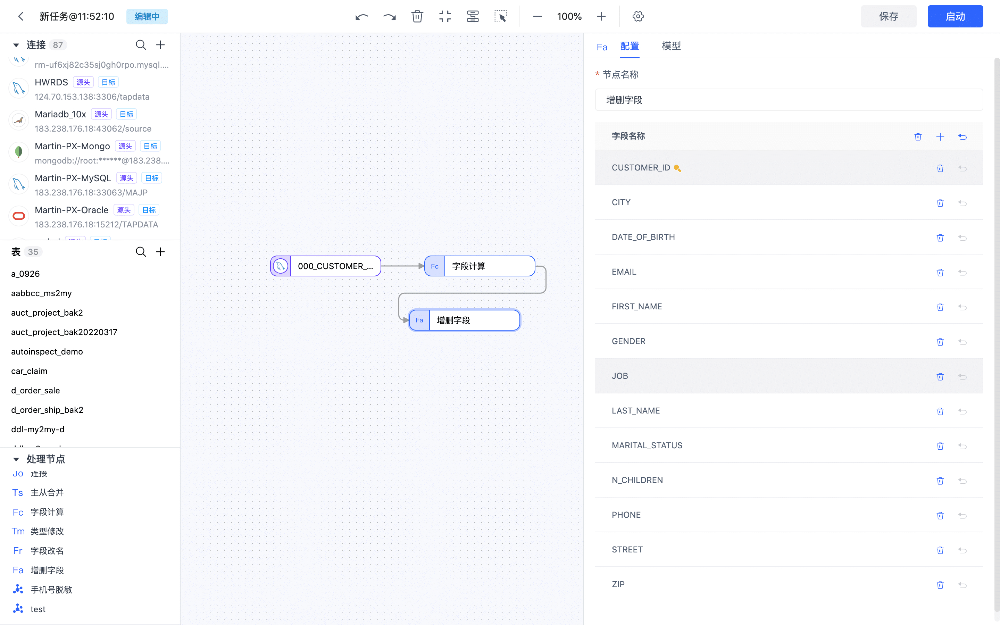
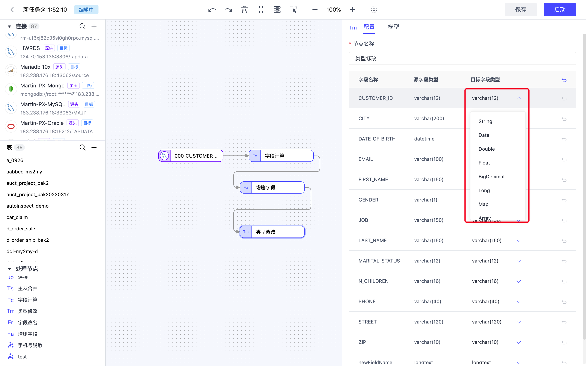
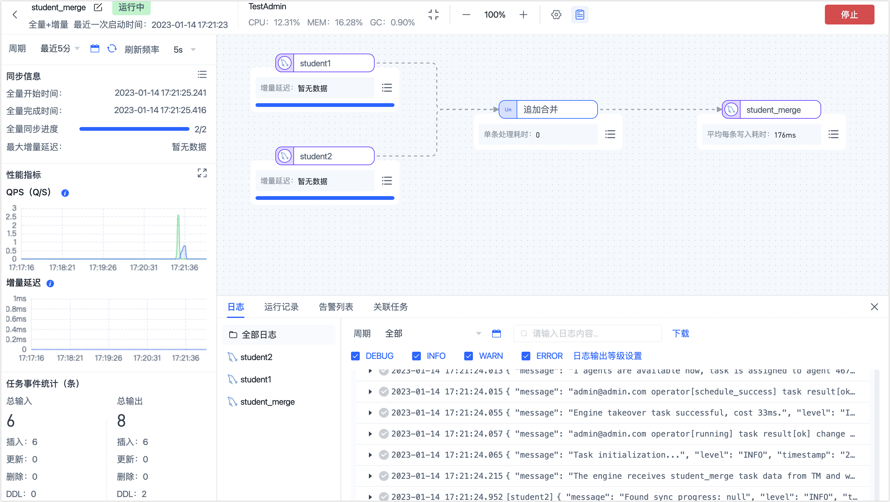
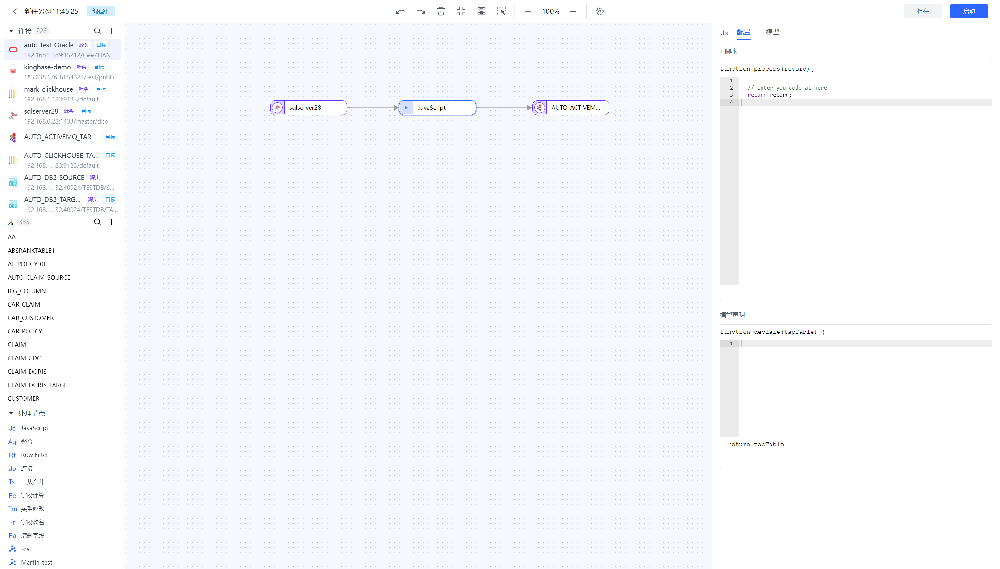

# 添加处理节点

Tapdata Cloud 支持在数据复制/开发任务中添加处理节点，满足对数据进行过滤、字段调整等需求。

## 行过滤器

主要用来对表数据进行过滤，可以设置过滤条件和执行动作。

* **执行动作**：可选择保留或丢弃匹配的数据

* **条件表达式**：设置过滤条件的表达式
* **表达式示例**：筛选出50岁以上的男性或者收入一万以下的30岁以上的人，`( record.gender == 0&& record.age > 50) || ( record.age >= 30&& record.salary <= 10000)`


## <span id="add-and-del-cols">增删字段</span>

可用来增加新的字段或者删除已有字段，将**增删字段**节点添加到画布，将该节点与数据节点按照处理顺序连接起来，随后可配置该节点参数，此外，您还可以调整字段的顺序。如果删除了某个字段，该不会传递到下个节点。




## 字段改名

可用来对字段执行重命名或转换大小写操作，将**字段改名**节点添加到画布，将该节点与数据节点按照处理顺序连接起来，随后可配置该节点参数。


## 字段计算

可通过字段间的计算为字段赋值，将**字段计算**节点添加到画布，将该节点与数据节点按照处理顺序连接起来，随后找到要计算的字段，配置计算规则（支持 JS）。


## 类型修改

类型修改节点可以用来调整字段的数据类型。




## <span id="union-node">追加合并</span>

通过**追加合并**节点，您可以将多个结构相同/相似的表，合并输出至一个表中，Tapdata 会将字段名一致的数据进行合并，详细规则如下：

- 如果推演出的类型长度和精度不同，则选择最大长度精度。
- 如果推演出的类型不同，则将其转换为一个通用类型。
- 当所有源表的主键字段一致时，则保留主键，否则移除该主键。
- 当所有源表的相同字段都有非空限制时，则保留非空限制，否则移除非空限制。
- 源表的唯一索引不会同步到目标表。


**场景示例：**

希望对 2 个表结构相同的 **student1** 和 **student2** 表执行追加合并操作（Union），然后将结果存在 **student_merge** 表中，表结构及数据如下：


**操作流程**：

1. 登录 [Tapdata Cloud 平台](https://cloud.tapdata.net/console/v3/)。

2. 在左侧导航栏，单击**数据开发**。

3. 单击页面右侧的**创建**。

4. 在页面左侧依次拖入要执行追加合并的数据源至右侧画布，然后从页面左下角拖入**追加合并**节点，最后将它们连接起来。

   

5. 依次单击要执行追加合并的数据源，在页面右侧的面板中选择待合并的表（**student1** / **student2**）。

6. （可选）单击**追加合并**节点，单击**模型**页签查看追加合并后的表结构信息。

7. 从页面左侧拖入一个数据源用于存放追加合并后的表，然后将**追加合并**节点连接至该数据源。

8. 单击用于存放追加合并表的数据源，在页面右侧的面板中选择目标表（**student_merge**）及高级设置。

   :::tip

   如希望由 Tapdata 自动创建表结构，可提前在目标库中创建一个名为 **student_merge** 的空表（表结构不限），然后在此处的**高级设置**中，将**已有数据处理**选择为**清除目标端原有表结构和数据**。

   :::

   

9. 确认配置无误后，单击**启动**。

   操作完成后，您可以在当前页面观察任务的执行情况，如 QPS、延迟、任务时间统计等信息，示例如下：

   


**结果验证**：

查询 **student_merge** 表，结果如下：

```sql
mysql> select * from student_merge;
+---------+------+--------+------+-------+--------+
| stu_id  | name | gender | age  | class | scores |
+---------+------+--------+------+-------+--------+
| 2201101 | Lily | F      |   18 |  NULL |   NULL |
| 2201102 | Lucy | F      |   18 |  NULL |   NULL |
| 2201103 | Tom  | M      |   18 |  NULL |   NULL |
| 2202101 | Lily | F      |   18 |     2 |    632 |
| 2202102 | Lucy | F      |   18 |     2 |    636 |
| 2202103 | Tom  | M      |   18 |     2 |    532 |
+---------+------+--------+------+-------+--------+
6 rows in set (0.00 sec)
```

## <span id="js-process">JS 处理</span>

支持通过 JavaScript 脚本或者 Java 代码对数据进行处理，编写代码时需先检测是否与源节点及目标节点相连，若未相连则无法编辑代码。  



### 模型声明

针对 JS 节点，Tapdata Cloud 会通过采样数据试运行的方式来推演节点的模型信息。如果发现推演出的模型不准确或字段数量发生变化，可通过模型声明显式的来定义模型里的字段信息。


在开发任务中，模型声明支持的方法如下所示：

```javascript
// 增加一个字段，如果字段已存在则不操作
TapModelDeclare.addField(tapTable, 'fieldName', 'TapString')
// 移除一个已存在字段
TapModelDeclare.removeField(tapTable, 'fieldName')
// 更新一个已存在的字段
TapModelDeclare.updateField(tapTable, 'fieldName', 'TapString')
// 更新字段，如果不存在则新增
TapModelDeclare.upsertField(tapTable, 'fieldName', 'TapString')
// 设置字段为主键
TapModelDeclare.setPk(tapTable, 'fieldName')
// 取消主键
TapModelDeclare.unsetPk(tapTable, 'fieldName')
// 增加索引
TapModelDeclare.addIndex(tapTable, 'indexName', [{'filedName':'fieldName1', 'order': 'asc'}])
// 移除索引
TapModelDeclare.removeIndex(tapTable, 'indexName')
```

参数说明：

- `tapTable`：开发任务时的固定参数，JS 节点的返回值
- `fieldName`：要新增或者操作的字段名
- `indexName`：要新增或者操作的索引名
- `TapType`：要新增的字段类型或者要将已有字段的类型修改为的目标类型。目前仅支持使用内置的 `TapType`，支持：
  - `TapBoolean`：布尔类型，使用 boolean 来存储布尔值
  - `TapDate`：日期类型，使用自定义的 DateTime 存储日期值
  - `TapArray`：数组类型，使用 Array 存储 Array 值
  - `TapNumber`：数值类型，使用 Java 的 Double存 储数字值
  - `TapBinary`：二进制类型，使用 byte[] 存储字节数组
  - `TapTime`：时间类型，使用 DateTime 存储时间值
  - `TapMap`：Map类型，使用 Map 存储 Map 值
  - `TapString`：字符串类型，使用 Java 的 String 存储字符串
  - `TapDateTime`：日期时间类型，使用自定义的 DateTime 存储日期和时间值
  - `TapYear`：年份，使用 DateTime 存储时间值


### 应用场景

1. 在JS节点中对数据记录进行加工处理
2. 在JS节点中调用自定义函数实现对数据的处理
3. 在JS节点中调用缓存
4. 其他需要使用JS节点自定义处理逻辑的场景

### JS 内置函数说明

* [标准 JS 内置函数](../../appendix/standard-js.md)：可对数据记录进行处理与运算，如将日期字符串转换为 Date 类型。
* [增强 JS 内置函数（Beta）](../../appendix/enhanced-js.md)：支持标准 JS 内置函数的基础上，可实现外部调用（如网络、数据库等）。

