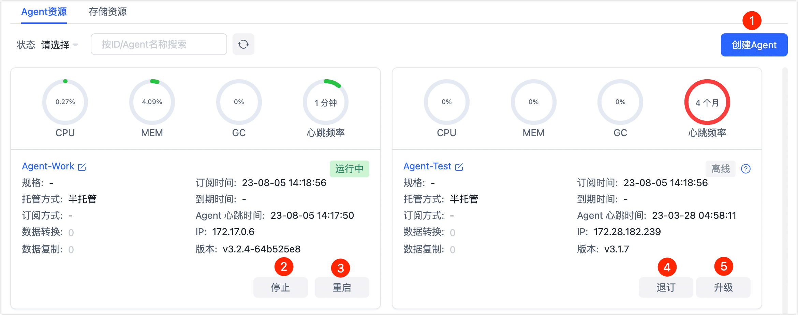

# 管理 Agent

Tapdata Cloud 支持对 Agent 的可视化运维管理，您可以通过页面管理已安装的 Agent，也可以通过命令行管理。


## 通过页面管理 Agent

1. 登录 [Tapdata Cloud 平台](https://auth.tapdata.net/)。

2. 单击左侧导航栏的 **Agent 管理**，在当前页面选择执行下述操作。

   

   

   | 序号 | 操作       | 说明                                                         |
   | ---- | ---------- | ------------------------------------------------------------ |
   | ①    | 创建 Agent | Agent 可支持多平台安装，具体操作，见[安装 Agent](../quick-start/install-agent)。 |
   | ②    | 升级 Agent | 当有新版本可用时，版本信息右侧会显示升级图标，单击该图标后选择升级方式：<br />●  **自动升级**：Agent 状态为**运行中**时可选择该方式，升级完成后升级图标会自动消失，如遇升级失败可手动<br />升级。 <br />●  **手动升级**：根据弹窗的提示，在 Agent 所安装的设备上执行升级命令。<br />💡 为避免升级操作影响任务运行，请在升级前停止该 Agent 相关的任务。 |
   | ③    | 停止 Agent | 单击**停止**可暂停 Agent 的运行，可用于临时维护场景，后续需要通过命令行启动 Agent。 |
   | ④    | 删除 Agent | 如不再需要 Agent，可将其停止后单击**删除**，删除后不可恢复。 |


## 通过命令管理 Agent

根据 Agent 安装的平台选择，查看相关命令介绍：

import Tabs from '@theme/Tabs';
import TabItem from '@theme/TabItem';

<Tabs className="unique-tabs">
    <TabItem value="linux" label="Linux 平台" default>
    <p>进入 Agent 的安装目录，选择执行下述命令：</p>
    <ul>
    <li>查看命令帮助：<code>./tapdata help</code>
    </li>
    <li>查看 Agent 状态：<code>./tapdata status</code>
    </li>
    <li>启动 Agent：<code>./tapdata start</code>
    </li>
    <li>停止 Agent：<code>./tapdata stop</code>
    </li>
    </ul>
   </TabItem>
   <TabItem value="windows" label="Windows 平台">
    <p>进入 Agent 的安装目录，选择执行下述操作：</p>
    <ul>
    <li>查看 Agent 状态：双击应用程序 <b>sstatus.bat</b>
    </li>
    <li>启动 Agent：双击应用程序 <b>start.bat</b> 或 <b>tapdata.exe</b>
    </li>
    <li>停止 Agent：双击应用程序 <b>stop.bat</b>
    </li>
    </ul>
   </TabItem>
   <TabItem value="dockerandmac" label="Docker/Mac（M1 芯片） 平台">
    <ol>
    <li>执行 <code>docker ps</code> 获取容器 ID。
    </li>
    <p></p>
    <li>执行下述格式的命令进入容器命令行。
    <pre>
    docker exec -it 容器ID /bin/bash</pre>
    <p>需替换命令中的容器 ID，例如 <code>docker exec -it 1dbee41b4adc /bin/bash</code>。</p>
    </li>
    <li>在容器命令行中，进入 Agent 的安装目录，然后选择执行下述命令：
    <ul>
    <li>查看命令帮助：<code>./tapdata help</code>
    </li>
    <li>查看 Agent 状态：<code>./tapdata status</code>
    </li>
    <li>启动 Agent：<code>./tapdata start</code>
    </li>
    <li>停止 Agent：<code>./tapdata stop</code>
    </li>
    </ul>
    </li>
    </ol>
   </TabItem>
   <TabItem value="computenest" label="阿里云计算巢">
    <ol>
    <li>登录阿里云并进入<a href="https://computenest.console.aliyun.com/">计算巢控制台</a>。
    </li>
    <p></p>
    <li>找到您的计算巢实例并单击其 ID，进入概览页面。
    </li>
    <p></p>
    <li>单击<b>资源</b >页签，找到 Agent 安装到的 ECS 示例（名称包含 <b>tapdata</b>），单击其右侧的<b>远程连接</b>。
    <p></p>
    </img>
    </li>
    <p></p>
    <li>在跳转到的命令窗口中，执行 <code>cd /data/tapdata</code> 进入 Agent 安装目录，然后选择执行下述命令：
    <ul>
    <li>查看命令帮助：<code>./tapdata help</code>
    </li>
    <li>查看 Agent 状态：<code>./tapdata status</code>
    </li>
    <li>启动 Agent：<code>./tapdata start</code>
    </li>
    <li>停止 Agent：<code>./tapdata stop</code>
    </li>
    </ul>
    </li>
    </ol>
   </TabItem>
  </Tabs>

### Agent 目录说明
Agent 在安装和执行任务的过程中，会自动在安装目录中生成一些文件，用于存放任务信息、日志、配置文件、数据源证书等信息，详细介绍如下：

tap_table_ehcache: 任务运行时相关数据源的表模型的缓存

```bash
├── cert										# 存放中间库的证书文件
├── application.yml								# Agent 配置文件
├── CacheObserveLogs							# 存放监控日志的缓存数据
├── components									# 存放引擎执行的 jar 包
├── connectors									# 存放数据源插件相关文件
├── etc											# 存放中间库初始化脚本
├── fileObserveLogAppenderV2					# 存放可观测性日志，子目录以任务 ID 命名
├── logs										# 存放引擎运行产生的日志
├── tapdata										# Agent 程序
├── tapdataDir									# 记录引擎的工作目录
└── tap_table_ehcache							# 存放任务运行时相关数据源的表模型缓存
```

:::tip

为确保 Agent 的稳定运行和快速定位故障，请勿删除上述目录或文件。

:::


### 调整 Agent 运行内存

找到 Agent 安装目录下的配置文件 **application.yml**，编辑该文件，根据服务器的可用内存调整内存配置信息，例如配置为 `tapdataJavaOpts: "-Xms4G -Xmx8G"`，即表示初始内存 4G，最大内存 8G，示例如下：

```yaml
tapdata:
    conf:
        tapdataPort: '3030'
        backendUrl: 'https://cloud.tapdata.net/api/'
        apiServerPort: ""
        tapdataJavaOpts: "-Xms4G -Xmx8G"
        reportInterval: 20000
        uuid: a5f266a1-a495-412f-a433-29d345713c176
		……
```

保存修改后，重启 Agent 生效：

```bash
# 停止 Agent
./tapdata stop -f
# 启动 Agent
./tapdata start
```
