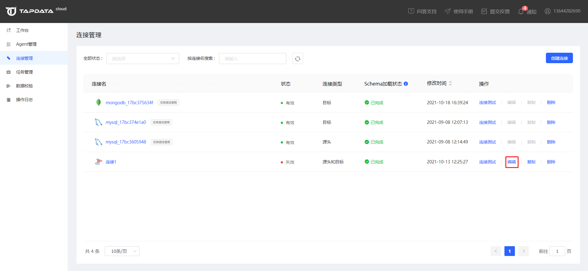
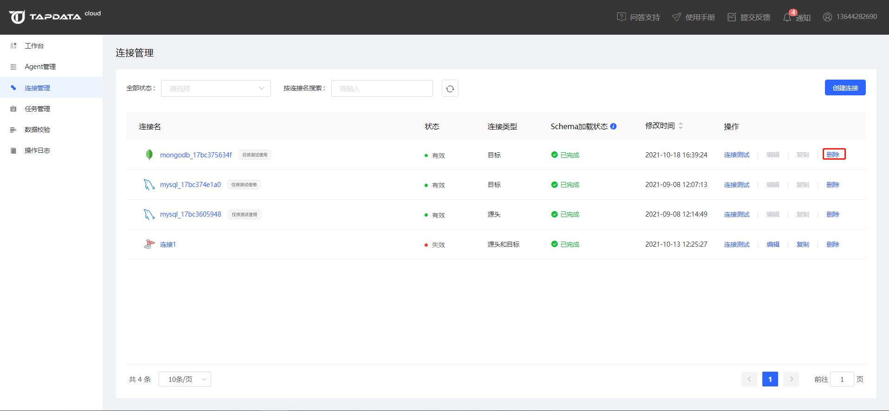

# 管理连接

Tapdata Cloud 通过连接保存了各数据库的连接信息，方便您在创建数据同步任务时选用，提升运维便利性。本文介绍连接的常见运维操作。

## 查询连接

连接管理支持通过连接状态和连接名称对连接进行快速查询和筛选。

## 编辑连接

1. 点击连接管理列表对应连接的【编辑】操作，可以对连接的配置信息进行编辑。

   

2. 点击【编辑】打开连接信息编辑页面，可以在这里对连接的名称和配置信息进行修改。

   

## 复制连接

Tapdata Cloud 支持通过复制的方式快速创建连接。点击连接后的【复制】操作，可以复制一个与原连接一模一样的连接。

## 删除连接

对于不需要的连接可以通过【删除】操作直接删除。

:::tip

连接删除后不可恢复，需谨慎操作。

:::

