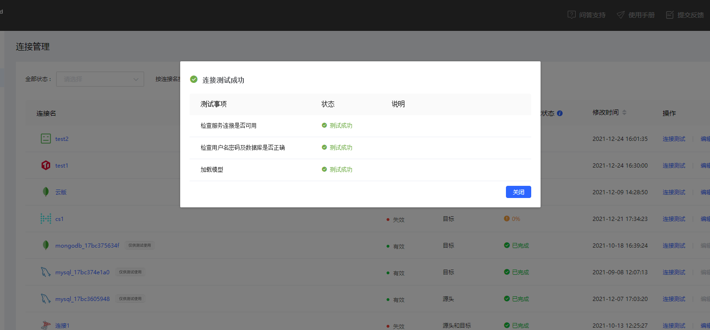

# TiDB 连接测试

在对连接进行测试前，您需要填写 [TiDB 连接信息](../connect-database/connect-tidb.md)，完成配置后可单击**连接测试**，测试内容包括检查服务连接是否可用、检查用户名密码及数据库是否正确加载模型。

- **检查服务连接是否可用**

  该测试项会对所填写的 TiDB 尝试连接，在网络不可达时会提示测试失败，此时请检查网络连通性，如：本地 iptables 配置、网络中的 ACL 限制等。

- **检查用户名密码及数据库是否正确**

  该测试项会使用所填写的用户名密码对 TiDB 尝试连接并登陆所填写数据库，在用户名错误、密码错误、库名错误、库不存在时会提示测试失败，此时请检查用户名、密码、库名的正确性。

- **加载模型**

  该测试项会尝试加载所填写数据库中的表的表结构，在无法加载时会提示测试失败，此时请检查对应账户权限是否足够。
