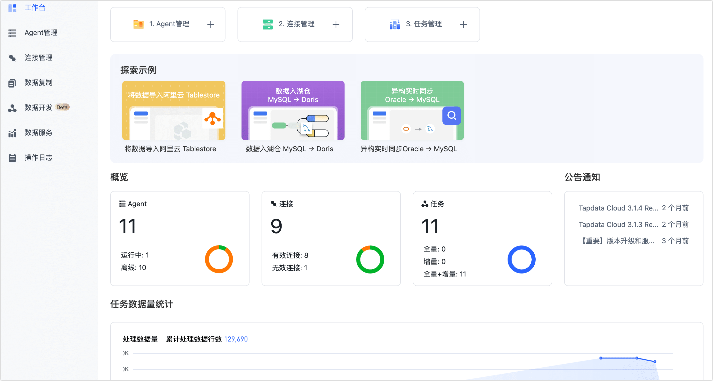
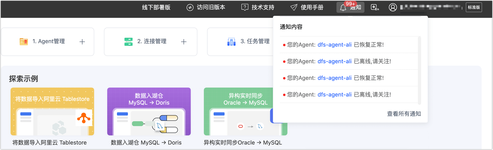

# Dashboard 介绍

Dashboard 主要帮助您快速了解和熟悉产品，并可以通过快速创建入口创建 Agent、连接和任务。

## 探索示例

展示 Tapdata Cloud 在不同场景下的最佳实践，例如数据入湖仓等。

## 概览

展示 Tapdata Cloud 中 Agent、连接、任务的数量和状态信息。

## 公告通知

展示最新的公告信息，包括升级变更提醒、版本新特性介绍等内容，点击公告标题可以查看公告详细内容。

## 系统通知

将鼠标悬浮在右上角的**通知**，可快速获取最近的系统通知和告警信息（例如 Agent 状态通知），此外，您还可以单击**通知**，进入**通知列表**页面设置 Agent 通知的方式（如邮件/短信等）。

## 相关文档

只需简单 3 步，即可体验 Tapdata 强大、便捷的数据流转能力：

* [安装 Agent](../quick-start/install-agent/README.md)
* [连接数据库](../quick-start/connect-database.md)
* [创建复制/开发任务](../quick-start/create-task.md)
