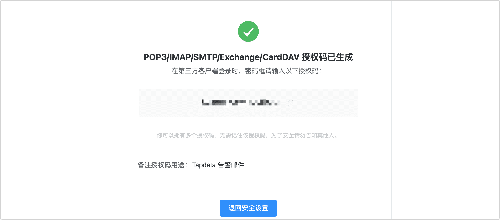

# 通过 QQ 邮箱发送告警信息

Tapdata 支持通过 SMTP 协议来发送告警邮件，可以实现在用户常用的邮箱中及时接收到异常通知，从而帮助您及时感知运行异常，保障任务运行的稳定性和可靠性。

## 场景介绍

QQ 邮箱作为一种普及度较高的通信工具，使用非常广泛，它可以方便地实现告警信息的接收和查看，为用户提供便捷的异常处理方式。本文案例中，我们将介绍如何在 Tapdata 中集成 QQ 邮箱，实现告警信息的发送，帮助提高运维人员的工作效率，快速定位和解决问题。

您也可以在 Tapdata 平台中集成其它邮箱（如 163 邮箱），配置流程与本文相似。

## 步骤一：获取邮箱授权码

邮箱授权码是 QQ 邮箱用于登录第三方客户端/服务的专用密码，适用于登录以下 SMTP 服务，在 Tapdata 平台中设置告警邮箱配置前，您需要通过获取邮箱授权码。

1. 登录 [QQ 邮箱](https://mail.qq.com/)。

2. 在页面顶部，单击**设置**。

3. 在**邮箱设置**页面，单击**账户**选项卡。

4. 下翻至**POP3/IMAP/SMTP/Exchange/CardDAV/CalDAV服务**，单击**开启服务**。

   

   :::tip

   如您已开启该服务，可单击**管理服务**，在跳转到的页面单击**生成授权码**。

   :::

5. 在弹出的**安全验证**对话框中，单击**前往验证**。

6. 根据页面提示，通过微信扫码或短信验证的方式完成验证。

7. 完成验证后页面将显示邮箱授权码，为保障信息安全请妥善保存，稍后我们将在 Tapdata 页面中配置邮箱时使用。

   
   
   :::tip
   
   如果更改了 QQ 帐号密码，会导致邮箱授权码过期，您需要重新获取新的授权码并更新至 Tapdata 平台中。
   
   :::

## 步骤二：配置 SMTP 服务

1. 登录 Tapdata 平台。

2. 在页面右上角单击图标，然后选择**系统设置**。

3. 在页面左侧，单击 **SMTP** 页签。

4. 根据下述说明，完成 SMTP 服务设置。

   

   * **SMTP 服务账号**：填写您的 QQ 邮件地址。
   * SMTP 服务密码：填写您在[步骤一](#mail-code)中获取的邮箱授权码。
   * **加密方式**：选择 **SSL**，保障信息安全性。
   * **SMTP 服务 Host**：填写发送 QQ 邮箱的发送邮件服务器，即 **smtp.qq.com**。
   * **SMTP 服务端口**：填写 **465** 或 **587**。
   * **Email 发送邮件地址**：填写您的 QQ 邮件地址。
   * **Email 接受邮件地址**：填写要接受告警信息的邮件地址，多个地址间用英文逗号（,）分隔。
   * **发送 Email 标题的前缀**：可选项，可设置邮件标题的前缀，便于您更快识别邮件来源。

5. 配置完成后，单击页面下方的**连接测试**，在 QQ 邮箱中确认接收到了测试邮件后单击**保存**。

   测试邮件的示例如下：

   

6. （可选）在左侧导航栏，选择**通知设置**，然后指定哪些事件需要发送告警邮件、发送间隔，然后单击**确定**。

   

   

## 结果验证

经过上述设置后，我们在 Tapdata 平台上删除了一个测试任务，随后即收到了一份邮件，示例如下。

