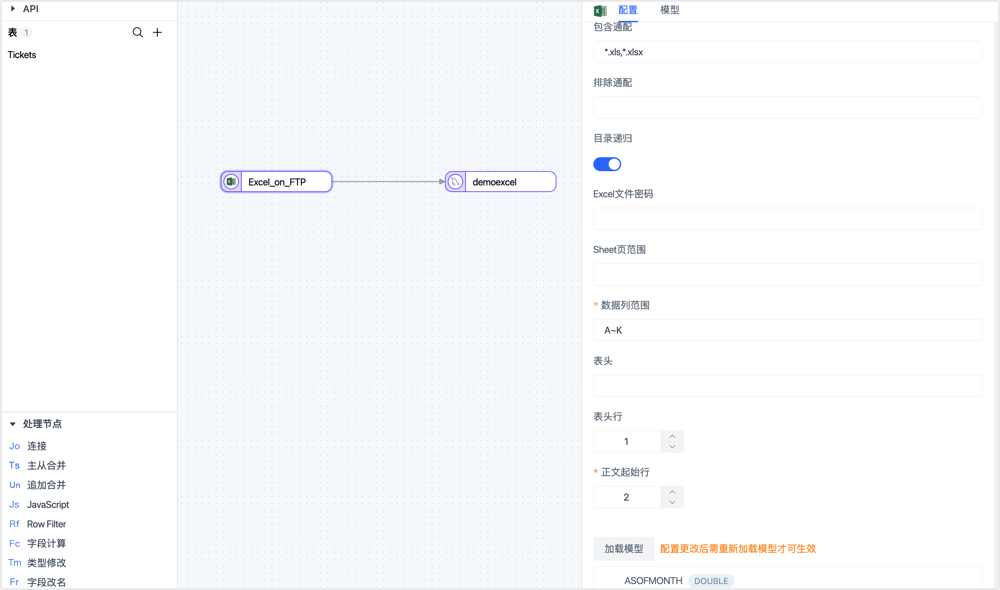
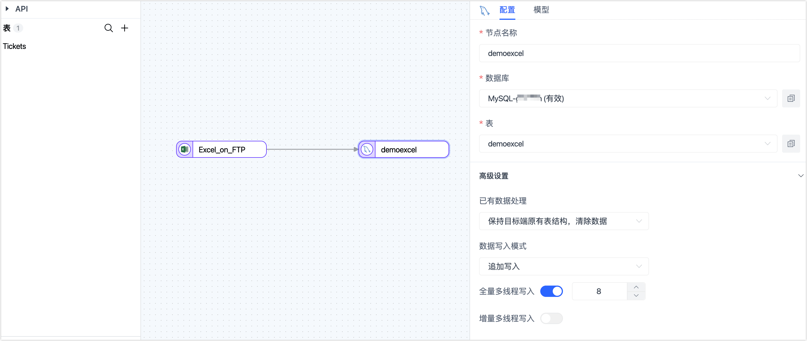
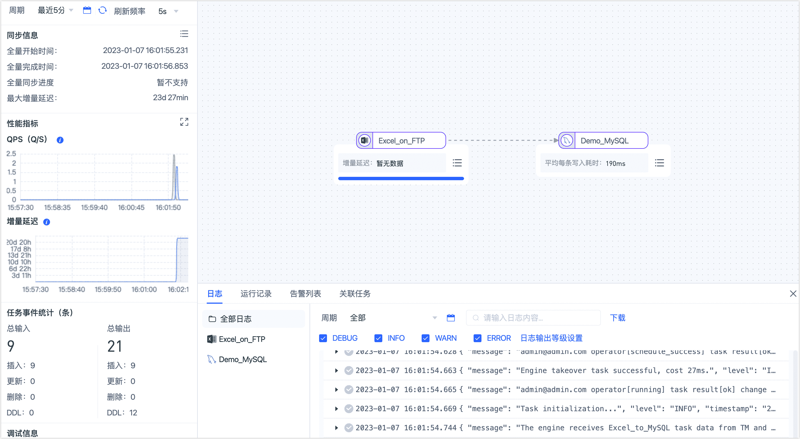

# Excel 数据开发任务

Excel 是使用广泛的数据统计和数据分析软件，Tapdata 支持读取本地、FTP、SFTP、SMB 或 S3FS 上的 Excel 文件，满足多样化的数据流转需求。

本文介绍如何通过 Tapdata 的数据开发任务，将 Excel 文件数据同步至 MySQL，实现数据的快速入库，用来对接更丰富的数据分析工具。

## 准备工作

在创建数据开发任务前，请确保您已经配置好了相关数据源：

1. [配置 Excel 连接](../user-guide/connect-database/beta/connect-excel.md)
2. [配置 MySQL 连接](../user-guide/connect-database/certified/connect-mysql.md)

## 操作步骤

1. 登录 Tapdata 平台。

2. 在左侧导航栏，选择**数据管道** > **数据开发**。

3. 单击页面右侧的**创建**。

4. 在页面左侧，将 Excel 和 MySQL 数据源拖拽至右侧画布中，然后将其连接起来。

5. 单击 Excel 数据源，根据下述说明完成右侧面板的配置。

   

   * 设置节点信息
     * **节点名称**：默认为数据源名称，您也可以修改为具有业务意义的名称。
     * **数据库**：保持默认。
     * **每批读取条数**：全量同步时，每批次读取的记录条数，默认为 **100**。
   * 设置文件信息
     * **过滤设置**：打开该开关后可自定义数据过滤规则。
     * **模型名**：任务节点选择的文件对应的模型名称，填写具有业务意义的名称。
     * **包含通配**：默认为 `*.xls,*.xlsx`，即表示搜索所有 XLS/XLSX 格式的文件，目前仅支持通过 `*` 模糊匹配，不支持正则表达式。
     * **排除通配**：默认为空，即不过滤任何 Excel 文件。
     * **目录递归**：默认开启状态，即遍历子目录来查找 Excel 文件。
     * **Excel 文件密码**：如果 Excel 设置了密码保护，需要填写密码以解密。
   * 设置数据信息
     * **Sheet 页范围**：默认加载所有 Sheet 页，例如输入 `1,3~5,8`，表示 1、3、4、5 和 8 页。
     * **数据列范围**：即数据包含那些列，例如输入 `A~BA`，表示 第 A 列到第 BA 列。
     * **表头**：可配置某行作为表头，也可以自定义表头，通过英文逗号（,）分隔。
     * **表头行**：指定作为表头的行，即列名所属的行，该值为 **0** 表示文件中没有表头行，如果此时表头为空，会自动按 **Column1**、**Column2**...进行命名。
     * **正文起始行**：指定作为正文起始的行，通常为表头行的下一行。

6. 述信息设置完成后，单击**加载模型**即可显示 Excel 中各列的名称和数据类型。

   :::tip

   目前支持的数据类型为 **STRING**、**TEXT**、**DOUBLE**、**BOOLEAN**、**DATE**。

   :::

7. 单击右侧的 MySQL 数据源，根据下述说明完成设置。

   

   - 基础设置
     - **节点名称**：默认为连接名称，您也可以设置一个具有业务意义的名称。
     - **表**：选择要写入的目标表，您也可以手动填写。
     - **更新条件字段**：选择更新条件的判断依据字段。
   - 高级设置
     - **全量多线程写入**：全量数据写入的并发线程数，默认为 **8**，可基于目标端写性能适当调整。
     - **增量多线程写入**：增量数据写入的并发线程数，默认未启用，启用后可基于目标端写性能适当调整。
     - **每批次写入条数**：全量同步时，每批次写入的条目数。
     - **每批写入最大等待时间**：根据目标库的性能和网络延迟评估，设置最大等待时间，单位为毫秒。
     - **已有数据处理**：根据业务需求选择，如果目标表没有数据且结构和源表不一致，可选择为**清除目标表原有表结构及数据**。
     - **数据写入模式**：根据业务需求选择。
       - **按事件类型处理**：选择此项后，还需要选择插入、更新、删除事件的数据写入策略。
       - **统计追加写入**：只处理插入事件，丢弃更新和删除事件。

8. （可选）单击页面右上角的**设置**，配置任务属性。
   - **任务名称**：填写具有业务意义的名称。
   - **同步类型**：可选择**全量+增量**，也可单独选择**全量**或**增量**。 全量表示将源端的存量数据复制到目标端，增量表示将源端实时产生的新数据或数据变更复制到目标端，二者结合可用于实时数据同步场景。
     :::tip
     在增量同步的过程中，Tapdata 默认每隔 1 分钟检测 Excel 文件是否发生变更（如新增/修改文件），如发生变更则将涉及的文件全量新增后更新条件字段以完成修改，暂不支持同步删除文件或数据。
     :::
   - **任务描述**：填写任务的描述信息。
   - **高级设置**：设置任务开始的时间、增量数据处理模式、处理器线程数、Agent 等。

9. 确认无误后，单击**启动**。

   操作完成后，您可以在当前页面观察任务的执行情况，如 QPS、延迟、任务时间统计等信息，示例如下：

   

## 任务管理

在任务列表页面，您还可以对任务进行启动/停止、监控、编辑、复制、重置、删除等操作。

具体操作，见[管理任务](../user-guide/data-pipeline/data-development/monitor-task.md)。
