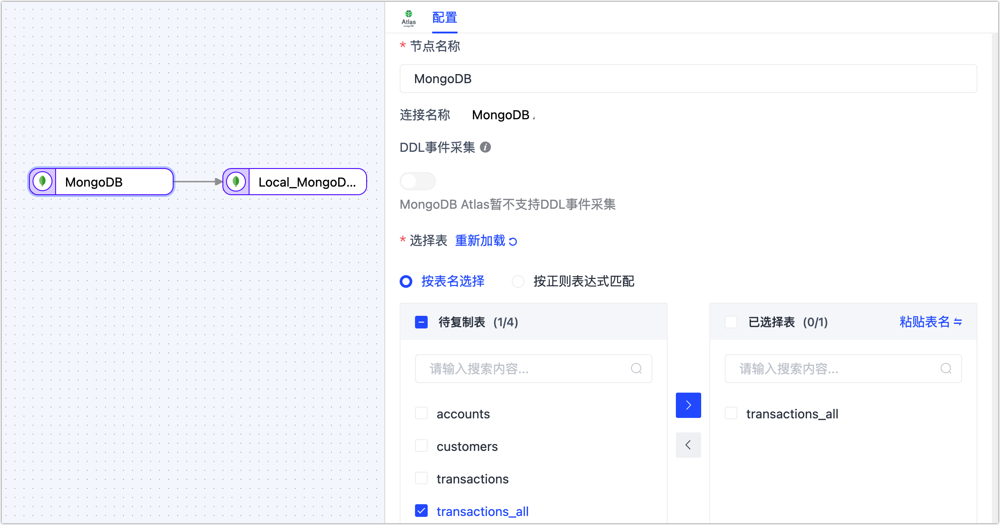
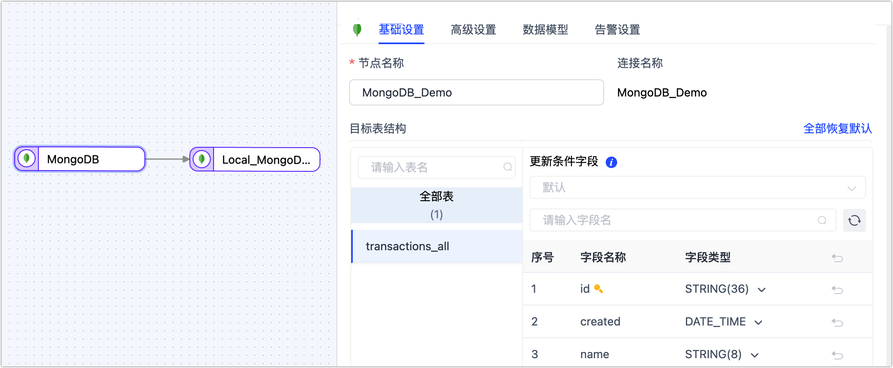

# 通过全量断点续传保障海量数据迁移

面对海量数据的迁移场景，您可以借助 Tapdata 的全量断点续传功能，将数据分片并迁移，提高数据迁移的可靠性，保障迁移任务的成功运行。

## 场景说明

随着企业业务的发展和数据量的不断增加，数据的存储和管理已经成为企业发展的核心问题之一。数据迁移作为一种常见的数据管理方式，已经广泛应用于企业的各个领域，例如云计算、大数据分析、备份和恢复等。然而，在实际数据迁移过程中，由于数据规模大、耗时长、网络环境不稳定、设备故障等原因，数据传输任务可能发生中断，从而导致任务执行失败。

为解决该问题，Tapdata 推出全量断点续传功能，它可以将源库的海量数据进行分片并记录传输的数据量和进度，在后续的数据迁移过程中，依次将每分片的数据缓存至 Tapdata 的本地缓存，随后将与其关联增量数据变更合并后发送至目标库，从而实现断点续传并保障数据准确性，有效地避免数据传输中断而导致的数据丢失和任务执行失败的问题，提高数据迁移的可靠性和效率。

## 前提条件

全量断点续传目前仅支持 MongoDB 数据源，即迁移的源库为 MongoDB 即可。

## 准备工作

在创建数据转换任务前，请确保您已经配置好了相关数据源，具体操作，见[配置 MongoDB 连接](../prerequisites/on-prem-databases/mongodb.md)。

## 操作步骤

本案例中，我们将以  MongoDB 间的数据迁移为例，介绍具体配置流程。

1. 登录 Tapdata 平台。

2. 在左侧导航栏，选择**数据管道** > **数据复制**。

3. 单击页面右侧的**创建**。

4. 在页面左侧，分别将作为源和目标库的 MongoDb 数据源拖拽至右侧画布中，然后将其连接起来。

5. 单击源库对应的节点，根据下述说明完成右侧面板的配置。

   

   * **基础设置**
     * **节点名称**：默认为连接名称，您也可以设置一个具有业务意义的名称。
     * **选择表**：根据业务需求选择。
       * **按表名选择**：在待复制表区域框选中表，然后单击向右箭头完成设置。
       * **按正则表达式匹配**：填写表名的正则表达式即可，此外，当源库新增的表满足表达式时，该表也会被自动同步至目标库。
     * **选择可见的表范围**：默认展示全部表，您也可以选择过滤**仅有主键表**或**仅无主键表**。由于无主键表采用全主键的方式来实现数据更新，可能因索引长度超限而报错，且性能可能受限，因此推荐您为无主键表单独建立数据复制任务，避免任务出错，提升数据更新的性能。
   * **高级设置**
     * **DDL 事件采集**：打开该开关后，Tapdata 会自动采集所选的源端 DDL 事件（如新增字段），如果目标端支持 DDL 写入即可实现 DDL 语句的同步。
     * **批量读取条数**：全量同步时，每批次读取的记录条数，默认为 **100**。
     * **全量断点续传**：该功能适用于数据规模达到亿级的迁移场景，开启后，停止任务后下次可从断点处继续迁移。
       * **分片方式**：基于业务需求选择：
         * **基于 count 分片**：即基于记录数分片，选择此项目时，您还需要指定分片大小。
         * **基于 min/max 分片**：即基于最大/小值分片，选择此项目时，您还需要指定分片的数量。
       * **分片并发线程数**：基于源库和 Tapdata 服务器负载选择并发数，默认为 8。
       * **分片一批读取上限**：基于源库负载选择分片中每批次读取数据的上限，默认为 3000。
       * **分片批量和增量数据本地合并之后再发送**：如本任务需要执行全量和增量迁移，则保持开启，如果仅执行全量迁移且源库在迁移期间不会发生数据变更，可关闭该功能。
     * **数据源专属配置**
       选择是否**禁用游标超时**（默认关闭）、**补充更新数据的完整字段**（默认开启）。
   * **数据模型**   
       展示源表的表结构信息，包含字段名称和字段类型。   
   * **告警设置**   
       默认情况下，节点的平均处理耗时连续 1 分钟大于等于 5 秒，则发送系统通知和邮件通知，您也可以根据业务需求调整规则或关闭告警。
   
6. 单击目标端节点，根据下述说明完成右侧面板的参数配置。

   

   * **基础设置**
     * **节点名称**：默认为连接名称，您也可以设置一个具有业务意义的名称。 
     * **目标表结构**：展示 Tapdata 将写入目标端的表结构信息，该信息基于源端节点设置所推演，同时会将更新条件自动设置为表的主键，如果没有主键则选用唯一索引字段，无主键和唯一索引时，您需要手动指定更新条件的字段。
       
       :::tip
       
       除此以外，您还可以直接单击目标自动的字段类型，在弹出的对话框中调整字段类型和精度。
       
       :::
       
     * **重复处理策略**：根据业务需求选择，默认为**保持目标端原有表结构和数据**。 
     * **全量多线程写入**：全量数据写入的并发线程数，默认为 **8**，可基于目标端写性能适当调整。 
     * **增量多线程写入**：增量数据写入的并发线程数，默认未启用，启用后可基于目标端写性能适当调整。 
     * **每批次写入条数**：全量同步时，每批次写入的条目数。 
     * **每批写入最大等待时间**：根据目标库的性能和网络延迟评估，设置最大等待时间，单位为毫秒。 
   * **高级设置**
     * **数据写入模式**：根据业务需求选择。
       * **按事件类型处理**：选择此项后，还需要选择插入、更新、删除事件的数据写入策略。
       * **统计追加写入**：只处理插入事件，丢弃更新和删除事件。
     * **数据源专属配置**：选择是否**保存删除数据**。 
   * **数据模型** 
     展示目标表的表结构信息，包含字段名称和字段类型。 
   * **告警设置** 
     默认情况下，节点的平均处理耗时连续 1 分钟大于等于 5 秒，则发送系统通知和邮件通知，您也可以根据业务需求调整规则或关闭告警。

7. （可选）单击页面右上角的**设置**，配置任务属性。

   * **任务名称**：填写具有业务意义的名称。
   * **同步类型**：可选择**全量+增量**，也可单独选择**全量**或**增量**。
     全量表示将源端的存量数据复制到目标端，增量表示将源端实时产生的新数据或数据变更复制到目标端，二者结合可用于实时数据同步场景。
   * **任务描述**：填写任务的描述信息。
   * **高级设置**：设置任务开始的时间、共享挖掘、增量数据处理模式、处理器线程数、Agent 等。

8. 单击**保存**或**启动**按钮完成创建，为保障任务的正常运行，Tapdata 会基于节点配置和数据源特征进行预检查，同时打印日志信息。

   :::tip

   如提未通过预检查，请根据当前页面的日志提示进行调整。更多信息，见[任务预检查说明](../user-guide/data-pipeline/pre-check.md)。

   :::

9. 启动成功后会自动跳转至任务监控页面，您可以查看任务的 QPS、延迟、任务事件等信息。

## 全量断点续传验证

任务运行过程中，单击任务监控页面的右上角的**停止**，任务暂停，全量迁移的进度仍存在。

等到业务低峰期时，可再次启动该任务，继续之前的全量迁移，您也可以编辑任务，在页面上方单击设置来设置任务的计划开始时间。

​      

