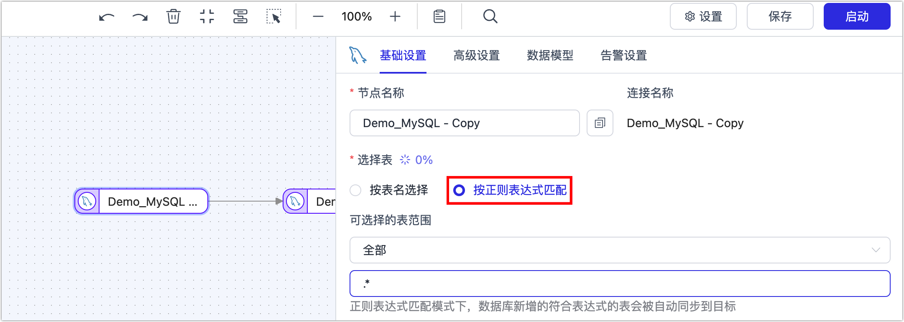
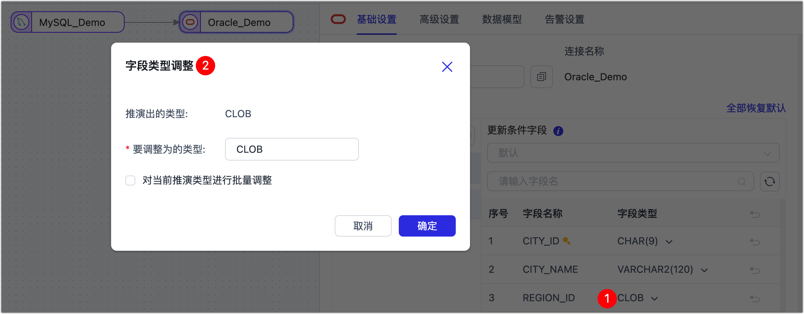
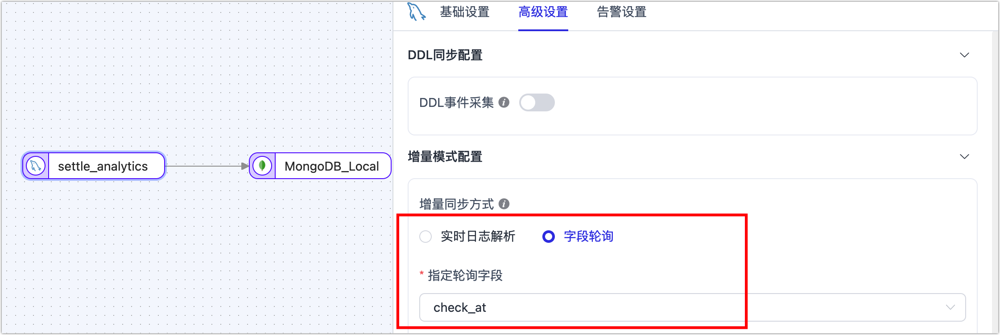
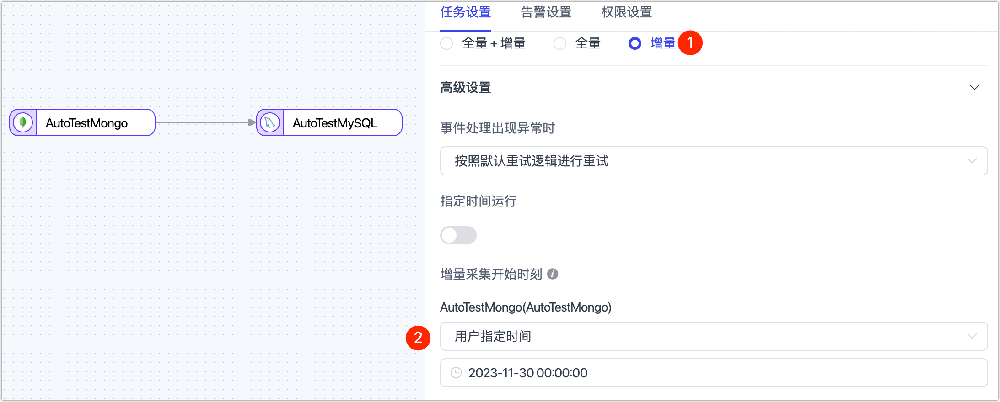

# 数据管道

本文列出在构建数据管道时，可能遇到的问题及相关解决方案，包含数据复制任务、数据转换任务、数据校验等功能模块。

## 数据复制任务

### 如何同步源库新增的表？

默认情况下，在配置数据同步任务时，可选择当前源库已有的表，如需在任务运行过程中自动识别源库新增的表并实时同步，您可以在配置数据同步任务阶段，通过正则表达式的方式来选择表，符合该表达式的表会被自动识别并同步。

### 源表没有主键，应该怎么处理？

推荐在任务配置时筛选出主键表和无主键表，为它们分别配置同步任务，避免影响主键表的同步性能；此外，在为无主键表配置同步任务时，为保障数据一致性和同步性能，可手动选特定的列组合作为数据更新的列，从而让其组合的值实现数据唯一性，避免使用全字段匹配而导致同步效率过低。

### 可以自动同步索引信息吗？

数据复制任务默认不会同步源表已有的索引，您可以在表结构同步完成后在目标库手动创建索引，此外，为提升数据同步效率，Tapdata 会在运行过程中根据源表的关联键/主键在目标创建索引。

### 重置任务配置会清空已同步的表和数据吗？

不会，重置任务配置只会清除任务运行的状态信息（如增量时间点灯），不会清除已同步到目标库的表和数据。

### 配置任务时，支持调整字段类型和长度吗？

支持，例如在异构数据库间执行同步时，Tapdata 从通用兼容性角度出发，自动推演出目标库的字段类型和长度。如果模型推演不准确或需要基于业务手动调整，您可以单击目标节点中的字段类型，然后在弹出的对话框中进行调整。

### 支持同步 DDL 变更吗？

支持，您需要在配置任务时打开对应的开关，此外，您需要了解表结构变更（如增减列）对数据同步流程的潜在影响，避免影响业务正常运行。更多介绍，见 [DDL 同步说明](../best-practice/handle-schema-change.md)。

### 增量同步时，源库的增量日志建议保存多久？

为保障增量数据的解析，推荐将源库的增量日志（如 Binlog）至少保留 7 天。

## 数据转换任务

### 单个数据转换任务可以将数据写入多个目标表吗？

写入的是单个表，数据转换任务主要用于数据建模、数据 ETL、数据清理、数据合并（包括多表合并到单表）、宽表建设等业务场景，其业务特性是目标通常是单表。

### 如果源表不支持通过实时日志解析，如何进行增量同步？

可以通过字段轮询的方式来获取增量数据，该字段通常是自增数值或时间戳，例如数据插入/变更时带上时间戳信息，Tapdata 可以通过定时查询该字段的值的来辅助判断增量数据变更，通常可获取并同步 INSERT/UPDATE 操作，无法获取 DELETE 操作。

### 支持同步 DDL 变更吗？

支持，您需要在配置任务时打开对应的开关，此外，您需要了解表结构变更（如增减列）对数据同步流程的潜在影响，避免影响业务正常运行。更多介绍，见 [DDL 同步说明](../best-practice/handle-schema-change.md)。

### 增量同步时，如果手动删除了目标表的某个字段引发报错，如何修复？

可编辑该任务，在目标节点前增加一个[增删字段节点](../user-guide/data-pipeline/data-development/process-node#add-and-del-cols)，将已删除的字段过滤，然后重启任务。

:::tip

在任务运行阶段，请勿手动调整目标表的结构以免因表结构变更引发任务中断，如需调整表结构，应当开启任务的 DDL 操作同步，并在源库调整表结构，更多介绍，见[处理 DDL 变更](../best-practice/handle-schema-change.md)。

:::

### 如何对全量同步阶段的数据进行过滤？

您可以在配置任务时，在源节点的高级设置中，打开全量自定义查询，然后填写全量数据同步阶段需要执行的 SQL 查询语句（不对增量阶段生效），可实现自定义的数据提取（如数据过滤、Join 等），例如填写 `SELECT id,name,address FROM customer WHERE id>1000;`。

:::tip

启用该功能要求目标节点为弱 Scheme 类的数据源（如 MongoDB/Kafka）等，如果需要对全量和增量阶段都执行数据过滤规则，可以通过添加[行过滤器](../user-guide/data-pipeline/data-development/process-node.md)来实现。

:::

## 实时数据中心

### 如需执行表 Join，推荐在哪个层级执行？

推荐 Join 等复杂操作在平台加工层（MDM）执行，该层级可基于平台缓存层的数据，执行定制化的加工运算生成最终业务要用的模型数据，即使反复运行和调试，也不会影响源库的读写性能。

## 数据校验

### 支持定时执行数据校验吗？

支持，可在配置校验任务时选择**校验频次**为**重复校验**，然后根据需要选择执行时间和间隔时间。

### 为什么会出现数据校验不一致？

Tapdata 基于多种自研技术保障数据一致性，如果执行校验后提示存在数据不一致，可能的原因如下：

* **有新业务数据入库**：可为校验任务添加过滤条件，从而排除新增的数据。
* **正在执行全量/增量同步**：如果是全量数据同步任务可等待任务完成后再校验，如果是增量数据同步任务，可通过添加过滤条件的方式排除某个时间点后的数据变更。
* **主键不一致**：检查相关表的主键和主键类型是否一致。
* **数据过滤条件引发**：例如数据管道本身加入了过滤条件，只同步了部分数据到目标表；此外，如果是校验增量任务的同步结果，需要保障过滤条件筛选的数据范围的准确性。

:::tip

对于 MongoDB 数据库，如果行数校验不一致，需要检查是否因孤儿文档，可[清理](https://www.mongodb.com/docs/manual/reference/command/cleanupOrphaned/)后重新运行数据校验任务；如果全字段校验不一致，需要对比的字段是否在同步范围内容，例如 MongoDB 双向同步场景应将 `__tapdata.deloo` 过滤掉。

:::

### 遇到数据校验不一致时，如何修复？

* **所有数据都不一致**：如果源和目标的字段类型不合理（如：字段宽度不够），调整同步任务配置，重置后重新执行数据同步。

* **不一致数据为增量事件导致**：如果数据管道中包含 JS 处理节点，需要检查 JS 节点的处理逻辑是否正确、源和目标的字段类型是否合理。

* **某时间段内变更的事件未同步**：创建一个数据同步任务，单击页面右上角的设置，仅同步增量数据并指定增量日志的获取时间，仅对未同步的时段进行同步，从而完成缺失增量数据的同步。

  

### 数据类型对校验结果有什么影响？

* **日期类型**：在异构数据库间同步时，可能对日期类型的格式处理逻辑不同，从而导致数据同步结果存在差异：
  * **时区**：源和目标库的时区不一致，此场景下，可在连接管理中，调整相关数据源上的时区来修正此问题，完成调整后需要重新同步数据再尝试校验。
  * **数据类型**：例如 DATE 类型在不同数据库中的含义不同，既有代表日期+时间 `1970-01-01 00:00:00`，也有只代表日期 `1970-01-01`两种形式。
  * **时间精度**：例如源精度为`.000`目标精度为`.000000`
* **数值类型**：检查源和目标的存储类型精度是否一致，如果不一致可能导致校验结果不一致。
* **布尔类型**：MySQL 中 `tinyint(1)` 正常读取时，其值为`0`或`1`；校验时如果另一个库存的类型为 `boolean`，会校验失败，因为`1`和`true`不相等，此场景下，可在 MySQL 数据源上设置参数：`tinyint1isBit=true`，这样同步及校验都会将值识别为 `boolean` 类型。

### 校验任务提示失败，如何处理？

单击校验任务对应的**详情**，查看相关报错提示，或联系我们[获取技术支持](../support.md)。

