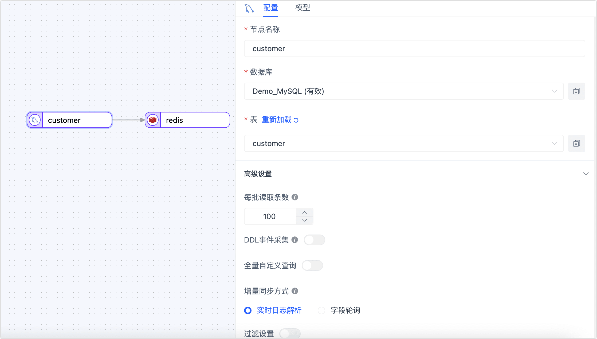
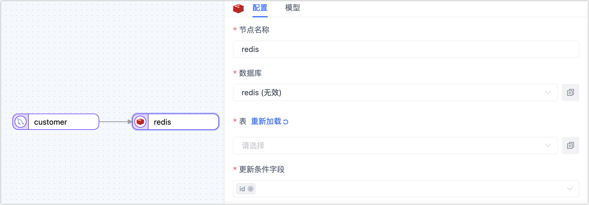

# MySQL 实时同步到 Redis

Redis 是基于内存的 key-value（键值对）数据库，可用于数据缓存、事件发布/订阅、高速队列等场景。Tapdata 支持将关系型数据库（Oracle、MySQL、MongoDB、PostgreSQL、SQL Server）的数据实时同步至 Redis，帮助您快速完成数据流转。

本文介绍如何通过数据转换任务，将 MySQL 的数据同步至 Redis。

:::tip

如需同时将源 MySQL 中的数据表同步到 Redis，可[创建数据复制任务](../user-guide/data-pipeline/copy-data/create-task.md)，配置流程与本文类似。

:::

## 准备工作

在创建数据转换任务前，请确保您已经配置好了相关数据源：

1. [配置 MySQL 连接](../prerequisites/on-prem-databases/mysql.md)
2. [配置 Redis 连接](../prerequisites/on-prem-databases/redis.md)

## 操作步骤

1. 登录 Tapdata 平台。

2. 在左侧导航栏，选择**数据管道** > **数据转换**。

3. 单击页面右侧的**创建**。

4. 在页面左侧，分别将 MySQL 和 Redis 数据源拖拽至右侧画布中，然后将其连接起来。

5. 单击 MySQL 数据源，根据下述说明完成右侧面板的配置。

   

   * **基础设置**      
     * **节点名称**：默认为连接名称，您也可以设置一个具有业务意义的名称。
     * **表**：选择要操作的源表，下方将展示表的结构信息，包含列名和列类型。      
     
   * **高级设置**      
     * **DDL 同步配置**      
       选择是否启用 **DDL 事件采集**，打开该开关后，Tapdata 会自动采集所选的源端 DDL 事件（如新增字段），如果目标端支持 DDL 写入即可实现 DDL 语句的同步。      
       
     * **增量同步方式**      
       选择**实时日志解析**或**字段轮询**，选择为**轮询**时，您还需要指定轮询的字段、时间间隔和每次读取行数。**实时日志解析**会使用数据源事务日志进行解析并同步增量事件，**字段轮询**会通过对字段的轮询进行增量事件同步，其中**字段轮询**通常无法同步删除事件。      
       
     * **数据过滤配置**      
       * **全量自定义查询**：打开该开关后，可填写全量数据同步阶段需要执行的 SQL 查询语句（不对增量阶段生效），可实现自定义的数据提取（如数据过滤、Join 等），例如填写 `SELECT id,name,address FROM customer;`。
         
         :::tip
         
         启用该功能要求目标节点为弱 Scheme 类的数据源（如 MongoDB/Kafka）等。
         
         ::: 
         
       * **过滤设置**：默认关闭，开启后您需要指定数据过滤条件。      
       
     * **批量读取条数**：全量同步时，每批次读取的记录条数，默认为 **100**。     
     
   * **告警设置**   
     默认情况下，节点的平均处理耗时连续 1 分钟大于等于 5 秒，则发送系统通知和邮件通知，您也可以根据业务需求调整规则或关闭告警。

6. 单击 Redis 数据源，根据下述说明完成右侧面板的设置。

   

   * **基础设置**      
     * **节点名称**：默认为连接名称，您也可以设置一个具有业务意义的名称。
     * **表**：选择处理后的数据要写入的表，填写的表不存在时会自动新建该表。
     * **更新条件字段**：选择更新条件的判断依据字段。
     * **已有数据处理**：根据业务需求选择，如果目标表没有数据且结构和源表不一致，可选择为**清除目标表原有表结构及数据**。
     * **每批次写入条数**：全量同步时，每批次写入的条目数。
     * **每批写入最大等待时间**：根据目标库的性能和网络延迟评估，设置最大等待时间，单位为毫秒。      
     * **全量多线程写入**：全量数据写入的并发线程数，默认为 **8**，可基于目标端写性能适当调整。      
     * **增量多线程写入**：增量数据写入的并发线程数，默认未启用，启用后可基于目标端写性能适当调整。      
     * **模型**：展示源表的表结构信息，包含字段名称和字段类型。         
     
   * **高级设置** 
     * **数据写入模式**：根据业务需求选择数据写入模式：
       * **按事件类型处理**：选择此项后，还需要选择插入、更新、删除事件的数据写入策略。
       * **统计追加写入**：只处理插入事件，丢弃更新和删除事件。        
       
     * **数据源专属配置**
       * **存储格式**：支持下述三种格式。
         * **String**：键值以平铺的方式存储，即键值为整条记录。
         * **List**：您可以打开**单键存储**开关，让整个表记录全部存储为一个键，List 的每条值对应一条记录，且允许将第一条设为表头（以英文逗号分隔）；您也可以将整个表记录按某些字段组成的键表达式分组然后平铺为多个 List 键值。
         * **Hash**：您可以打开**单键存储**开关，让整个表记录全部存储为一个键，Hash 中的键均存储为 String 类型；您也可以将整个表记录全部平铺为多个键值，每个键对应的 Hash 即为一条记录，每个字段对应各自的值。
       - **单键存储**：当存储格式选择为 **List** 或 **Hash**，可设置该选项，需注意不可超过 Redis 单键的大小限制（512 MB）。
       
       - **包含表头**：当存储格式选择为 **List** 或 **Hash**，且选择为**单键存储**时，<span id="release320-contain-table-head">打开该开关</span>可在 Redis 中加入一个 Hash 键（默认名称为 `-schema-key-`），其值用来存放源表的表名和列名信息，示例如下：
         
         ```bash
         HGETALL -schema-key-
         1) "customer"
         2) "id,name,lastname,address,country,city,registry_date,
         birthdate,email,phone_number,locale"
         ```
         
       - **键表达式**：键名的表达式，格式为 `prefix_${列名}_suffix`，例如：`db0_${id}_202301`，键名即为 `db0_id列对应的值_202301`。
       
       - **值显示**：支持下述两种显示方式。
         - **Json**：将每条记录转化为 Json 串。
         - **Text**：按照字段的顺序将对应值用特定的连接符合并起来，如果内容包含了该字符，则以转义字符将内容包裹。
     
   * **告警设置**   
     默认情况下，节点的平均处理耗时连续 1 分钟大于等于 5 秒，则发送系统通知和邮件通知，您也可以根据业务需求调整规则或关闭告警。

7. （可选）单击页面右上角的**设置**，配置任务属性。

   - **任务名称**：填写具有业务意义的名称。
   - **同步类型**：可选择**全量+增量**，也可单独选择**全量**或**增量**。 全量表示将源端的存量数据复制到目标端，增量表示将源端实时产生的新数据或数据变更复制到目标端，二者结合可用于实时数据同步场景。
   - **任务描述**：填写任务的描述信息。
   - **高级设置**：设置任务开始的时间、增量数据处理模式、处理器线程数、Agent 等。

8. 确认无误后，单击**启动**。

   操作完成后，您可以在当前页面观察任务的执行情况，如 QPS、延迟、任务时间统计等信息，示例如下：

   


## 结果验证

根据上述任务设置，Tapdata 会将源 MySQL 中 **customer** 表的数据实时同步到 Redis 中，且存储的键类型为 String。

我们在 MySQL 中随机查询一条数据，例如查询 id 为 `879f660510764c4ea4127447e7ca44b8` 的记录，结果如下：

```sql
mysql> select * from customer where id='879f660510764c4ea4127447e7ca44b8' \G;
*************************** 1. row ***************************
           id: 879f660510764c4ea4127447e7ca44b8
         name: Rebecca
     lastname: Dunlap
      address: USS Vasquez
FPO AA 12217
      country: Lao People's Democratic Republic
         city: Hutchinsonborough
registry_date: 15-07-2011
    birthdate: 11-08-2001
        email: cameroncole@example.com
 phone_number: 1-516-422-8314x744
       locale: or_IN
1 row in set (0.00 sec)
```

随后，我们前往 Redis 并查询对应的数据，结果如下，数据以 JSON 形式存储在键值中，且随后的记录变更（如修改字段值）也可以正常同步。


```shell
127.0.0.1:6379> get db0_879f660510764c4ea4127447e7ca44b8_202301
"{\"country\":\"Lao People's Democratic Republic\",\"birthdate\":\"11-08-2001\",
\"registry_date\":\"15-07-2011\",\"address\":\"USS Vasquez\\nFPO AA 12217\",
\"city\":\"Hutchinsonborough\",\"name\":\"Rebecca\",\"phone_number\":
\"1-516-422-8314x744\",\"id\":\"879f660510764c4ea4127447e7ca44b8\",\"locale\":
\"or_IN\",\"email\":\"cameroncole@example.com\",\"lastname\":\"Dunlap\"}"
```


## 任务管理

在任务列表页面，您还可以对任务进行启动/停止、监控、编辑、复制、重置、删除等操作。

具体操作，见[管理任务](../user-guide/data-pipeline/data-development/monitor-task.md)。
