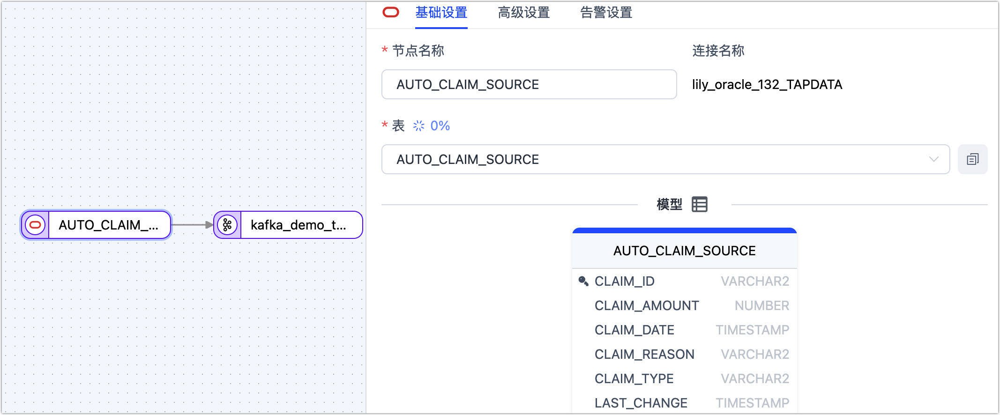
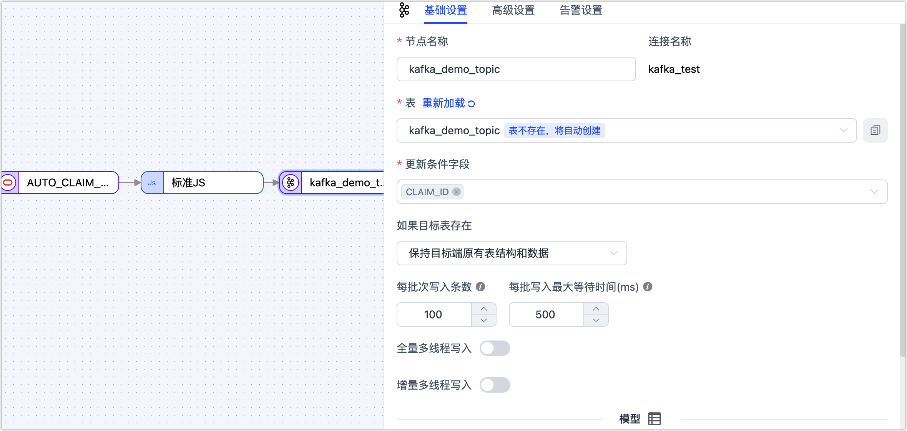
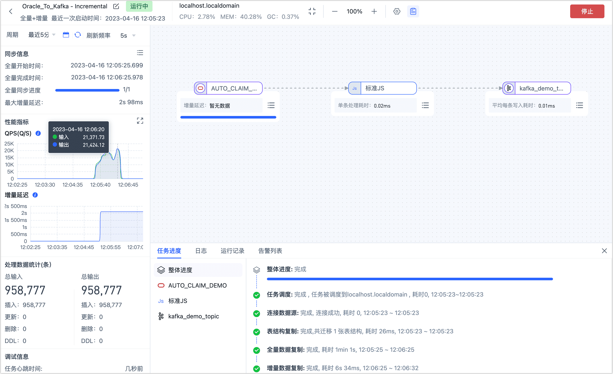

# Oracle 实时同步到 Kakfa

在大数据时代，越来越多的企业需要将传统的关系型数据库中的数据实时同步到大数据处理平台，以支持实时数据处理、数据湖构建、数据仓库替代等场景。而 Oracle 作为一款广泛应用于企业级应用的关系型数据库，其数据同步到大数据平台的需求也日益增加。

本文将介绍如何通过 Tapdata，简单几步拖拽实现 Oracle 到 Kafka 的数据同步，满足大数据供数场景下的需求。


## 场景说明

随着企业的业务不断发展，数据量也不断增加，传统的关系型数据库在处理大数据时面临着性能、扩展性和成本等方面的挑战。而大数据处理平台（如 Flink）则提供了实时数据处理和复杂的数据分析任务。

因此，将 Oracle 数据库中的数据实时同步到大数据平台，成为了很多企业在大数据供数场景中的需求，通常具有下述好处：


* **实时数据同步**：可实现快速获取最新的数据，实现实时数据处理和分析，从而可以及时做出决策、识别业务机会或者进行实时监控。
* **降低源库负载**：Oracle 作为企业的核心数据存储系统，可能会面临高并发的数据写入和读取请求，而将数据同步到 Kafka 后，可以通过消息队列进行异步处理，减轻数据库的读压力，避免采用 T +1 的同步方式大批量提取数据而影响源库业务。
* **统一数据分发**：将数据发布到Kafka消息队列，可以实现数据的统一分发，下游应用可按需消费所需数据，实现多样化的数据消费和处理需求。
* **降低业务耦合度**：不同系统之间的依赖关系被解耦，使得系统可以独立演化，减少系统之间的耦合度，从而提高系统的灵活性和可维护性。


Tapdata 作为一款高效、可靠、安全实时数据平台，可为您提供简单易用、功能丰富、简单易用的数据流转服务，帮助您提升数据开发效率，专注业务本身，此外，在面对大规模数据处理场景下，您还可以通过增加节点或调整配置实现水平扩展。


在本案例中，我们希望实时读取源 Oracle 库中的汽车保险索赔表（**AUTO_CLAIM_Demo**）的数据，同时将读取来的数据进行加工以帮助我们获取增量变更前后的数据，然后再将数据写实时写入 Kafka 数据源中，下游业务应用可以自由订阅并消费 Kafka 的数据，构建实时数据同步管道。


## 注意事项

* 确保单条 Oracle 的数据大小不超过 Kafka 的单条消息限制（默认为 1 MB），避免无法写入数据。如果遇到超限的状况，可在配置数据转换任务时，在  Oracle 和 Kafka 节点间加入一个**增删字段**节点来过滤大字段列，您也可以修改 Kafka 相关的最大消息限制。
* Tapdata 解析 Oracle 日志的速度约为 10,000 QPS，如增量事件高于该速率，可能导致数据处理的延迟上升。
* 裸日志功能目前不支持在 RAC-ASM 的部署架构上使用，且不支持从 DG 架构的非主节点获取裸日志。

## 准备工作

在创建数据转换任务前，请确保您已经配置好了相关数据源：

1. [配置 Oracle 连接](../prerequisites/on-prem-databases/oracle.md)
2. [配置 Kafka 连接](../prerequisites/mq-and-middleware/kafka.md)

## 操作步骤

1. 登录 Tapdata 平台。

2. 在左侧导航栏，选择**数据管道** > **数据转换**。

3. 单击页面右侧的**创建**。

4. 在页面左侧，分别将 Oracle 和 Kafka 数据源拖拽至右侧画布中，然后将其连接起来。

5. 单击 Oracle 数据源，根据下述说明完成右侧面板的配置。

   

   * **基础设置** 
     * **节点名称**：默认为连接名称，您也可以设置一个具有业务意义的名称。
     * **表**：选择要操作的源表，下方将展示表的结构信息，包含列名和列类型。在本案例中，我们创建的是适用于单表处理的数据转换任务，如需同时处理多个表，可创建数据复制任务，配置流程与本案例类似。 
   * **高级设置** 
     * **DDL 同步配置**
       选择是否启用 **DDL 事件采集**，打开该开关后，Tapdata 会自动采集所选的源端 DDL 事件（如新增字段），如果目标端支持 DDL 写入即可实现 DDL 语句的同步。
     * **增量同步方式** 
       选择**实时日志解析**或**字段轮询**，选择为**轮询**时，您还需要指定轮询的字段、时间间隔和每次读取行数。**实时日志解析**会使用数据源事务日志进行解析并同步增量事件，**字段轮询**会通过对字段的轮询进行增量事件同步，其中**字段轮询**通常无法同步删除事件。
     * **数据过滤配置**      
       * **全量自定义查询**：打开该开关后，可填写全量数据同步阶段需要执行的 SQL 查询语句（不对增量阶段生效），可实现自定义的数据提取（如数据过滤、Join 等），例如填写 `SELECT id,name,address FROM customer;`。
         
         :::tip
         
         启用该功能要求目标节点为弱 Scheme 类的数据源（如 MongoDB/Kafka）等。
         
         ::: 
         
       * **过滤设置**：默认关闭，开启后您需要指定数据过滤条件。 
     * **批量读取条数**：全量同步时，每批次读取的记录条数，默认为 **100**。
     * **数据源专属配置**
       * **日志连续挖掘**：为降低增量数据的获取延迟，当 Oracle 版本低于 19c 时，推荐开启此开关，当版本为 19c 及以上时，需关闭此开关。
       * **日志积压数量**：仅对连续挖掘生效，当源库的更新频率较低时，可选择较低的值以降低延迟；源库的更新频率较高时，选择较高的值以提升吞吐量，通常计算公式为：`源库数据变化 QPS 数 除以 10`，推荐取值 1 ~ 1000。
       * **大事务时间界限**：当事务事件超过该数值会进入大事务逻辑，设置过大有可能会影响内存，大事务后会有本地磁盘缓存，在任务出现异常时需要注意磁盘清理。
       * **关联键更新**：关闭开关可以提升性能，但关联键的更新会被忽略。
       * **开启同步 LOB 类型**：关闭开关可以提升性能，但 LOB 类型解析将会不可靠。
       * **未提交事务生命时长（分钟）**：长时间未提交的事务会导致每次启停任务将从该事务开始挖掘，为避免影响源库和增量同步的性能，Tapdata 会清理超过该时长的为提交事务，请结合业务需求设置该时长，避免数据不一致。
   * **告警设置**   
     默认情况下，节点的平均处理耗时连续 1 分钟大于等于 5 秒，则发送系统通知和邮件通知，您也可以根据业务需求调整规则或关闭告警。

6. 为展示数据变更前后的详细信息，方便下游业务对接，我们在 Oracle 和 Kafka 节点间加入一个标准 JS 节点。

   1. 将鼠标指向 Oracle 和 Kafka 间的连线，单击 **+** 图标并选择**标准 JS**。

      

   2. 单击该节点，然后在页面右侧的面板中，填入下述代码，我们实现了一个自定义消息体，包含了 `before`、`after`、`createTime` 和 `tableName` 等属性，帮助我们获取增量变更前后的数据。

      ```js
      var ret = {}
      ret.before = context.event.before;
      ret.after = record;
      ret.createTime = new Date();
      ret.tableName = context.tableName;
      return ret;
      ```

      :::tip

      如需了解更多关于 JS 节点的用法和支持的函数，见[处理节点](../user-guide/data-pipeline/data-development/process-node.md)。

      :::

   3. 设置完成后，单击右下角的**试运行**，单击右侧的对比查看输入输出的数据示例，确认无问题后单击右上角的**退出全屏**。

      

7. 单击 Kafka 数据源，根据下述说明完成右侧面板的设置。

   

   * **基础设置**      
     * **节点名称**：默认为连接名称，您也可以设置一个具有业务意义的名称。
     * **表**：选择为 Kafka 中的目标 Topic（主题），本案例选择为 **kafka_demo_topic**，填写的 Topic 不存在时会自动创建。
     * **更新条件字段**：选择数据更新的条件字段，本案例选择为 **createTime**。
     * **已有数据处理**：根据业务需求选择，如果目标表没有数据且结构和源表不一致，可选择为**清除目标表原有表结构及数据**。
     * **每批次写入条数**：全量同步时，每批次写入的条目数。
     * **每批写入最大等待时间**：根据目标库的性能和网络延迟评估，设置最大等待时间，单位为毫秒。      
     * **全量多线程写入**：全量数据写入的并发线程数，默认为 **8**，可基于目标端写性能适当调整。      
     * **增量多线程写入**：增量数据写入的并发线程数，默认未启用，启用后可基于目标端写性能适当调整。      
     * **模型**：展示源表的表结构信息，包含字段名称和字段类型。         
   * **<span id="advanced_settings">高级设置</span> **
     根据业务需求选择数据写入模式：
     
     * **按事件类型处理**：选择此项后，还需要选择插入、更新、删除事件的数据写入策略。
     * **统计追加写入**：只处理插入事件，丢弃更新和删除事件。        
     
     设置数据源专属配置：
     
     * **副本数**：由 Tapdata 自动创建的 Topic 的副本数，不可大于 Kafka 集群数量且创建后不可更改。
     * **分区数量**：若 Topic 已存在，分区的数量只能增加不能减小。
   * **告警设置**   
     默认情况下，节点的平均处理耗时连续 1 分钟大于等于 5 秒，则发送系统通知和邮件通知，您也可以根据业务需求调整规则或关闭告警。

8. （可选）单击页面右上角的**设置**，配置任务属性。

   - **任务名称**：填写具有业务意义的名称。
   - **同步类型**：可选择**全量+增量**，也可单独选择**全量**或**增量**。 全量表示将源端的存量数据复制到目标端，增量表示将源端实时产生的新数据或数据变更复制到目标端，二者结合可用于实时数据同步场景。
   - **任务描述**：填写任务的描述信息。
   - **高级设置**：设置任务开始的时间、增量数据处理模式、处理器线程数、Agent 等。

9. 确认无误后，单击**启动**。

   操作完成后，您可以在当前页面观察任务的执行情况，如 QPS、延迟、任务时间统计等信息，示例如下：

   


## 结果验证

根据上述任务设置，Tapdata 会 Oracle 中 **AUTO_CLAIM_DEMO** 表同步到 Kafka 中，如果源表的数据发生变更，通过 JS 节点往 Kafka 节点中写入变化前后是数据。

等待任务进入增量数据复制阶段，我们首先统计 Kafka 中的消息数量，得知 Topic 中的消息数与源表中的条目数完全一致，均为 **95,877** 条。

```bash
# 统计 Topic 中的消息数量
kafka-run-class.sh kafka.tools.GetOffsetShell --broker-list 192.168.1.18:9092 --topic kafka_demo_topic 

# 返回结果，结果相加值为 95,877
kafka_demo_topic:0:317747
kafka_demo_topic:1:320986
kafka_demo_topic:2:320044
```

我们抽取一条最开始写入的数据，并以 JSON 格式展示消息结果以便于阅读，即全量阶段同步过来的数据样例如下：

```json
// 查看最开始的一条数据
kafka-console-consumer.sh --bootstrap-server localhost:9092 --topic kafka_demo_topic --max-messages 1 --from-beginning | jq .

// 返回结果示例
{
  "createTime": "2023-04-16 04:05:26.587000",
  "after": {
    "SETTLED_DATE": "2023-03-06T12:31:02Z",
    "SETTLED_AMOUNT": 2800,
    "claim_id": "CID_02dyzrhu",
    "CLAIM_REASON": "WATER/HEATING/AC",
    "CLAIM_TYPE": "BUIDLING",
    "POLICY_ID": "PID_Dw6ypOhC",
    "CLAIM_DATE": "2023-03-06T12:31:02Z",
    "LAST_CHANGE": "2023-03-06T12:31:01.964589Z",
    "CLAIM_AMOUNT": 2800
  },
  "tableName": "AUTO_CLAIM_DEMO"
}
```

随后，我们在 Kafka 节点上执行下述命令开启消息监听，同样便于阅读，我们采用 **JSON 格式**展示消息结果。

```bash
kafka-console-consumer.sh --bootstrap-server localhost:9092 --topic kafka_demo_topic --max-messages 1 | jq .
```

接下来，我们在源表上执行数据变更操作，将某条数据的 **SETTLED_AMOUNT** 的值从 **1000** 调整为 **1200**：


稍等一会后，在 Tapdata 的任务监控页面，可查看到 Tapdata 已经将本次数据更新同步到 Kafka 中。


而回到我们的 Kafka 的监听命令行中，也看到了最新的数据变更消息，此处可以看到数据变化前后的详细数据，后续可快捷地接入下游应用（如 Flink 等）。

```json
{
  "before": {
    "SETTLED_DATE": {
      "tapType": {
        "fraction": 3,
        "type": 1
      },
      "value": "2023-03-31T21:47:40Z"
    },
    "SETTLED_AMOUNT": 1000,
    "claim_id": "CID_01scxEy7",
    "CLAIM_REASON": "WATER/HEATING/AC",
    "CLAIM_TYPE": "BUIDLING",
    "POLICY_ID": "PID_tXePZRIG",
    "CLAIM_DATE": {
      "tapType": {
        "fraction": 3,
        "type": 1
      },
      "value": "2023-03-31T21:47:40Z"
    },
    "LAST_CHANGE": {
      "tapType": {
        "fraction": 3,
        "type": 1
      },
      "value": "2023-03-31T21:47:40.019518Z"
    },
    "CLAIM_AMOUNT": 1399
  },
  "createTime": "2023-04-16 04:23:57.559000",
  "after": {
    "SETTLED_DATE": "2023-03-31T21:47:40Z",
    "SETTLED_AMOUNT": 1200,
    "claim_id": "CID_01scxEy7",
    "CLAIM_REASON": "WATER/HEATING/AC",
    "CLAIM_TYPE": "BUIDLING",
    "POLICY_ID": "PID_tXePZRIG",
    "CLAIM_DATE": "2023-03-31T21:47:40Z",
    "LAST_CHANGE": "2023-03-31T21:47:40.019518Z",
    "CLAIM_AMOUNT": 1399
  },
  "tableName": "AUTO_CLAIM_DEMO"
}
Processed a total of 1 messages
```


## 任务管理

在任务列表页面，您还可以对任务进行启动/停止、监控、编辑、复制、重置、删除等操作。

具体操作，见[管理任务](../user-guide/data-pipeline/data-development/monitor-task.md)。
