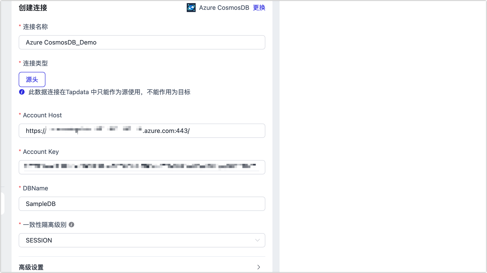

# Azure Cosmos DB

Azure Cosmos DB 是一个完全托管的 NoSQL 和关系数据库，适用于新式应用开发，包括 AI、数字商业、物联网、预订管理和其他类型的解决方案的开发。本文介绍如何在 Tapdata 平台中，连接 Azure Cosmos DB，帮助实现云端数据的快速流转。

## 前提条件

Azure Cosmos DB 类型为 [NoSQL](https://learn.microsoft.com/zh-cn/azure/cosmos-db/distributed-nosql)

## 功能限制

Azure Cosmos DB 仅支持全量数据同步，暂不支持增量数据同步。

## 准备工作

在连接数据源前，我们需要登录 Azure 控制台，获取连接所需的地址和密钥信息，具体步骤如下：

1. 登录 [Azure 门户](https://portal.azure.com/)。

2. 在页面顶部，搜索并进入 **Azure Cosmos DB** 控制台。

3. 单击 Azure Cosmos DB 实例名称。

4. 在左侧导航栏，选择**设置** > **密钥**。

   

## 操作步骤

1. 登录 Tapdata 平台。

2. 在左侧导航栏，单击**连接管理**。

3. 在页面右侧，单击**创建**。

4. 在弹出的对话框中，搜索并选择 **Azure Cosmos DB**。

5. 在跳转到的页面，根据下述说明填写 **Azure Cosmos DB** 的连接信息。

   

   * **基础设置**
     * **连接名称**：填写具有业务意义的独有名称。
     * **连接类型**：目前仅支持作为**源头**。
     * **Account Host**、**Account Key**：Azure Cosmos DB 的连接地址和密钥信息（只读权限即可），获取方式，见[准备工作](#azure-cosmosdb-keys)。
     * **DBName**：数据库名称。
     * **一致性隔离级别**：需和 Azure Cosmos DB 设置相同，默认为会话级别（SESSION），更多介绍，见[一致性级别介绍](https://learn.microsoft.com/zh-cn/azure/cosmos-db/consistency-levels?WT.mc_id=Portal-Microsoft_Azure_DocumentDB#session)。
   * **高级设置**
     * **包含表**：默认为**全部**，您也可以选择自定义并填写包含的表，多个表之间用英文逗号（,）分隔。
     * **排除表**：打开该开关后，可以设定要排除的表，多个表之间用英文逗号（,）分隔。
     * **Agent 设置**：默认为**平台自动分配**，您也可以手动指定 Agent。
     * **模型加载时间**：当数据源中模型数量小于 10,000 时，每小时刷新一次模型信息；如果模型数据超过 10,000，则每天按照您指定的时间刷新模型信息。

6. 单击**连接测试**，测试通过后单击**保存**。

   :::tip

   如提示连接测试失败，请根据页面提示进行修复。

   :::