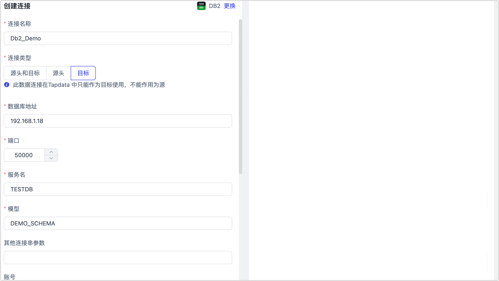

# Db2

IBM Db2 是一种关系数据库，可为存储和管理结构化数据提供高性能、可扩展性和可靠性。Tapdata 支持将 Db2 作为源和目标库，帮助您快速构建数据链路。接下来，我们将介绍如何在 Tapdata 平台中连接 Db2 数据源。

## 支持版本

Db2 为 9.7~11.5 版本，部署在 LUW（Linux, Unix, Windows）平台

import Content1 from '../../../reuse-content/beta/_beta.md';

<Content1 />

## 功能限制

暂不支持 XML 数据类型

## 准备工作

在连接 Db2 数据库前，您还需要完成数据库账号的授权等准备工作，本文以 Db2 数据库部署在 Linux 平台为例演示相关操作示例。

### 作为源库

1. 创建用户。

   以 Linux 平台为例，登录至依次执行下述格式的命令创建用于登录 Db2 数据库的用户并设置密码。

   ```bash
   -- 请替换 username 为您要创建的用户名
   sudo useradd username
   sudo passwd username
   ```

2. 为刚创建的账号授予权限。

   1. 以具有 DBA 权限的用户身份登录 Db2 数据库。

   2. 执行下述格式的命令，为用户授予指定 Schema 的对象管理和数据读写权限。

      ```sql
      -- 请分别替换 username、schema_name 为您要创建的用户名和 Schem 名称
      GRANT ON SCHEMA schema_name TO USER username;
      ```

      :::tip

      您也可以基于业务需求自定义更精细化的权限控制，更多介绍，见 [GRANT TABLE](https://www.ibm.com/docs/en/db2/11.1?topic=statements-grant-table-view-nickname-privileges)。

      :::

3. 开启表的增量数据采集。

   ```sql
   ALTER TABLE "schema_name"."table_name" DATA CAPTURE CHANGES;
   ```

   * **schema_name**：Schema 名称。
   * **table_name**：表名称。

4. [联系 Tapdata 团队](../../support.md)，获取并部署裸日志采集组件，实现 Db2 增量数据的捕获。

5. （可选）如源表发生了结构变更（例如删除字段、修改字段属性等），您需要在 Db2 中执行下述存储过程以保障数据正常读取。

   ```sql
   CALL SYSPROC.ADMIN_CMD('REORG TABLE schema_name.table_name')
   ```

   * **schema_name**：Schema 名称。
   * **table_name**：表名称。

### 作为目标库

1. 创建用户。

   以 Linux 平台为例，登录至依次执行下述格式的命令创建用于登录 Db2 数据库的用户并设置密码

   ```bash
   -- 请替换 username 为您要创建的用户名
   sudo useradd username
   sudo passwd username
   ```

2. 为刚创建的账号授予权限。

   1. 以具有 DBA 权限的用户身份登录 Db2 数据库。

   2. 执行下述格式的命令，为用户授予指定 Schema 的对象管理和数据读写权限。

      ```sql
      -- 请分别替换 schema_name、username 为您要创建的 Schem 名称和用户名
      GRANT CREATEIN, ALTERIN, DROPIN ON SCHEMA schema_name TO USER username;
      ```

      :::tip

      您也可以基于业务需求自定义更精细化的权限控制，更多介绍，见 [GRANT TABLE](https://www.ibm.com/docs/en/db2/11.1?topic=statements-grant-table-view-nickname-privileges)。

      :::

## 添加数据源

1. 登录 Tapdata 平台。

2. 在左侧导航栏，单击**连接管理**。

3. 单击页面右侧的**创建**。

4. 在弹出的对话框中，搜索并选择 **Db2**。

5. 在跳转到的页面，根据下述说明填写 Db2 的连接信息。

   

   * **连接信息设置**

     * **连接名称**：填写具有业务意义的独有名称。
     * **连接类型**：支持将 Db2 作为源或目标库。
     * **数据库地址**：数据库连接地址。
     * **端口**：数据库的服务端口。
     * **服务名**：填写数据库名称。
     * **模型**：模型（Schema） 名称，即一个连接对应一个 Schema，如需连接多个 Schema 则需创建多个数据连接。
     * **其他连接串参数**：额外的连接参数，默认为空。
     * **账号**、**密码**：数据库的账号及对应的密码。
     * **裸日志服务器地址**、裸日志服务器端口：请[联系 Tapdata 团队](../../support.md)，获取并部署裸日志采集组件，实现 Db2 增量数据的捕获，默认服务端口为 **1031**。

   * **高级设置**
     
      * **包含表**：默认为**全部**，您也可以选择自定义并填写包含的表，多个表之间用英文逗号（,）分隔。
      * **排除表**：打开该开关后，可以设定要排除的表，多个表之间用英文逗号（,）分隔。
      * **Agent 设置**：默认为**平台自动分配**，您也可以手动指定 Agent。
      * **模型加载频率**：当数据源中模型数量小于1万时，Tapdata 将每小时更新一次模型；当数据源中模型数量大于 10,000 时，会每天按照指定的时间进行模型刷新。
      * **开启心跳表**：当连接类型选择为**源头和目标**、**源头**时，支持打开该开关，由 Tapdata 在源库中创建一个名为 **_tapdata_heartbeat_table** 的心跳表并每隔 10 秒更新一次其中的数据（数据库账号需具备相关权限），用于数据源连接与任务的健康度监测。
      
        :::tip
      
        数据源需在数据复制/开发任务引用并启动后，心跳任务任务才会启动，此时您可以再次进入该数据源的编辑页面，即可单击**查看心跳任务**。
      
        :::

6. 单击**连接测试**，测试通过后单击**保存**。

   :::tip

   如提示连接测试失败，请根据页面提示进行修复。

   :::

