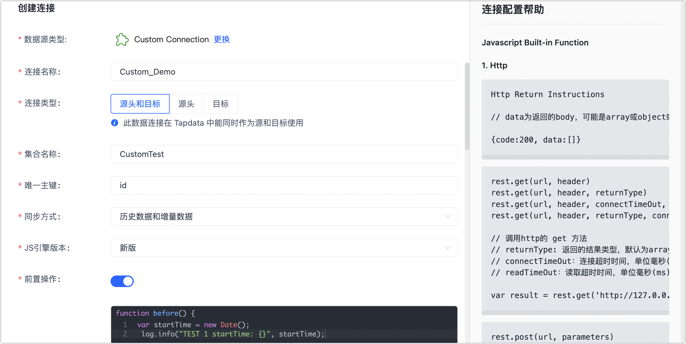

# Custom Connection

如果现有的数据源暂未满足您的需求，您也可以基于业务需求创建自定义连接，本文介绍配置流程。


## 连接 Custom Connection

1. 登录 Tapdata 平台。

2. 在左侧导航栏，单击**连接管理**。

3. 单击页面右侧的**创建**。

4. 在弹出的对话框中，搜索并选择 **Custom Connection**。

5. 根据下述说明完成数据源配置。

   

    * 基本信息设置

        * **连接名称**：填写具有业务意义的独有名称。
        * **连接类型**：支持作为源或目标库。
        * **集合名称**：即表名称，作为源库时需设置，表示从 Custom Connection 里获取到的数据要生成的数据模型的名字。
        * **唯一主键**：填写作为主键的字段名。
        * **同步方式**：作为源库时需设置：
            * **历史数据**：选择该选项，Tapdata 只会执行一次历史数据脚本。
            * **增量数据**：选择该选项，Tapdata 每隔 2 秒定期执行增量数据脚本。
            * **历史数据和增量数据**：选择该选项，Tapdata 执行一次历史数据脚本后，再定期执行增量脚本。

    * JS 脚本设置
        * **JS 引擎版本**：选择为**新版**。
        * **前置操作**：打开该开关后，Tapdata 将在执行数据脚本前，执行您定义的 JS 操作脚本（仅一次）。
        * **目标数据处理脚本**：目标数据处理的 JS 脚本，用来将数据处理为符合目标 Custom Connection 的格式，**连接类型**包含目标时才会显示该选项。
        * **增量数据脚本**：增量数据获取和处理的 JS 脚本，**同步方式**包含增量数据时需设置。
        * **历史数据脚本**：历史数据获取和处理的 JS 脚本，**同步方式**包含历史数据时需设置。
        * **后置操作**：打开该开关后，Tapdata 将在数据脚本执行完成之后，执行您定义的 JS 脚本（仅一次）。

    * 高级设置
        * **共享挖掘**：打开共享挖掘开关后，多个任务共享增量日志读取结果，无需从源库重复读取，可极大降低源库负载。
        
        * **Agent 设置**：默认为**平台自动分配**，您也可以手动指定。
        
        * **模型加载时间**：当数据源中模型数量小于 10,000 时，每小时刷新一次模型信息；如果模型数据超过 10,000，则每天按照您指定的时间刷新模型信息。
        
        * **开启心跳表**：当连接类型选择为**源头和目标**、**源头**时，支持打开该开关，由 Tapdata 在源库中创建一个名为 **_tapdata_heartbeat_table** 的心跳表并每隔 10 秒更新一次其中的数据（数据库账号需具备相关权限），用于数据源连接与任务的健康度监测。
          
          :::tip
          
          数据源需在数据复制/开发任务引用并启动后，心跳任务任务才会启动，此时您可以再次进入该数据源的编辑页面，即可单击**查看心跳任务**。
          
          :::

6. 设置完成，单击**脚本调试**。

7. 在跳转到的页面，选择源头或目标、设置超时时间并单击试运行，测试脚本运行正确性。

   运行结束后，页面右侧将打印本次运行结果，如遇错误则会打印相关错误日志，帮助您快速定位并修改脚本。

   

8. 试运行调试完毕后，单击页面右侧的关闭按钮返回至连接配置页面。

9. 单击**连接测试**，测试通过后单击**保存**。

   :::tip

   如提示连接测试失败，请根据页面提示进行修复。

   :::


## 常用函数介绍

下文列出常用函数介绍，您可以在编写 JS 脚本时参考。

### Http

```javascript
Http Return Instructions

// data为返回的body，可能是array或object或string

{code:200, data:[]}
rest.get(url, header)
rest.get(url, header, returnType)
rest.get(url, header, connectTimeOut, readTimeOut)
rest.get(url, header, returnType, connectTimeOut, readTimeOut)

// 调用http的 get 方法
// returnType: 返回的结果类型，默认为array
// connectTimeOut：连接超时时间，单位毫秒(ms)，默认为 10000 ms，需要指定连接超时时间时可以使用该参数
// readTimeOut：读取超时时间，单位毫秒(ms)，默认为 30000 ms，需要指定读取超时时间时可以使用该参数

var result = rest.get('http://127.0.0.1:1234/users?id=1', {}, '[array/object/string]', 30, 300);
rest.post(url, parameters)
rest.post(url, parameters, headers, returnType)
rest.post(url, parameters, connectTimeOut, readTimeOut)
rest.post(url, parameters, headers, returnType, connectTimeOut, readTimeOut)

// 调用http的 post 方法
// returnType: 返回的结果类型，默认为array
// connectTimeOut：连接超时时间，单位毫秒(ms)，默认为 10000 ms，需要指定连接超时时间时可以使用该参数
// readTimeOut：读取超时时间，单位毫秒(ms)，默认为 30000 ms，需要指定读取超时时间时可以使用该参数

var result = rest.post('http://127.0.0.1:1234/users/find', {}, {}, '[array/object/string]', 30, 300);
rest.patch(url, parameters)
rest.patch(url, parameters, headers)
rest.patch(url, parameters, connectTimeOut, readTimeOut)
rest.patch(url, parameters, headers, connectTimeOut, readTimeOut)

// 调用http的 patch 方法
// connectTimeOut：连接超时时间，单位毫秒(ms)，默认为 10000 ms，需要指定连接超时时间时可以使用该参数
// readTimeOut：读取超时时间，单位毫秒(ms)，默认为 30000 ms，需要指定读取超时时间时可以使用该参数

var result = rest.patch('http://127.0.0.1:1234/users?where[user_id]=1', {status: 0}, {}, 30, 300);
rest.delete(url)
rest.delete(url, headers)
rest.delete(url, connectTimeOut, readTimeOut)
rest.delete(url, headers, connectTimeOut, readTimeOut)

// 调用http的 delete 方法
// connectTimeOut：连接超时时间，单位毫秒(ms)，默认为 10000 ms，需要指定连接超时时间时可以使用该参数
// readTimeOut：读取超时时间，单位毫秒(ms)，默认为 30000 ms，需要指定读取超时时间时可以使用该参数

var result = rest.delete('http://127.0.0.1:1234/users?where[user_id]=1', {}, 30, 300);
```

### **MongoDB**

```javascript
mongo.getData(uri, collection)
mongo.getData(uri, collection, filter)
mongo.getData(uri, collection, filter, limit, sort)

// MongoDB 查询数据

var result = mongo.getData('mongodb://127.0.0.1:27017/test', 'users', {id: 1}, 10, {add_time: -1});
mongo.insert(url, collection, inserts)

// MongoDB 插入数据
// inserts 表示插入的数据，可以传入数组或者对象

mongo.insert('mongodb://127.0.0.1:27017/test', 'users', [{id: 1, name: 'test1'}, {id: 2, name: 'test2'}]);
mongo.update(url, collection, filter, update)

// MongoDB更新数据

var modifyCount = mongo.update('mongodb://127.0.0.1:27017/test', 'users', {id: 1}, {name: 'test3'});
mongo.delete(url, collection, filter)

// MongoDB删除数据

var deleteCount = mongo.delete('mongodb://127.0.0.1:27017/test', 'users', {id: 1});
```