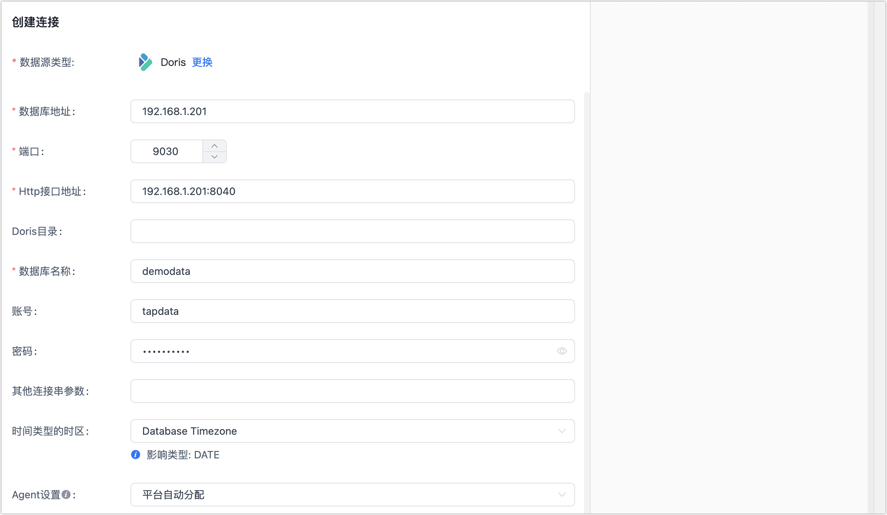

# Doris

Doris 适用于实时数据分析和报表，支持高并发查询和复杂分析，广泛应用于数据仓库、BI报表和数据可视化。Tapdata 支持将 Doras 作为源或目标库来构建数据管道，帮助您快速完成大数据分析场景下的数据流转。

接下来，跟随本文介绍在 Tapdata 平台上连接 Doris 数据源。

```mdx-code-block
import Tabs from '@theme/Tabs';
import TabItem from '@theme/TabItem';
```

## 支持版本

Dorix 1.x、2.x

import Content from '../../../reuse-content/beta/_beta.md';

<Content />

## 注意事项

如需使用 Doris 作为源库并同步增量数据变更，您需要[创建数据转换任务](../../user-guide/data-pipeline/data-development/create-task.md)并选择**增量同步方式**为**字段轮询**。

## 准备工作

1. 登录 Doris 数据库，执行下述格式的命令，创建用于数据同步/开发任务的账号。

   ```sql
   CREATE USER 'username'@'host' IDENTIFIED BY 'password';
   ```

   - **username**：用户名。
   - **password**：密码。
   - **host**：允许该账号登录的主机，百分号（%）表示允许任意主机。

   示例：创建一个名为 tapdata 的账号。

   ```sql
   CREATE USER 'tapdata'@'%' IDENTIFIED BY 'Tap@123456';
   ```

2. 为刚创建的账号授予权限，您也可以基于业务需求设置更精细化的权限控制。

```mdx-code-block
<Tabs className="unique-tabs">
<TabItem value="作为源库">
```
```sql
-- 请根据下述提示更换 catalog_name、database_name 和 username
GRANT SELECT_PRIV ON catalog_name.database_name.* TO 'username'@'%';
```
</TabItem>

<TabItem value="作为目标库">

```sql
-- 请根据下述提示更换 catalog_name、database_name 和 username
GRANT SELECT_PRIV, ALTER_PRIV, CREATE_PRIV, DROP_PRIV, LOAD_PRIV ON catalog_name.database_name.* TO 'username'@'%';
```
</TabItem>
</Tabs>

 

:::tip

请更换上述命令中的信息：
* **catalog_name**：数据目录名称，默认名称为 **internal**，可以通过 [SHOW CATALOGS](https://doris.apache.org/zh-CN/docs/1.2/sql-manual/sql-reference/Show-Statements/SHOW-CATALOGS) 命令查看已创建的数据目录。更多介绍，见[多源数据目录](https://doris.apache.org/zh-CN/docs/1.2/lakehouse/multi-catalog/)。
* **database_name**：要授予权限的数据库名称。
* **username**：用户名。

:::


## 连接 Doris

1. 登录 Tapdata 平台。

2. 在左侧导航栏，单击**连接管理**。

3. 单击页面右侧的**创建**。

4. 在弹出的对话框中，搜索并选择 **Doris**。

5. 在跳转到的页面，根据下述说明填写 Doris 的连接信息。

   

    - **连接名称**：填写具有业务意义的独有名称。
    - **连接类型**：支持将 Doris 作为源或目标库。
    - **数据库地址**：Doris 的连接地址。
    - **端口**：Doris 的查询服务端口，默认端口为 **9030**。
    - **HTTP 接口地址**：BE 服务的 HTTP 协议访问地址，包含地址和端口信息，默认端口为 **8040**。
    - **Doris 目录**：Doris 的目录，其层级在数据库之上，如使用默认目录可置空，更多介绍，见[多源数据目录](https://doris.apache.org/zh-CN/docs/1.2/lakehouse/multi-catalog/)。
    - **数据库名称**：一个连接对应一个数据库，如有多个数据库则需创建多个数据连接。
    - **账号**、**密码**：分别填写数据库的账号和密码。
    - **其他连接参数**：额外的连接参数，默认为空。
    - **时间类型的时区**：默认为数据库所用的时区，您也可以根据业务需求手动指定。 
    - **agent 设置**：默认为**平台自动分配**，您也可以手动指定 Agent。

6. 单击页面下方的**连接测试**，提示通过后单击**保存**。

   :::tip

   如提示连接测试失败，请根据页面提示进行修复。

   :::

