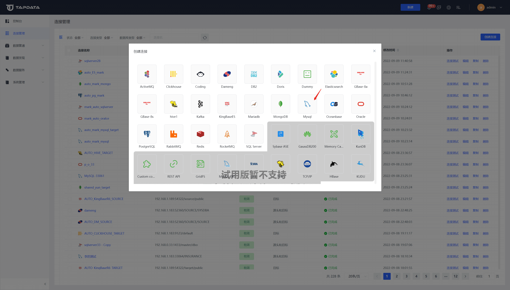

# 连接数据库

完成[部署](install/README.md)后，您需要在 Tapdata 平台为数据库建立连接，完成操作后即可创建数据同步任务。

## 操作步骤

1. 登录 Tapdata 平台。

2. 在左侧导航栏栏，单击**连接管理**。

3. 单击页面右侧的**创建连接**。

4. 选择要添加的数据库并填写连接信息。

   

## 下一步

[创建数据同步任务](create-task.md)
