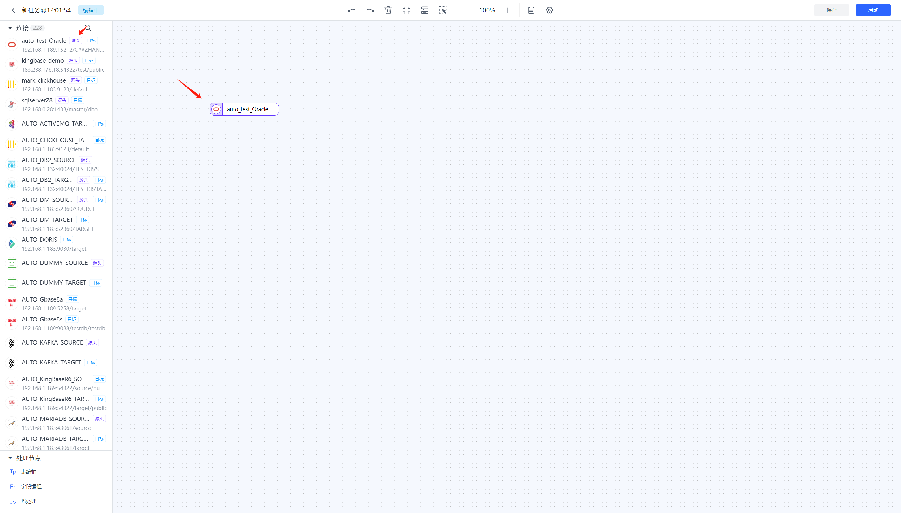
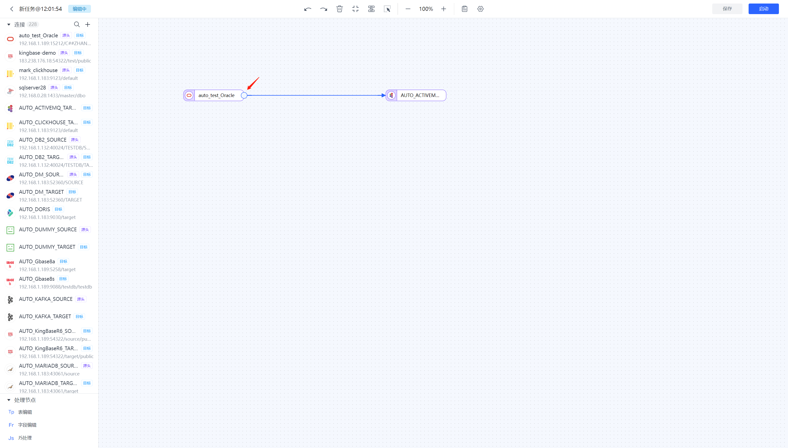
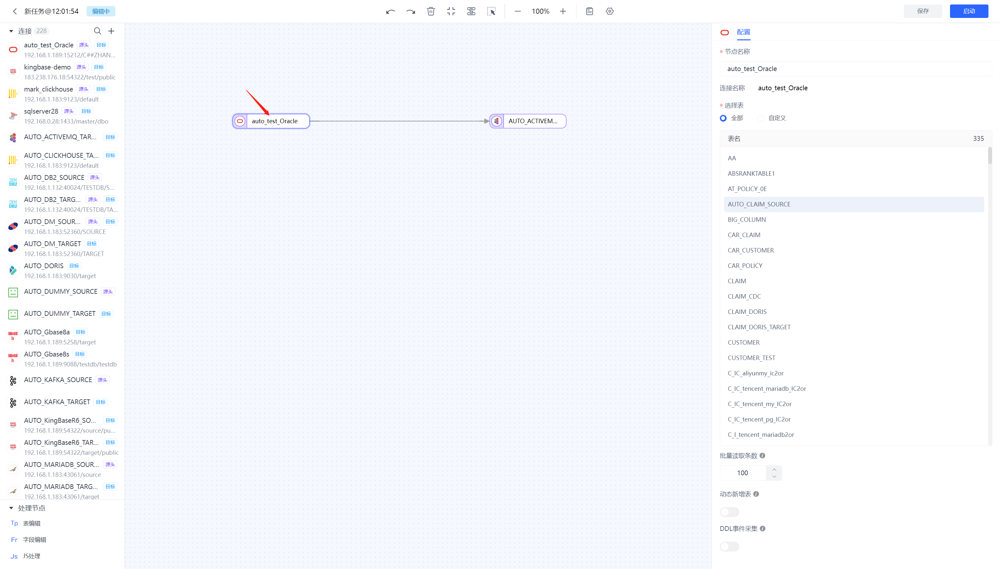
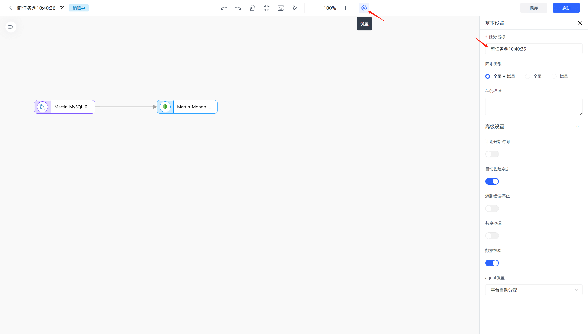

# 创建数据同步任务

数据同步功能是 Tapdata 的重要功能和核心优势，您只需简单设置，即可全自动的将数据从一个节点中读取（源端），并写入至另一个节点（目标端）。

## 操作步骤

1. 登录 Tapdata 平台。

2. 在左侧导航栏，选择**数据管道** > **数据复制**。

3. 单击页面右上角的**创建**，跳转到任务配置页面。

4. 在左侧的连接列表中，选择选择一个作为源的表节点并拖拽至画布中。

   

5. 然后选择选择一个支持作为目标的表节点并拖拽至画布中。

6. 将源节点和目标节点连接起来。

   

7. 单击对应的节点，在右侧弹出的面板中配置源和目标节点的属性（选择表及写入策略等）。

   

8. 单击上方任务设置按钮来配置任务属性。

   

9. 单击保存或启动按钮完成创建。

## 推荐阅读

[创建数据复制任务](../user-guide/data-pipeline/copy-data/create-task.md)（含高级设置介绍）