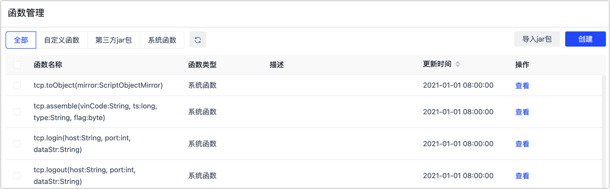
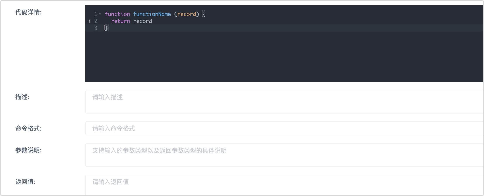
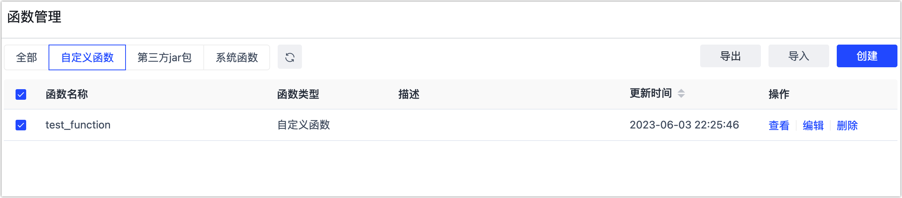

# 管理函数

Tapdata 支持丰富的函数，可帮助您更加便捷地完成处理过程的定义，从而在 [JS 节点](../data-pipeline/data-development/process-node#js-process)中引用。除此以外，您还可以根据需求自由定义函数或导入第三方 jar 包来引入函数。

## 操作步骤

1. 登录 Tapdata 平台。

2. 在左侧导航栏，选择**数据管道** > **函数管理**。

3. 在本页面，您可以看到当前已有的函数，例如单击系统函数右侧的**查看**来了解详情。

   

4. 如已有的函数无法满足您的需求，您可以单击右上角的创建来自定义一个新的函数，设置完成后单击**保存**。

   :::tip

   除此方法外，您还可以单击导入 jar 包**，然后导入包中的函数（需符合 Tapdata 规范），后续在 JS 节点中即可使用该 jar 包中的函数，通用格式为：函数名称.方法名（具体参数）。

   :::

   

   - **代码详情**：用户可以在代码详情里编写自己的函数逻辑。
   - **描述**：自定义函数的功能描述。
   - **命令格式**：自定义函数的命令格式，方便在调用函数输入命令后的提示。
   - **参数说明**：支持输入的参数类型以及返回参数类型的具体说明。
   - **返回值**：自定义函数的返回值。

5. 对于自定义的函数，您可以将其选中并导出备份或分享给其他团队成本，您也可以导入自定义函数。

   
