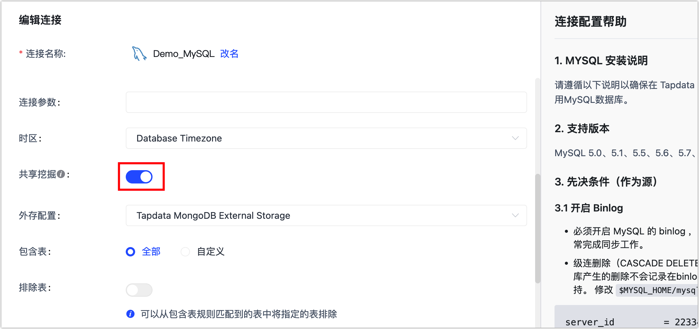
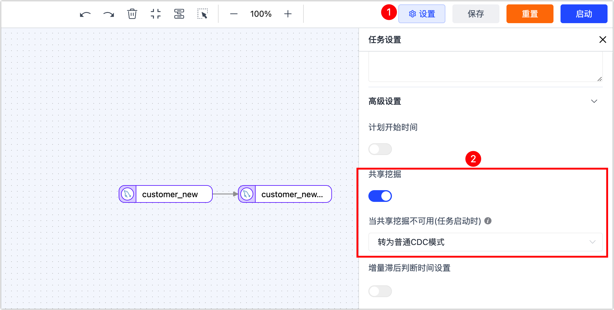
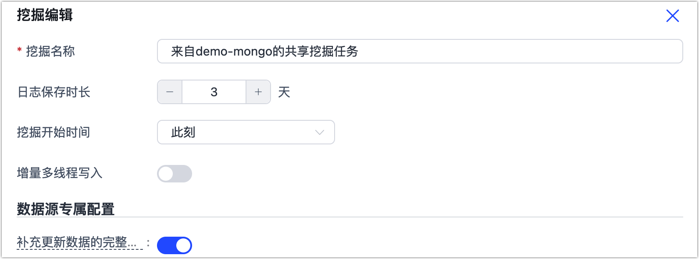
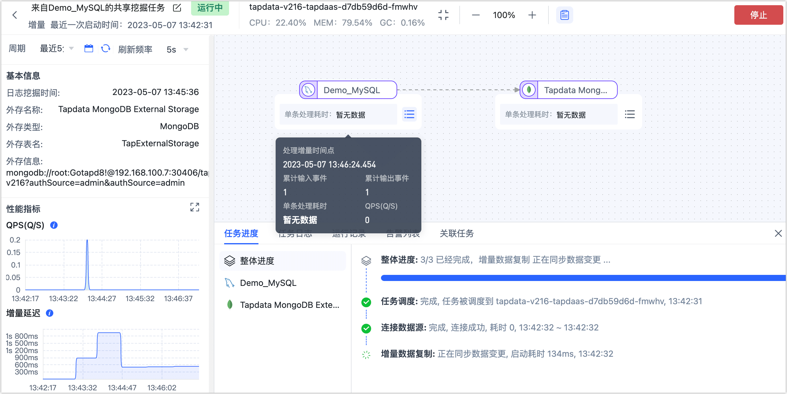
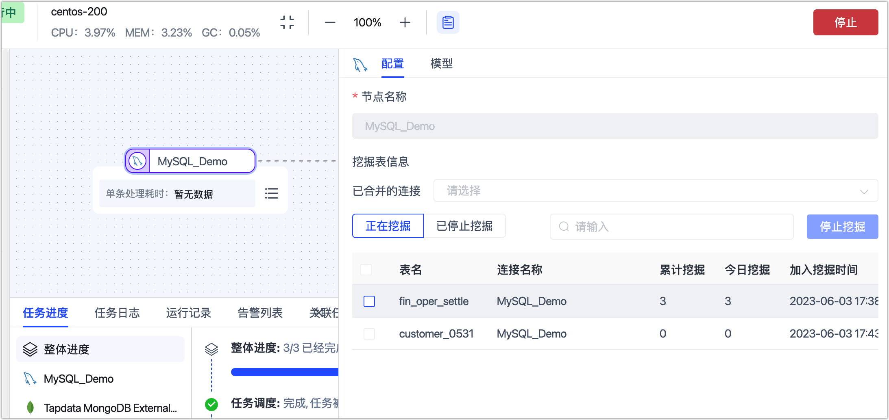

# 管理共享挖掘

为减轻增量时源端数据库压力，Tapdata 支持对增量日志进行共享挖掘，挖掘功能开启后并不会马上开始挖掘，而是在用户创建该数据源下所属表的任务时开启挖掘，无论挖掘任务暂停或者错误均不会影响同步任务正常运行。

## 开启共享挖掘

可在[创建连接](../../quick-start/connect-database.md)时开启共享挖掘，开启后从共享源读取数据，如果是首次开启则需填写存储挖掘连接（可选择一个 MongoDB 作为存储库）。

## 使用共享挖掘

创建数据转换或数据复制任务，当任务包含增量的任务且数据源已开启共享挖掘，即可在任务设置中使用共享挖掘功能。更多关于任务配置的介绍，见[创建数据复制/开发任务](../../quick-start/create-task.md)。

## 管理共享挖掘

任务创建成功后系统会自动生成挖掘任务，在 Tapdata 平台，单击左侧导航栏的**数据管道** > **共享挖掘**，可查看到挖掘名称以**数据源名称**为前缀以帮助您快速识别：

可执行的管理操作如下：

* **停止共享挖掘任务**：当不再需要执行共享挖掘任务或需要调整配置时，可单击**停止**。

* **编辑共享挖掘配置**：当共享挖掘任务处于停止状态时，可单击**编辑**，然后在弹出的对话框中，设置挖掘名称、日志保存时长、挖掘开始时间、是否启用增量多线程写入和补充更新数据的完整字段。

  

* **监控任务详情**：单击挖掘任务对应**监控**，可查看详细挖掘信息，例如 QPS、增量延迟等关键指标。

  

* **配置任务告警**：单击挖掘任务对应**监控**，单击页面右上角的设置，在右侧弹出的面板中配置任务告警，可通过系统通知消息或邮件来发出告警信息，帮助更好地掌握任务的运行状态。

  

* 启停指定表的挖掘任务：单击挖掘任务对应的<b>监控</b>，然后单击源节点，在页面右侧的面板中可查看到共享挖掘所涉及的表、挖掘的数量等信息，如下图所示。
  
  
  
  当遇到某个表因大事务而引发增量事件获取异常时，您可以在此页面选中相关的表并单击**停止挖掘**，在弹出的对话框中确认影响范围后单击**确定**。
  
  后续完成大事务的提交处理后，可单击**已停止挖掘**页签，选中目标表并单击**恢复挖掘**。

## 应用场景

希望创建一个 MySQL 到 Oracle 的同步任务，但为了减轻源库压力所以想通过共享挖掘来实现。

**操作思路：**

先创建一个mongo DB作为存储挖掘日志的中间库，再将需要进行增量日志挖掘的连接开启共享挖掘并选择该mongo DB，最后在创建任务时开启共享挖掘即可

**具体流程：**

1. 创建一个数据库连接，用来存储共享挖掘的数据。

   1. 打开连接管理，点击右上角**创建连接**按钮。
   2. 创建一个 MongoDB 连接，配置信息如下：
      * 连接名称：可任意命名，例：lyl_mongo
      * 连接类型：源和目标
      * 连接方式：标准连接
      * 数据库地址：47.115.163.**
      * 数据库名称：test
      * 其他为非必填项
   3. 点击下方**保存**按钮，跳转至连接管理界面。

2. 点击右上角**创建连接**按钮，创建一个MySQL连接作为源，开启共享挖掘。

3. 选择刚才创建的 MongoDB 连接作为存储中间库（这一步也可在共享挖掘-挖掘设置中操作）二次设置不会再显示

   * 存储MongoDB连接名称：lyl_mongo
   * 存储MongoDB表名：david_mongo_share

4. 点击**保存**按钮。

5. 创建一个 Oracle 连接作为目标（不需要开启共享挖掘）。

6. 打开数据转换页面，单击右上角**创建**按钮创建一个任务。

   1. 选择刚刚创建的 MySQL 连接作为源，表选择：lyl_demo_mysql。
   2. 再选择一个连接作为目标，表选择或新建：lyl_demo_oracle_target，将他们连线。
   3. 在DAG画布中点击右上角**设置**按钮。
   4. 打开**共享挖掘**按钮，然后单击右上角**保存**按钮。

7. 点击左上角**返回**按钮，跳转至任务列表页。

8. 点击该任务的**启动**按钮，系统在启动任务的同时会自动生成一个共享挖掘任务。

   您可点击数据管道-共享挖掘查看该挖掘任务，也可点击该挖掘任务的**详情**按钮查看详细信息。

**演示：**

在源库新增一条数据

查看MongoDB中间库：（看是否有增量日志）

 python376 tap.py --source_type=MongoDB --name=lyl_mongo --table=david_mongo_share  common_query

在目标库查看是否有增量数据

