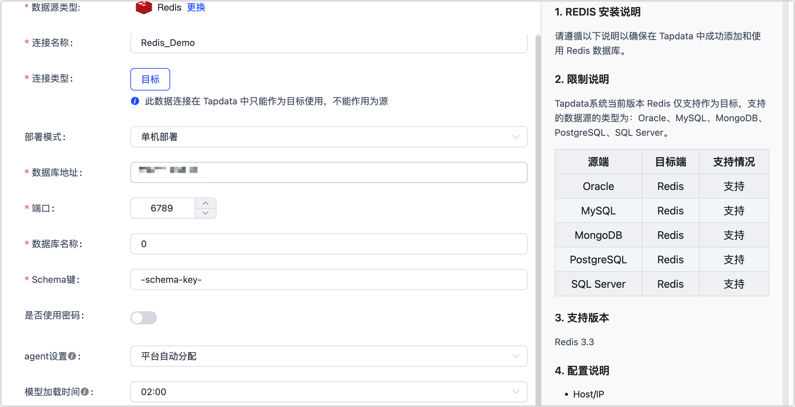

# 连接 Redis

Redis 是基于内存的 key-value（键值对）数据库，可用于数据缓存、事件发布/订阅、高速队列等场景。Tapdata 支持将关系型数据库（Oracle、MySQL、MongoDB、PostgreSQL、SQL Server）的数据实时同步至 Redis，帮助您快速完成数据流转。本文介绍如何在 Tapdata 上连接 Redis 数据源。

## 支持的版本

Redis 2.8 ~ 6.0

## 操作步骤

1. 登录 Tapdata 平台。

2. 在左侧导航栏，单击**连接管理**。

3. 单击页面右侧的**创建连接**。

4. 在弹出的对话框中，单击 **Alpha 数据源**页签，然后选择 **Redis**。

5. 在跳转到的页面，根据下述说明填写 Redis 的连接信息。

   

   * **连接名称**：填写具有业务意义的独有名称。
   * **连接类型**：目前仅支持**目标**。
   * **部署模式**：选择**单机部署**或**哨兵部署**，如选择**哨兵部署**，您还需要填写哨兵地址。
   * **数据库地址**：填写数据库的连接地址。
   * **端口**：填写数据库的服务端口。
   * **数据库名称**：填写数据库名称，例如 **0**。
   * **是否使用密码**：如 Redis 启用了密码验证，您需要打开该开关并填写数据库密码。
   * **agent 设置**：默认为**平台自动分配**，您也可以手动指定。

6. 单击**连接测试**，测试通过后单击**保存**。

   :::tip

   如提示连接测试失败，请根据页面提示进行修复。

   :::

## 相关文档

[Redis 数据开发任务](../../../best-practice/mysql-to-redis.md)