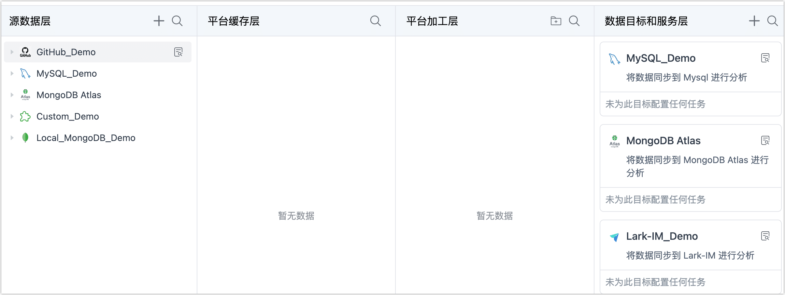

# 一键自动流转数据

在数据服务平台模式下，您只需要简单地拖动源表至所需层级，即可一键生成数据管道并自动启动任务，极大简化任务配置流程，本文介绍如何实现数据在不同层级间的流转，并最终为提供给终端业务。

```mdx-code-block
import Tabs from '@theme/Tabs';
import TabItem from '@theme/TabItem';
```

## 操作步骤

1. 登录 Tapdata 平台。

2. 在左侧导航栏，单击**实时数据中心**。

3. 在本页面，您可以直观地看到您已录入的数据源信息，Tapdata 基于数据治理和流转顺序，展示了四个层级。

   

   :::tip

   关于各层级的详细说明，见[数据服务平台分层介绍](enable-daas-mode.md)。

   :::

4. 跟随下述流程，<span id="release330-task">一键完成数据流转</span>。

   :::tip
   通过平台加工层，您可以对表进行表结构调整（如增加字段）、合并表、构建宽表等操作，如果缓存层的表已经满足您的业务需求，则无需使用平台加工层，您可以直接发布 API 或将缓存层的表拖动至**数据目标和服务层**。
   :::

<Tabs className="unique-tabs">
<TabItem value="流转至平台缓存层" default>

1. 在**源数据层**，单击图标，找到您需要同步的表，将其拖动至**平台缓存层**。
2. 在弹出的对话框中，填写表前缀、选择数据同步方式（全量或增量）并单击**确定**。

   

3. 选择**保存并运行**后，Tapdata 将自动创建一个数据复制任务，将您选择表实时同步至平台缓存层并自动校验，您可以单击平台缓存中表名右侧的图标，跳转至任务监控页面来查看任务运行详情。

</TabItem>

<TabItem value="流转至平台加工层">

1. 在**平台缓存层**，单击  图标，找到您需要加工的表，将其拖动至**平台加工层**。
2. 在弹出的对话框中，填写表名称并选择是否启动任务。
   * **仅保存**：仅保存任务链路，页面将提示保存成功，单击提示信息即可跳转到任务配置页面，您可以[添加处理节点](../../data-pipeline/data-development/process-node)，实现表结构调整（如增加字段）、合并表、构建宽表等需求，完成设置后单击页面右上角的**启动**。
   * **保存并运行**：无需执行额外的操作，由 Tapdata 自动创建一个数据转换任务并运行，将该表实时同步至平台加工层。
3. 在**平台加工层**，找到目标表，单击其右侧的图标，可查看该表关联的任务和表的基本信息，包含列信息、样本数据、Scheme 等信息。


</TabItem>

<TabItem value="流转至数据目标和服务层">

1. 从**平台缓存层**或**平台缓存层**中，找到要同步的表，将其拖动至**数据目标和服务层**中的目标数据源中。

   

2. 在弹出的对话框中，填写具有业务意义的任务名称，然后选择是否启动任务。
   * **仅保存**：仅保存任务链路，此时，您可以单击目标库卡片中的任务名称，在跳转到的任务配置页面[添加处理节点](../../data-pipeline/data-development/process-node)，实现更多复杂处理（如数据过滤、增删字段等），完成设置后单击页面右上角的**启动**。
   * **保存并运行**：无需执行额外的操作，由 Tapdata 自动创建一个数据转换任务并运行，将该表实时同步至平台加工层。

完成设置后，Tapdata 将自动创建一个数据转换任务，将您的源表实时同步到选定的目标库中，提供给最终业务。您还可以单击目标库卡片中的任务名称，进入任务监控页面查看详细的运行状态，更多介绍，见[监控任务](../../data-pipeline/data-development/monitor-task)。

</TabItem>
</Tabs>


## 常见问题

* 问：通过拖拽任务生产的表名或库名，推荐的命名规范是什么？

  答：推荐以小写字母开头，仅包含小写字母、下划线和数字。

* 问：推荐将什么类型的数据流入到平台缓存层？

  答：推荐将核心业务数据流入到平台缓存层，可最大程度数据读取对源库的影响，可进行自由的权限管控，而且后续可以为多个数据管道供数，无需再去源库取数。

* 问：支持同步源库的 DDL 操作吗，例如新增字段？

  答：部分数据源支持，您可以在配置任务时**开启 DDL 事件**采集和 **DDL 应用**，支持同步的 DDL 和数据源的更多介绍，见 [DDL 同步说明](../../../best-practice/handle-schema-change.md)。

* 问：如果任务因 Schema 变化而以外终止，如何修复？

  答：Tapdata 致力于无缝处理大多数 DDL 变更，如遇不支持同步的 DDL，可能引发任务意外终止，此时，您可以在**连接管理**页面中，找到源库并**重新加载 Schema**，重置任务后再重启任务来修复，您也可以在目标库手动执行本次 DDL 变更来尝试修复。

